# Detection Engineering Foundations

## Table of Contents

1. Multiple Failed Logins Followed by Successful Authentication
2. Impossible Travel Across Cloud and VPN Sessions
3. MFA Push Fatigue or Repeated MFA Challenge Abuse
4. New MFA Method Registered After Risky Sign-in
5. MFA Disabled or Authentication Method Removed
6. Password Spray Against Multiple Users
7. Targeted Brute Force Against Privileged Account
8. Dormant Account Suddenly Active
9. Disabled Account Authentication Attempt
10. Admin Login from Unmanaged or Non-Compliant Device
11. Privileged Login Outside Normal Operating Window
12. Successful Legacy Authentication to Cloud Mailbox
13. Login from Anonymous Proxy or TOR Exit Node
14. Session Token Replay Across Unusual ASN or Device
15. Risky Sign-in followed by Sensitive Application Access
16. User added to domain admins or global admins
17. Dcync or directory replication abuse indicator
18. Kerboroasting-like service ticket request spike
19. GPO modified in weaken security controls
20. Remote Service creation on multiple hosts
21. WMI Remote execution from unusal host
22. PAM password checkout without approved ticket
23. Breakglass account used
24. Priviledged session recording disabled or missing 
25. Vendor priviledged access outside approved window
26. Phishing email delivered and user clicked link
27. Suspicious zip attachment containing lnk or script
28. Teams or sharepoint suspicious file shared internally 
29. Mailbox forwarding rule to external domain
30. Inbox rule created to hide security or finance mails
31. Mass outbount email from user mailbox
32. BEC payment instruction change request 
33. Executive display name spoofing 
34. QR Phishing email 
35. Mailox delegation or fullaccess permission added
36. Office application spawns powershell
37. Encoded or obfuscated powershell command
38. Powershell downloads remote content
39. LNK File launches command interpreter
40. Rundll32 execution from user-writable path
41. MShta Execution from email or Browser context 
42. CertUtil or Bitsadmin used to download file
43. Suspicious Scheduled Task Created
44. Registry Run key persistence
45. Suspicious lsass Access
46. Security tool disabled or tampered
47. Same Suspicious hash executed on multiple hosts
48. Volume Shadow Copy Deletion 
49. Backup Repository Deletion or Tampering 
50. Mass File Rename or modification spike
51. Ransom note pattern across multiple hosts
52. Remote Admin tool abuse before impact 
53. Security logs cleared on server
54. Mass service stop on critical host 
55. Data Staging and large archive creation before upload
56. New OAuth Application Consent
57. High-Risk OAuth Permissions Granted
58. OAuth Consent After Risky login
59. Service Principal or Certificate Added
60. Service Principal Used from new country or ASN
61. AI Agent Created or granted access
62. AI agent performs abnormal volume of actions
63. Conditional access policy modified
64. Cloud Audit logging Disabled or Reduced
65. Cloud Admin Rule Assigned
66. External Guest Added to Sensitive Workspace
67. Guest User Mass Download from sharepoint
68. DLP or Sensitive label policy modified
69. Excessive API Calls to sensitive endpoint
70. API token used from new source ip 
---

## Common Investigation Framework

### Standard Triage Questions

- Is the activity expected?
- Is there an approved change or business justification?
- Is the source IP, device, ASN, country, or application unusual?
- Is MFA behaving normally?
- Is there evidence of lateral movement, persistence, privilege escalation, or data access?
- Should escalation occur?

### Standard Response Actions

- Validate timeline
- Preserve evidence
- Enrich identities and assets
- Correlate SIEM, EDR, IAM, Cloud, Email, and Network telemetry
- Revoke sessions or reset credentials if required
- Document findings and containment actions

### Common False Positive Categories

- Approved maintenance
- Administrative activity
- Vulnerability assessments
- Automation accounts
- Vendor activity
- Business travel
- Remote work
- Logging issues

---

# usecase 1 : multiple failed logins failed by succesfull authentications

category : identity and access
mitre att&K mapping : T1110 Brute Force; T1078 Valid Accounts

hypothesis :  a user account receives many failed authe attempts from a hosting provider ip followed by a succesfull cloud login and immediate access to email and file repos.

req log sources : 
    - entra id / sigin logs
        - like cloud identity evidence for multiple failed logins
        - basically to check for source ip , asn , geo data , mfa satisfication status, etc to check whether its a normal user or a sus identity behaviour
    - ad security logs
        - like on prem identity and windows auth evidence for multiple failed 
        logins followed by success logins
        - to capture the system event id , source workstation , target account and for any priv assignment
    - vpn logs
        - remote access activity to multiple failed logins followed by success logins
        - to check for public source ip, assigned internal ip , vpn gateway 
        - basically to check for correlating cloud sign-ins with remote network access and internal movement
    - iam risk events 
        - for checking the risk level and to define a risk scoring for multiple failed logins followed by a success one in order to determine a normal authentication from signals with informations like anon ip, unfamiliar-sigin-props, leaked creds, malware linked ip or suspicious inbox acitivity
    - timegenerated/eventtime
        - used as an anchor for constructing the timeline
    - user account/spn
        - to identify the account, admin, service account or cloud applications
    - Host/ device / asset
        - to identify the endpoint, server, cloud workload or application component
    - source ip / dest ip / geo / asn 
        - to check the network origin and destination linked to multiple failed logins followed by the success one
    - action / result / status
        - check if the activity was allowed, blocked , failed or completed partially
    - application / resource
        - identify the source application

Building Blocks Design 

BB Known corp countries list to be mainted 
BB Known priv users list to be mainted 
BB Allowed VPN Ranges list to be mainted 
BB Service Account exclusion list to be maintained

Rule logic

rule Password_Spray_Success_HighRisk
{
  meta:
    severity = "Critical"

  events:

    // detecting the core activity by the use-case event
    $fail.metadata.event_type = "USER_LOGIN"
    $fail.security_result.action = "BLOCK"

    $success.metadata.event_type = "USER_LOGIN"
    $success.security_result.action = "ALLOW"

    // context conditions to search with the building blocks like user-risks, service accounts, asset criticality
    $success.principal.user.userid = $user
    $success.src.ip = $ip

    $risk.entity.user.userid = $user
    $risk.risk_level = "HIGH"

    // searching by correlating for related activity within a defined lookback windows
  match:
    $user over 30m

  // incident condition based on the risks
  condition:
    #fail >= 10 and
    #success >= 1 and
    #risk >= 1
}

Alert Design 

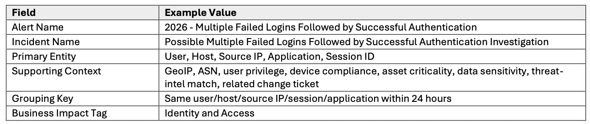

Grouping logic

• Group by same user and source IP when identity or cloud activity is involved.
• Group by same host, process, file hash or destination when endpoint activity is involved.
• Group by same mailbox, site, file repository or external recipient when email or data activity is involved.
• Group by same API token, endpoint, session or customer object when application/API activity is involved.
• Escalate to a higher-level incident when two or more categories appear in the same timeline.

Triaging questions

• Is the user, host, application or service account expected to perform this activity?
• Is there an approved change, service request, incident ticket or business justification?
• Did the same entity trigger other related alerts before or after this event?
• Is the source IP, country, ASN, device, user-agent or session new for this entity?
• Is the affected asset, mailbox, data repository or application business-critical?
• Was the activity allowed, blocked, partially completed or only attempted?
• Is there evidence of data access, privilege change, control tampering, lateral movement or persistence?
• Should this be escalated to L2/L3, Incident Response, IAM, endpoint, cloud, network, application or risk/compliance
team?
• Was MFA satisfied normally, bypassed, repeatedly challenged or modified?
• Should active sessions or tokens be revoked while validation is ongoing?

Recommended actions 

• Validate the alert against the simulated or real evidence timeline and preserve raw events.
• Enrich the entities with user role, asset owner, department, asset criticality, privilege level and recent activity.
• Check for matching activity across SIEM, EDR, identity, cloud, proxy, email, application and network telemetry.
• Escalate according to the incident classification and business impact, not only the technical event type.
• Document the final decision, containment actions, evidence and closure rationale in the case record.
• Consider session revocation, password reset, MFA reset, OAuth grant removal, conditional access review and account
disablement based on confirmation.
• Hunt for the same IP, application, token, user-agent, app ID or consent pattern across the tenant.

False Positive Possibilities

• Approved maintenance, migration, testing, vulnerability assessment or administrative activity.
• Known automation account, service integration, backup process, security tool, scanner or deployment platform.
• Business travel, remote work, vendor support activity or approved temporary access.
• False reputation match, geolocation inaccuracy, NAT/proxy aggregation or log parsing issue.
• Application behaviour change after release, patch, policy update or workflow redesign.

# usecase 2 : Impossible travel across cloud and vpn sessions

Category : Identity and access
mitre Att&Ck mapping : T1078 Valid Accounts; T1550 Use Alternate Authentication Material

Hypothesis : A user sigin's from kaul lumpur then appears 12 mins later from eu using the same acc followed by a sharepoint access

Log sources req 
    - entra id sign-in logs
    - vpn logs
    - geoip enrichment logs
    - m365 audit logs
        - to check for post authentication activities to see what the user did after sigining what mailbox did he access , did he create any inbox rule , file download , file sharing or teams activity
    - timegenerated/event-timestamp
    - user-account/service principal
    - host/device/asset
        - check for the endpoint , server , cloud workload or application component to impossible travel across cloud and vpn sessions
    - source-ip/destination-ip/geo/asn
        - check for network origin and destination of activity linked to the impossible travel
    - action / result / status
    - application / resource / object 
        - to check for application , mailbox , sharepoint site, api endpoint, database, file path or business resource being touched during impossible travel across cloud and vpn sessions

Building Blocks Design 

BB user travel exception list 
BB approved remote access countries list 
BB High-Risk Geographies list to be mainted 

Rule Creation Logic

rule Impossible_Travel_High_Risk
{
 meta:
   severity = "High"

 events:

   $login1.metadata.event_type = "USER_LOGIN"

   $login2.metadata.event_type = "USER_LOGIN"

   $login1.principal.user.userid = $user
   $login2.principal.user.userid = $user

   $login1.src.location.country_or_region = $country1
   $login2.src.location.country_or_region = $country2

   $risk.principal.user.userid = $user
   $risk.security_result.severity = "HIGH"

 match:
   $user over 30m

 outcome:

   $risk_score =
       50 +
       if(#risk > 0,25,0)

 condition:
   $country1 != $country2 and
   #login1 > 0 and
   #login2 > 0 and
   $risk_score >= 70
}

Alert Design 

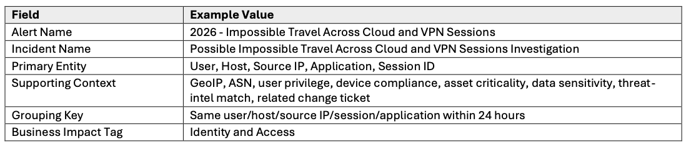

Grouping Logic

• Group by same user and source IP when identity or cloud activity is involved.
• Group by same host, process, file hash or destination when endpoint activity is involved.
• Group by same mailbox, site, file repository or external recipient when email or data activity is involved.
• Group by same API token, endpoint, session or customer object when application/API activity is involved.
• Escalate to a higher-level incident when two or more categories appear in the same timeline.

Triaging Questions 

• Is the user, host, application or service account expected to perform this activity?
• Is there an approved change, service request, incident ticket or business justification?
• Did the same entity trigger other related alerts before or after this event?
• Is the source IP, country, ASN, device, user-agent or session new for this entity?
• Is the affected asset, mailbox, data repository or application business-critical?
• Was the activity allowed, blocked, partially completed or only attempted?
• Is there evidence of data access, privilege change, control tampering, lateral movement or persistence?
• Should this be escalated to L2/L3, Incident Response, IAM, endpoint, cloud, network, application or risk/compliance
team?
• Was MFA satisfied normally, bypassed, repeatedly challenged or modified?
• Should active sessions or tokens be revoked while validation is ongoing?

Recommeded Response Actions

• Validate the alert against the simulated or real evidence timeline and preserve raw events.
• Enrich the entities with user role, asset owner, department, asset criticality, privilege level and recent activity.
• Check for matching activity across SIEM, EDR, identity, cloud, proxy, email, application and network telemetry.
• Escalate according to the incident classification and business impact, not only the technical event type.
• Document the final decision, containment actions, evidence and closure rationale in the case record.
• Consider session revocation, password reset, MFA reset, OAuth grant removal, conditional access review and account
disablement based on confirmation.
• Hunt for the same IP, application, token, user-agent, app ID or consent pattern across the tenant.

False Positive Posssibilities 

• Approved maintenance, migration, testing, vulnerability assessment or administrative activity.
• Known automation account, service integration, backup process, security tool, scanner or deployment platform.
• Business travel, remote work, vendor support activity or approved temporary access.
• False reputation match, geolocation inaccuracy, NAT/proxy aggregation or log parsing issue.
• Application behaviour change after release, patch, policy update or workflow redesign.

use-case 3 : mfa push fatigue or repeated mfa challenge abuse

category : identity and access
mitre att&ck mapping : T1621 Multi-Factor Authentication Request Generation

hypothesis : a user receives repeated mfa prompts late at night despite not initiating any login, suggesting an attacker is trying to pressure the user into approval

req log sources :
    - entra-id logs 
    - identity protection logs
    - sigin-in logs
    - event time stamp / time generated 
    - user/account/service principal
    - host/device/asset
    - source ip / destination ip / geo / asn 
    - action / result / status
    - application / resource / object 

Building blocks for rule design 

BB MFA Push Count Threshold with the mfa update freq and exception approval process
BB VIP Users list 
BB Approved helpdesk reset window with the source of truth and exception approval process

Rule Creation Logic

rule MFA_Push_Fatigue_With_Risk_Context
{
  meta:
    author = "SOC"
    severity = "High"
    mitre_tactic = "Credential Access"

  events:

    $mfa.metadata.event_type = "USER_AUTHENTICATION"

    $mfa.security_result.action = "CHALLENGE"

    $mfa.principal.user.userid = $user

    $mfa.src.ip = $src_ip

    $risk.principal.user.userid = $user

    $risk.security_result.severity = "HIGH"

  match:
    $user over 30m

  outcome:

    $risk_score =
      50 +
      if(#risk > 0,20,0)

  condition:

    #mfa >= 10 and
    $risk_score >= 70
}

Alert Design 

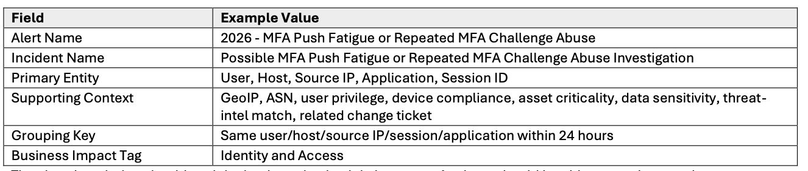

Grouping logic 

• Group by same user and source IP when identity or cloud activity is involved.
• Group by same host, process, file hash or destination when endpoint activity is involved.
• Group by same mailbox, site, file repository or external recipient when email or data activity is involved.
• Group by same API token, endpoint, session or customer object when application/API activity is involved.
• Escalate to a higher-level incident when two or more categories appear in the same timeline.

Triage Questions 

• Is the user, host, application or service account expected to perform this activity?
• Is there an approved change, service request, incident ticket or business justification?
• Did the same entity trigger other related alerts before or after this event?
• Is the source IP, country, ASN, device, user-agent or session new for this entity?
• Is the affected asset, mailbox, data repository or application business-critical?
• Was the activity allowed, blocked, partially completed or only attempted?
• Is there evidence of data access, privilege change, control tampering, lateral movement or persistence?
• Should this be escalated to L2/L3, Incident Response, IAM, endpoint, cloud, network, application or risk/compliance
team?
• Was MFA satisfied normally, bypassed, repeatedly challenged or modified?
• Should active sessions or tokens be revoked while validation is ongoing?

Recommeded Response Actions

• Validate the alert against the simulated or real evidence timeline and preserve raw events.
• Enrich the entities with user role, asset owner, department, asset criticality, privilege level and recent activity.
• Check for matching activity across SIEM, EDR, identity, cloud, proxy, email, application and network telemetry.
• Escalate according to the incident classification and business impact, not only the technical event type.
• Document the final decision, containment actions, evidence and closure rationale in the case record.
• Consider session revocation, password reset, MFA reset, OAuth grant removal, conditional access review and account
disablement based on confirmation.
• Hunt for the same IP, application, token, user-agent, app ID or consent pattern across the tenant.

Possible False Positives 

• Approved maintenance, migration, testing, vulnerability assessment or administrative activity.
• Known automation account, service integration, backup process, security tool, scanner or deployment platform.
• Business travel, remote work, vendor support activity or approved temporary access.
• False reputation match, geolocation inaccuracy, NAT/proxy aggregation or log parsing issue.
• Application behaviour change after release, patch, policy update or workflow redesign.

# usecase 4 : new mfa method registered after risky-sign-in

Category : Identity and access
mitre Att&ck Mapping : T1098 Account Manipulation; T1556 Modify Authentication Process

Hypothesis : A risky login is followed by a new phone number or a authenticator app being added to the account. 

Required log sources : 
    - entra id audit logs
    - sign-in logs 
    - mfa registered events
        - external intelligence context for the added new mfa method
        - like ioc, actor , campaign , reputation, first seen date and confidence
        - in order to connect internal evidence with the known malicious infra
    -  timegenerated / event timestamp
    - user/account/service principal
    - host/device/asset
    - sourceip/destip/geo/asn
    - application/resource/object

Building Blocks Design 

BB Risky sign-in 
BB MFA Methods 
BB Priv Users

Rule Creation logic

rule New_MFA_Method_After_Risky_Signin_High_Risk
{
  meta:
    author = "SOC"
    severity = "Critical"
    mitre_tactic = "Persistence"

  events:

    $signin.metadata.event_type = "USER_LOGIN"

    $signin.security_result.severity = "HIGH"

    $signin.principal.user.userid = $user

    $mfa_change.metadata.event_type = "USER_RESOURCE_UPDATE"

    $mfa_change.principal.user.userid = $user

    $vip.principal.user.userid = $user

    $vip.group.name = "Privileged Users"

  match:
    $user over 30m

  outcome:

    $risk_score =
      60 +
      if(#vip > 0,20,0)

  condition:

    #signin >= 1 and
    #mfa_change >= 1 and
    $risk_score >= 70
}

Alert Design 

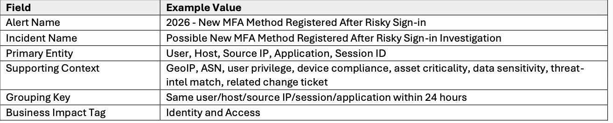

Grouping logic

• Group by same user and source IP when identity or cloud activity is involved.
• Group by same host, process, file hash or destination when endpoint activity is involved.
• Group by same mailbox, site, file repository or external recipient when email or data activity is involved.
• Group by same API token, endpoint, session or customer object when application/API activity is involved.
• Escalate to a higher-level incident when two or more categories appear in the same timeline.

Triage Questions 

• Is the user, host, application or service account expected to perform this activity?
• Is there an approved change, service request, incident ticket or business justification?
• Did the same entity trigger other related alerts before or after this event?
• Is the source IP, country, ASN, device, user-agent or session new for this entity?
• Is the affected asset, mailbox, data repository or application business-critical?
• Was the activity allowed, blocked, partially completed or only attempted?
• Is there evidence of data access, privilege change, control tampering, lateral movement or persistence?
• Should this be escalated to L2/L3, Incident Response, IAM, endpoint, cloud, network, application or risk/compliance
team?
• Was MFA satisfied normally, bypassed, repeatedly challenged or modified?
• Should active sessions or tokens be revoked while validation is ongoing?

Recommended Response Actions 

• Validate the alert against the simulated or real evidence timeline and preserve raw events.
• Enrich the entities with user role, asset owner, department, asset criticality, privilege level and recent activity.
• Check for matching activity across SIEM, EDR, identity, cloud, proxy, email, application and network telemetry.
• Escalate according to the incident classification and business impact, not only the technical event type.
• Document the final decision, containment actions, evidence and closure rationale in the case record.
• Consider session revocation, password reset, MFA reset, OAuth grant removal, conditional access review and account
disablement based on confirmation.
• Hunt for the same IP, application, token, user-agent, app ID or consent pattern across the tenant.

Possible False Positives

• Approved maintenance, migration, testing, vulnerability assessment or administrative activity.
• Known automation account, service integration, backup process, security tool, scanner or deployment platform.
• Business travel, remote work, vendor support activity or approved temporary access.
• False reputation match, geolocation inaccuracy, NAT/proxy aggregation or log parsing issue.
• Application behaviour change after release, patch, policy update or workflow redesign.

# usecase 5 : mfa disabled or authentication method removed

category : identity and access
mitre att&ck mapping : T1556 Modify Authentication Process; T1098 Account Manipulation

hypothesis : An account has mfa removed without a correspoding approved iam change, weakening identity protection 

Req log sources : 

    - entra id audit logs
    - iam change logs
    - timegenerated / event timestamp
    - user/account/service principal
    - host / device / asset
    - source-ip/dest-ip/geo/asn
    - action/result/status
    - application/resource/object

Building Blocks Design 

BB Authentication Control Change list 
BB Priviledge User list 
BB Approved IAM Change Tickets list 

Rule Creation logic 

rule MFA_Disabled_Privileged_User
{
  meta:
    author = "SOC"
    severity = "Critical"
    mitre_tactic = "Defense Evasion"

  events:

    $audit.metadata.event_type = "USER_RESOURCE_UPDATE"

    re.regex(
      $audit.additional.fields["activity_name"],
      `(?i)(disable.*mfa|remove.*authentication|delete.*authentication method)`
    )

    $audit.principal.user.userid = $user

    $vip.principal.user.userid = $user

    $vip.group.name = "Privileged Users"

  match:
    $user over 60m

  outcome:

    $risk_score =
      60 +
      if(#vip > 0,20,0)

  condition:

    #audit >= 1 and
    $risk_score >= 70
}

Alert Design 

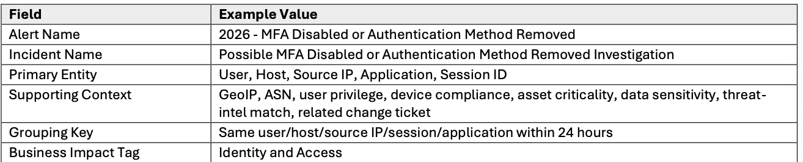

Grouping logic 

• Group by same user and source IP when identity or cloud activity is involved.
• Group by same host, process, file hash or destination when endpoint activity is involved.
• Group by same mailbox, site, file repository or external recipient when email or data activity is involved.
• Group by same API token, endpoint, session or customer object when application/API activity is involved.
• Escalate to a higher-level incident when two or more categories appear in the same timeline.

Traige Questions :

• Is the user, host, application or service account expected to perform this activity?
• Is there an approved change, service request, incident ticket or business justification?
• Did the same entity trigger other related alerts before or after this event?
• Is the source IP, country, ASN, device, user-agent or session new for this entity?
• Is the affected asset, mailbox, data repository or application business-critical?
• Was the activity allowed, blocked, partially completed or only attempted?
• Is there evidence of data access, privilege change, control tampering, lateral movement or persistence?
• Should this be escalated to L2/L3, Incident Response, IAM, endpoint, cloud, network, application or risk/compliance
team?
• Was MFA satisfied normally, bypassed, repeatedly challenged or modified?
• Should active sessions or tokens be revoked while validation is ongoing?

Recommended Response Actions : 

• Validate the alert against the simulated or real evidence timeline and preserve raw events.
• Enrich the entities with user role, asset owner, department, asset criticality, privilege level and recent activity.
• Check for matching activity across SIEM, EDR, identity, cloud, proxy, email, application and network telemetry.
• Escalate according to the incident classification and business impact, not only the technical event type.
• Document the final decision, containment actions, evidence and closure rationale in the case record.
• Consider session revocation, password reset, MFA reset, OAuth grant removal, conditional access review and account
disablement based on confirmation.
• Hunt for the same IP, application, token, user-agent, app ID or consent pattern across the tenant.

False Positive Actions : 

• Approved maintenance, migration, testing, vulnerability assessment or administrative activity.
• Known automation account, service integration, backup process, security tool, scanner or deployment platform.
• Business travel, remote work, vendor support activity or approved temporary access.
• False reputation match, geolocation inaccuracy, NAT/proxy aggregation or log parsing issue.
• Application behaviour change after release, patch, policy update or workflow redesign.

use-case 6 : password spray against multiple users

category : identity and access
mitre att&ck mapping : T1110.003 Password Spraying

hypothesis : one source ip tries a small number of passwords across many user accounts to avoid lockout thresholds

Log sources required : 
    - entra id sign-in logs
    - ad security logs 
    - vpn logs
    - waf login logs 
        - to capture the web attack evidence for password spray against multiple users , including the request uri, http method, payload pattern, ruleid, acion , response code, and whether any exploit attempt was blocked or allowed
    - timegenrated event timestamp
    - user/account/service principal
    - host / device / asset 
    - sourceip/destip/geo/asn
    - action / result / status
    - application / resource / object 

Building Blocks Design 

BB Failed login threshold 
BB External Source IP 
BB Known Scanner Exclusion 

Rule Creation logic 

rule Password_Spray_With_Risk_Context
{
  meta:
    severity = "High"

  events:

    $fail.metadata.event_type = "USER_LOGIN"

    $fail.security_result.action = "BLOCK"

    $fail.src.ip = $src_ip

    $fail.principal.user.userid = $user

    $risk.principal.user.userid = $user

    $risk.security_result.severity = "HIGH"

  match:
    $src_ip over 30m

  outcome:

    $risk_score =
      50 +
      if(#risk > 0,20,0)

  condition:

    #fail >= 20 and
    count_distinct($user) >= 10 and
    $risk_score >= 70
}

Alert Design 

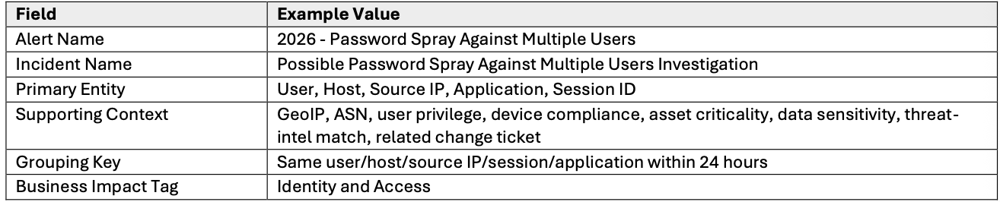

Grouping logic 

• Group by same user and source IP when identity or cloud activity is involved.
• Group by same host, process, file hash or destination when endpoint activity is involved.
• Group by same mailbox, site, file repository or external recipient when email or data activity is involved.
• Group by same API token, endpoint, session or customer object when application/API activity is involved.
• Escalate to a higher-level incident when two or more categories appear in the same timeline.

Triage Questions : 

• Is the user, host, application or service account expected to perform this activity?
• Is there an approved change, service request, incident ticket or business justification?
• Did the same entity trigger other related alerts before or after this event?
• Is the source IP, country, ASN, device, user-agent or session new for this entity?
• Is the affected asset, mailbox, data repository or application business-critical?
• Was the activity allowed, blocked, partially completed or only attempted?
• Is there evidence of data access, privilege change, control tampering, lateral movement or persistence?
• Should this be escalated to L2/L3, Incident Response, IAM, endpoint, cloud, network, application or risk/compliance
team?
• Was MFA satisfied normally, bypassed, repeatedly challenged or modified?
• Should active sessions or tokens be revoked while validation is ongoing?

Recommended Response Actions 

• Validate the alert against the simulated or real evidence timeline and preserve raw events.
• Enrich the entities with user role, asset owner, department, asset criticality, privilege level and recent activity.
• Check for matching activity across SIEM, EDR, identity, cloud, proxy, email, application and network telemetry.
• Escalate according to the incident classification and business impact, not only the technical event type.
• Document the final decision, containment actions, evidence and closure rationale in the case record.
• Consider session revocation, password reset, MFA reset, OAuth grant removal, conditional access review and account
disablement based on confirmation.
• Hunt for the same IP, application, token, user-agent, app ID or consent pattern across the tenant.

False Positives Possibilities 

• Approved maintenance, migration, testing, vulnerability assessment or administrative activity.
• Known automation account, service integration, backup process, security tool, scanner or deployment platform.
• Business travel, remote work, vendor support activity or approved temporary access.
• False reputation match, geolocation inaccuracy, NAT/proxy aggregation or log parsing issue.
• Application behaviour change after release, patch, policy update or workflow redesign.

# usecase 7 : targeted brute force against a priv account 

category : identity and access
mitre att&ck mapping : T1110 Brute Force; T1078 Valid Accounts

hypothesis : a domain admin or cloud admin account recieves a high number of failed logins from one or more external sources 

Req log sources : 
    - ad security logs
    - entra id security logs
    - pam logs 
        - to capture the priv session evidence for targeted brute force against a priv account to link admin activity to approved access requests, password checkouts, session recordings, commands-executed, target systems and vendor/user identity 
    - timegenerated/event-time stamp
    - user/account/service principal
    - host/device/asset
    - source-ip/destination-ip/geo/asn
    - action/result/status
    - application/resource/object 

Building Blocks Design 

BB Priv users list 
BB Critical Admin accounts list 
BB Failed login threshold 

Rule Creation logic 

rule Privileged_Bruteforce_High_Risk
{
  meta:
    severity = "Critical"

  events:

    $fail.metadata.event_type = "USER_LOGIN"

    $fail.security_result.action = "BLOCK"

    $fail.principal.user.userid = $user

    $fail.src.ip = $src_ip

    $ti.src.ip = $src_ip

    $privileged.principal.user.userid = $user

    $privileged.group.name = "Privileged Users"

  match:
    $user over 30m

  outcome:

    $risk_score =
      50 +
      if(#privileged > 0,20,0) +
      if(#ti > 0,20,0)

  condition:

    #fail >= 10 and
    #privileged > 0 and
    (
      #ti > 0
    ) and
    $risk_score >= 80
}

Alert Design 

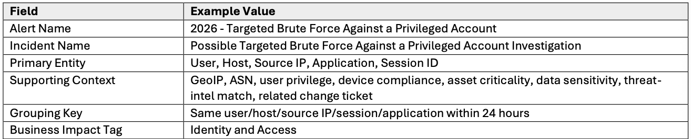

Grouping logic : 

• Group by same user and source IP when identity or cloud activity is involved.
• Group by same host, process, file hash or destination when endpoint activity is involved.
• Group by same mailbox, site, file repository or external recipient when email or data activity is involved.
• Group by same API token, endpoint, session or customer object when application/API activity is involved.
• Escalate to a higher-level incident when two or more categories appear in the same timeline.

Triage Questions : 

• Is the user, host, application or service account expected to perform this activity?
• Is there an approved change, service request, incident ticket or business justification?
• Did the same entity trigger other related alerts before or after this event?
• Is the source IP, country, ASN, device, user-agent or session new for this entity?
• Is the affected asset, mailbox, data repository or application business-critical?
• Was the activity allowed, blocked, partially completed or only attempted?
• Is there evidence of data access, privilege change, control tampering, lateral movement or persistence?
• Should this be escalated to L2/L3, Incident Response, IAM, endpoint, cloud, network, application or risk/compliance
team?
• Was MFA satisfied normally, bypassed, repeatedly challenged or modified?
• Should active sessions or tokens be revoked while validation is ongoing?

Recommended Response Actions : 

• Validate the alert against the simulated or real evidence timeline and preserve raw events.
• Enrich the entities with user role, asset owner, department, asset criticality, privilege level and recent activity.
• Check for matching activity across SIEM, EDR, identity, cloud, proxy, email, application and network telemetry.
• Escalate according to the incident classification and business impact, not only the technical event type.
• Document the final decision, containment actions, evidence and closure rationale in the case record.
• Consider session revocation, password reset, MFA reset, OAuth grant removal, conditional access review and account
disablement based on confirmation.
• Hunt for the same IP, application, token, user-agent, app ID or consent pattern across the tenant.

Possible False Possibilities : 

• Approved maintenance, migration, testing, vulnerability assessment or administrative activity.
• Known automation account, service integration, backup process, security tool, scanner or deployment platform.
• Business travel, remote work, vendor support activity or approved temporary access.
• False reputation match, geolocation inaccuracy, NAT/proxy aggregation or log parsing issue.
• Application behaviour change after release, patch, policy update or workflow redesign.

# usecase 8 : dormant account suddenly active

category : identity and access
mitre att&ck mapping : T1078 Valid Accounts

hypothesis : an account that has not logged in for more than 90 days suddenly authenticates to vpn or cloud email 

req cloud sources :

    - ad security logs 
    - entra id sign-in logs
    - hr feed status
    - iam lifecycle
    - timegenerated/event timestamp
    - user/account/service princicpal
    - host/device/asset
    - sourceip/destip/geo/ip
    - action/result/status
    - application/resource/object

Building Blocks Design 

BB Dormant Account 60 days 
BB Terminated Users
BB Non-Human Account Exclusion

Rule Creation Logic

rule Dormant_Account_Activated_With_Risk
{
  meta:
    severity = "Critical"

  events:

    $login.metadata.event_type = "USER_LOGIN"

    $login.security_result.action = "ALLOW"

    $login.principal.user.userid = $user

    $dormant.principal.user.userid = $user

    $dormant.security_result.summary = "DORMANT_ACCOUNT"

    $risk.principal.user.userid = $user

    $risk.security_result.severity = "HIGH"

    $terminated.principal.user.userid = $user

    $terminated.security_result.summary = "TERMINATED_USER"

  match:
    $user over 60m

  outcome:

    $risk_score =
      50 +
      if(#risk > 0,20,0) +
      if(#terminated > 0,30,0)

  condition:

    #login > 0 and
    #dormant > 0 and
    (
      #risk > 0 or
      #terminated > 0
    ) and
    $risk_score >= 70
}

Alert Design 

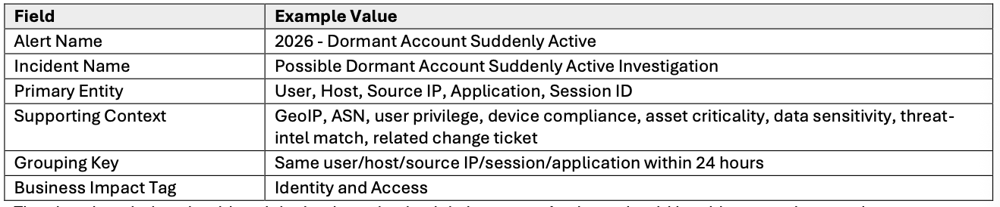

Grouping logic 

• Group by same user and source IP when identity or cloud activity is involved.
• Group by same host, process, file hash or destination when endpoint activity is involved.
• Group by same mailbox, site, file repository or external recipient when email or data activity is involved.
• Group by same API token, endpoint, session or customer object when application/API activity is involved.
• Escalate to a higher-level incident when two or more categories appear in the same timeline.

Traige Questions 

• Is the user, host, application or service account expected to perform this activity?
• Is there an approved change, service request, incident ticket or business justification?
• Did the same entity trigger other related alerts before or after this event?
• Is the source IP, country, ASN, device, user-agent or session new for this entity?
• Is the affected asset, mailbox, data repository or application business-critical?
• Was the activity allowed, blocked, partially completed or only attempted?
• Is there evidence of data access, privilege change, control tampering, lateral movement or persistence?
• Should this be escalated to L2/L3, Incident Response, IAM, endpoint, cloud, network, application or risk/compliance
team?
• Was MFA satisfied normally, bypassed, repeatedly challenged or modified?
• Should active sessions or tokens be revoked while validation is ongoing?

Recommended Response Actions 

• Validate the alert against the simulated or real evidence timeline and preserve raw events.
• Enrich the entities with user role, asset owner, department, asset criticality, privilege level and recent activity.
• Check for matching activity across SIEM, EDR, identity, cloud, proxy, email, application and network telemetry.
• Escalate according to the incident classification and business impact, not only the technical event type.
• Document the final decision, containment actions, evidence and closure rationale in the case record.
• Consider session revocation, password reset, MFA reset, OAuth grant removal, conditional access review and account
disablement based on confirmation.
• Hunt for the same IP, application, token, user-agent, app ID or consent pattern across the tenant.

False Positive Possibilities 

• Approved maintenance, migration, testing, vulnerability assessment or administrative activity.
• Known automation account, service integration, backup process, security tool, scanner or deployment platform.
• Business travel, remote work, vendor support activity or approved temporary access.
• False reputation match, geolocation inaccuracy, NAT/proxy aggregation or log parsing issue.
• Application behaviour change after release, patch, policy update or workflow redesign.

use-case 9 : disabled account authentication attempt

category : identity and access
mitre att&ck mapping : T1078 valid account

hypothesis : a disabled or deprovised account is being used in an authentication attempt indicating stale credentials or password reuse testing 

req log sources : 

    - ad security logs
    - entra id sign-in logs
    - vpn logs
    - timegenerated / eventime
    - user/account/service principal
    - host / device / asset
    - action / result / status 
    - application / resource / object 

Building Blocks Design 

BB Disabled Accounts list 
BB External Source IPs
BB Known Scanner Exclusions

Rule Creation Logic 

rule Disabled_Account_Login_Attempt_With_Context
{
  meta:
    severity = "High"
    mitre_tactic = "Credential Access"

  events:

    $login.metadata.event_type = "USER_LOGIN"

    $login.security_result.action = "BLOCK"

    $login.principal.user.userid = $user

    $login.src.ip = $src_ip

    $risk.principal.user.userid = $user

    $risk.security_result.severity = "HIGH"

    $ti.src.ip = $src_ip

  match:
    $user over 30m

  outcome:

    $risk_score =
      40 +
      if(#risk > 0,20,0) +
      if(#ti > 0,20,0)

  condition:

    #login >= 1 and
    (
      #risk > 0 or
      #ti > 0
    ) and
    $risk_score >= 60
}

Alert Design 

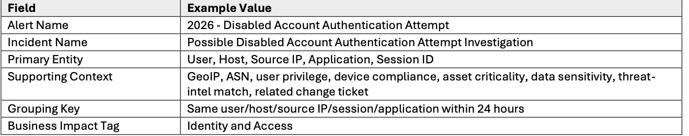

Grouping logic 

• Group by same user and source IP when identity or cloud activity is involved.
• Group by same host, process, file hash or destination when endpoint activity is involved.
• Group by same mailbox, site, file repository or external recipient when email or data activity is involved.
• Group by same API token, endpoint, session or customer object when application/API activity is involved.
• Escalate to a higher-level incident when two or more categories appear in the same timeline.

Triaging Questions : 

• Is the user, host, application or service account expected to perform this activity?
• Is there an approved change, service request, incident ticket or business justification?
• Did the same entity trigger other related alerts before or after this event?
• Is the source IP, country, ASN, device, user-agent or session new for this entity?
• Is the affected asset, mailbox, data repository or application business-critical?
• Was the activity allowed, blocked, partially completed or only attempted?
• Is there evidence of data access, privilege change, control tampering, lateral movement or persistence?
• Should this be escalated to L2/L3, Incident Response, IAM, endpoint, cloud, network, application or risk/compliance
team?
• Was MFA satisfied normally, bypassed, repeatedly challenged or modified?
• Should active sessions or tokens be revoked while validation is ongoing?

Response Actions 

Validate the alert against the simulated or real evidence timeline and preserve raw events.
• Enrich the entities with user role, asset owner, department, asset criticality, privilege level and recent activity.
• Check for matching activity across SIEM, EDR, identity, cloud, proxy, email, application and network telemetry.
• Escalate according to the incident classification and business impact, not only the technical event type.
• Document the final decision, containment actions, evidence and closure rationale in the case record.
• Consider session revocation, password reset, MFA reset, OAuth grant removal, conditional access review and account
disablement based on confirmation.
• Hunt for the same IP, application, token, user-agent, app ID or consent pattern across the tenant.

Possible False Positives 

• Approved maintenance, migration, testing, vulnerability assessment or administrative activity.
• Business travel, remote work, vendor support activity or approved temporary access.
• Known automation account, service integration, backup process, security tool, scanner or deployment platform.
• False reputation match, geolocation inaccuracy, NAT/proxy aggregation or log parsing issue.
• Application behaviour change after release, patch, policy update or workflow redesign.

# usecase 10 : admin login from unmanaged or non-compliant device

category : identity and access
mitre att&ck mapping : T1078.004 Cloud Accounts

hypothesis : a priviledged user sigin-ins to an admin portal using a device not managed by the organisation 

Req log sources : 
    - entra id sign-in logs
    - device compliance logs
        - identify the endpoint, server , cloud workload or application component connection to admin login from unmanaged or non-compliant device to check and determine whether the activity affected a normal workstation, critical server, domain controller , payment application or internet-facing service
    - mdm logs
        - to check for supporting evidence for admin login from unmanaged or non-compliant device.
        - to check for telemetry that the event has occurred and whether this action leads to any other suspicious action on the timeline
    - timegenerated / event-time logs
    - user/account/service principal logs
    - host/device/asset
    - sourceip/dest-ip/geo/asn
    - action/result/status
    - application/resource/object

Building Blocks Design

BB Priviledged Users
BB Compliant Devices
BB Admin Portals

Rule Creation Logic 

rule Privileged_Admin_Login_NonCompliant_Device
{
  meta:
    severity = "Critical"

  events:

    $login.metadata.event_type = "USER_LOGIN"

    $login.principal.user.userid = $user

    $privileged.principal.user.userid = $user

    $privileged.group.name = "Privileged Users"

    $device.principal.user.userid = $user

    $device.security_result.summary = "NON_COMPLIANT"

  match:
    $user over 30m

  outcome:

    $risk_score =
      50 +
      if(#privileged > 0,20,0) +
      if(#device > 0,20,0)

  condition:

    #login > 0 and
    #privileged > 0 and
    #device > 0 and
    $risk_score >= 70
}

Alert Design 

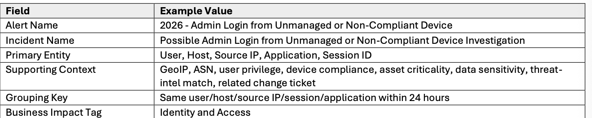

Grouping logic 

• Group by same user and source IP when identity or cloud activity is involved.
• Group by same host, process, file hash or destination when endpoint activity is involved.
• Group by same mailbox, site, file repository or external recipient when email or data activity is involved.
• Group by same API token, endpoint, session or customer object when application/API activity is involved.
• Escalate to a higher-level incident when two or more categories appear in the same timeline

Triage Questions

• Is the user, host, application or service account expected to perform this activity?
• Is there an approved change, service request, incident ticket or business justification?
• Did the same entity trigger other related alerts before or after this event?
• Is the source IP, country, ASN, device, user-agent or session new for this entity?
• Is the affected asset, mailbox, data repository or application business-critical?
• Was the activity allowed, blocked, partially completed or only attempted?
• Is there evidence of data access, privilege change, control tampering, lateral movement or persistence?
• Should this be escalated to L2/L3, Incident Response, IAM, endpoint, cloud, network, application or risk/compliance
team?
• Was MFA satisfied normally, bypassed, repeatedly challenged or modified?
• Should active sessions or tokens be revoked while validation is ongoing?

Recommended Response Actions

• Validate the alert against the simulated or real evidence timeline and preserve raw events.
• Enrich the entities with user role, asset owner, department, asset criticality, privilege level and recent activity.
• Check for matching activity across SIEM, EDR, identity, cloud, proxy, email, application and network telemetry.
• Escalate according to the incident classification and business impact, not only the technical event type.
• Document the final decision, containment actions, evidence and closure rationale in the case record.
• Consider session revocation, password reset, MFA reset, OAuth grant removal, conditional access review and account
disablement based on confirmation.
• Hunt for the same IP, application, token, user-agent, app ID or consent pattern across the tenant.

False Positive Possibilities

• Approved maintenance, migration, testing, vulnerability assessment or administrative activity.
• Known automation account, service integration, backup process, security tool, scanner or deployment platform.
• Business travel, remote work, vendor support activity or approved temporary access.
• False reputation match, geolocation inaccuracy, NAT/proxy aggregation or log parsing issue.
• Application behaviour change after release, patch, policy update or workflow redesign.

# usecase 11 : priviledged login outside the normal operating window

category : identity and access
mitre att&ck mapping : T1078 Valid Accounts

hypothesis : A priviledged account is used at 12:00 without an approved change request or incident record

Required log sources
    - PAM logs
    - AD security logs
    - entra id sign-in logs
    - change management feed
    - timegenerated / eventtime stamps
    - user/account/service principal
    - host/device/asset
    - sourceip/destip/geo/asn
    - action/result/status
    - application/resource/object

Building Blocks Design 

BB Priviledged Users
BB Approved Change window 
BB Emergency Access Accounts

Rule Creation logic

rule Privileged_Login_Out_Of_Hours_Risk_Context
{
  meta:
    severity = "Critical"

  events:

    $login.metadata.event_type = "USER_LOGIN"

    $login.security_result.action = "ALLOW"

    $login.principal.user.userid = $user

    $privileged.principal.user.userid = $user

    $privileged.group.name = "Privileged Users"

    $after_hours.principal.user.userid = $user

    $after_hours.security_result.summary = "OUTSIDE_NORMAL_HOURS"

    $risk.principal.user.userid = $user

    $risk.security_result.severity = "HIGH"

    $device.principal.user.userid = $user

    $device.security_result.summary = "NON_COMPLIANT"

  match:
    $user over 60m

  outcome:

    $risk_score =
      50 +
      if(#privileged > 0,20,0) +
      if(#risk > 0,10,0) +
      if(#device > 0,10,0)

  condition:

    #login > 0 and
    #privileged > 0 and
    #after_hours > 0 and
    $risk_score >= 80
}

Alert Design

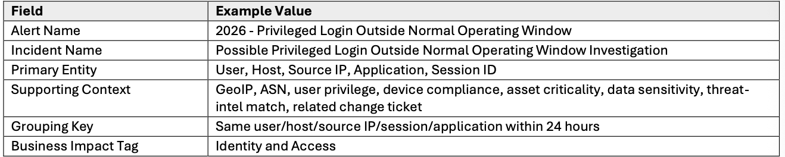

Grouping logic

• Group by same user and source IP when identity or cloud activity is involved.
• Group by same host, process, file hash or destination when endpoint activity is involved.
• Group by same mailbox, site, file repository or external recipient when email or data activity is involved.
• Group by same API token, endpoint, session or customer object when application/API activity is involved.
• Escalate to a higher-level incident when two or more categories appear in the same timeline.

Triaging Questions

• Is the user, host, application or service account expected to perform this activity?
• Is there an approved change, service request, incident ticket or business justification?
• Did the same entity trigger other related alerts before or after this event?
• Is the source IP, country, ASN, device, user-agent or session new for this entity?
• Is the affected asset, mailbox, data repository or application business-critical?
• Was the activity allowed, blocked, partially completed or only attempted?
• Is there evidence of data access, privilege change, control tampering, lateral movement or persistence?
• Should this be escalated to L2/L3, Incident Response, IAM, endpoint, cloud, network, application or risk/compliance
team?
• Was MFA satisfied normally, bypassed, repeatedly challenged or modified?
• Should active sessions or tokens be revoked while validation is ongoing?

Recommended Response Actions

• Validate the alert against the simulated or real evidence timeline and preserve raw events.
• Enrich the entities with user role, asset owner, department, asset criticality, privilege level and recent activity.
• Check for matching activity across SIEM, EDR, identity, cloud, proxy, email, application and network telemetry.
• Escalate according to the incident classification and business impact, not only the technical event type.
• Document the final decision, containment actions, evidence and closure rationale in the case record.
• Consider session revocation, password reset, MFA reset, OAuth grant removal, conditional access review and account
disablement based on confirmation.
• Hunt for the same IP, application, token, user-agent, app ID or consent pattern across the tenant.

False Positive Possibilities

• Approved maintenance, migration, testing, vulnerability assessment or administrative activity.
• Known automation account, service integration, backup process, security tool, scanner or deployment platform.
• Business travel, remote work, vendor support activity or approved temporary access.
• False reputation match, geolocation inaccuracy, NAT/proxy aggregation or log parsing issue.
• Application behaviour change after release, patch, policy update or workflow redesign.

# usecase 12 : succesfull legacy authentication to cloud mailbox

category : identity and access

mitre att&ck mapping : T1078.004 Cloud Accounts

hypothesis : a mailbox is accessed using legacy/basic authentication that bypasses modern conditional access expectations

Required log sources : 

    - entra id sign-in logs
    - exchange online logs
        - check for post-authentication activity for succesfull legacy authentication to cloud mailbox
        - show what the user did after login such as mailbox access, inbox rule creation, file sharing , teams activity, onedrive sync, sharepoint access and admin changes
    - timegenerated/event time
    - user/account/service principal
    - host/device/assets
    - sourceip/destip/geo/asn
    - action/result/status
    - application/resource/object

Building Blocks Design 

BB legacy auth protocols watchlist
BB Sensitive Mailboxes
BB Approved Legacy Exceptions

Rule Creation Logic 

rule Legacy_Authentication_Sensitive_Mailbox
{
  meta:
    severity = "High"

  events:

    $login.metadata.event_type = "USER_LOGIN"

    $login.security_result.action = "ALLOW"

    $login.principal.user.userid = $user

    re.regex(
      $login.network.application_protocol,
      `(?i)(imap|pop3|smtp|activesync)`
    )

    $mailbox.principal.user.userid = $user

    $mailbox.security_result.summary = "SENSITIVE_MAILBOX"

  match:
    $user over 60m

  outcome:

    $risk_score =
      50 +
      if(#mailbox > 0,20,0)

  condition:

    #login > 0 and
    #mailbox > 0 and
    $risk_score >= 70
}

Alert design 

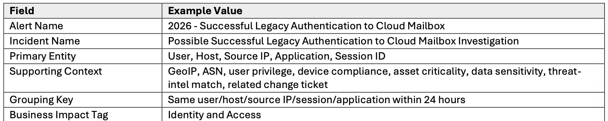

Grouping Logic

• Group by same user and source IP when identity or cloud activity is involved.
• Group by same host, process, file hash or destination when endpoint activity is involved.
• Group by same mailbox, site, file repository or external recipient when email or data activity is involved.
• Group by same API token, endpoint, session or customer object when application/API activity is involved.
• Escalate to a higher-level incident when two or more categories appear in the same timeline.

Triage Questions 

• Is the user, host, application or service account expected to perform this activity?
• Is there an approved change, service request, incident ticket or business justification?
• Did the same entity trigger other related alerts before or after this event?
• Is the source IP, country, ASN, device, user-agent or session new for this entity?
• Is the affected asset, mailbox, data repository or application business-critical?
• Was the activity allowed, blocked, partially completed or only attempted?
• Is there evidence of data access, privilege change, control tampering, lateral movement or persistence?
• Should this be escalated to L2/L3, Incident Response, IAM, endpoint, cloud, network, application or risk/compliance
team?
• Was MFA satisfied normally, bypassed, repeatedly challenged or modified?
• Should active sessions or tokens be revoked while validation is ongoing?

Recommended Response Actions

• Validate the alert against the simulated or real evidence timeline and preserve raw events.
• Enrich the entities with user role, asset owner, department, asset criticality, privilege level and recent activity.
• Check for matching activity across SIEM, EDR, identity, cloud, proxy, email, application and network telemetry.
• Escalate according to the incident classification and business impact, not only the technical event type.
• Document the final decision, containment actions, evidence and closure rationale in the case record.
• Consider session revocation, password reset, MFA reset, OAuth grant removal, conditional access review and account
disablement based on confirmation.
• Hunt for the same IP, application, token, user-agent, app ID or consent pattern across the tenant.

False Positive Possibilities

• Approved maintenance, migration, testing, vulnerability assessment or administrative activity.
• Known automation account, service integration, backup process, security tool, scanner or deployment platform.
• Business travel, remote work, vendor support activity or approved temporary access.
• False reputation match, geolocation inaccuracy, NAT/proxy aggregation or log parsing issue.
• Application behaviour change after release, patch, policy update or workflow redesign.

# usecase 13 : login from anon proxy or tor exit node

category : identity and access
mitre att&ck mapping : T1090 Proxy; T1078 Valid Accounts

hypothesis : A valid user login originates from anon infra and is followed by cloud resource access

Req log sources : 
    - entra id sign-in logs
    - vpn logs
        - check for remote access activity related to login from anon proxy or tor exit nodes, including login time, public source ip, assigned internal ip, vpn gateway, session duration and disconnect reason
    - threat intel geoip
        - check for the network origin and destination of activity linked to login from anon proxy or tor exit node
        - check for new countries, high risk asns, hosting providers, anonmyisation services, external commmand infra, internal lateral mov and unusal access paths
    - timegenerated/eventtime
    - user / account / service principal
    - host / device / asset
    - sourceip/destip/geo/asn
    - action/result/status
    - application/resource/object

Building Blocks Design 

BB Anon Proxy IP list 
BB Tor Exit Node List 
BB Approved VPN Provider list 

Rule Creation logic

rule Login_From_TOR_High_Risk_User
{
  meta:
    severity = "High"

  events:

    $login.metadata.event_type = "USER_LOGIN"

    $login.security_result.action = "ALLOW"

    $login.principal.user.userid = $user

    $login.src.ip = $src_ip

    $ti.src.ip = $src_ip

    $ti.security_result.summary = "TOR_EXIT_NODE"

    $risk.principal.user.userid = $user

    $risk.security_result.severity = "HIGH"

  match:
    $user over 60m

  outcome:

    $risk_score =
      50 +
      if(#risk > 0,20,0)

  condition:

    #login > 0 and
    #ti > 0 and
    $risk_score >= 70
}

Alert design 

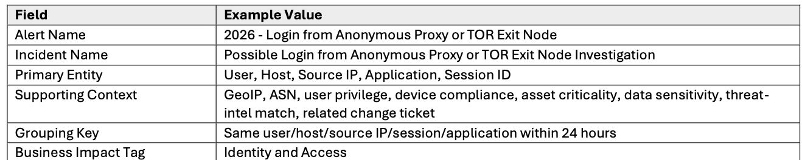

Grouping logic

• Group by same user and source IP when identity or cloud activity is involved.
• Group by same host, process, file hash or destination when endpoint activity is involved.
• Group by same mailbox, site, file repository or external recipient when email or data activity is involved.
• Group by same API token, endpoint, session or customer object when application/API activity is involved.
• Escalate to a higher-level incident when two or more categories appear in the same timeline.

Triage Questions 

• Is the user, host, application or service account expected to perform this activity?
• Is there an approved change, service request, incident ticket or business justification?
• Did the same entity trigger other related alerts before or after this event?
• Is the source IP, country, ASN, device, user-agent or session new for this entity?
• Is the affected asset, mailbox, data repository or application business-critical?
• Was the activity allowed, blocked, partially completed or only attempted?
• Is there evidence of data access, privilege change, control tampering, lateral movement or persistence?
• Should this be escalated to L2/L3, Incident Response, IAM, endpoint, cloud, network, application or risk/compliance
team?
• Was MFA satisfied normally, bypassed, repeatedly challenged or modified?
• Should active sessions or tokens be revoked while validation is ongoing?

Recommended Response Actions

• Validate the alert against the simulated or real evidence timeline and preserve raw events.
• Enrich the entities with user role, asset owner, department, asset criticality, privilege level and recent activity.
• Check for matching activity across SIEM, EDR, identity, cloud, proxy, email, application and network telemetry.
• Escalate according to the incident classification and business impact, not only the technical event type.
• Document the final decision, containment actions, evidence and closure rationale in the case record.
• Consider session revocation, password reset, MFA reset, OAuth grant removal, conditional access review and account
disablement based on confirmation.
• Hunt for the same IP, application, token, user-agent, app ID or consent pattern across the tenant.

Possible False Positives

• Approved maintenance, migration, testing, vulnerability assessment or administrative activity.
• Known automation account, service integration, backup process, security tool, scanner or deployment platform.
• Business travel, remote work, vendor support activity or approved temporary access.
• False reputation match, geolocation inaccuracy, NAT/proxy aggregation or log parsing issue.
• Application behaviour change after release, patch, policy update or workflow redesign.

# usecase 14 : Session token replay across unusal asn or device

Category : identity and access
mitre Att&ck mapping : T1550 Use Alternate Authentication Material 

hypothesis : A user session appears to continue from a diff network and device without normal mfa flow.

Required log sources : 
    - entra id sign-in logs
    - m365 audit 
      - provides post-auth activity data for session token replay across unusal asn or device
      - shows what the user or application did after login, such as mailbox access, inbox rule creation, file download, file sharing, teams activity, one-drive sync, sharepoint access and admin changes
    - casb logs
      - shows the data protection evidence for session replay token across unusal asn or device 
      - dlp/casb telemetry confirms whether the sensitive data was uploaded, shared, pasted, copied, synchronized or transferred to external services
    - Proxy logs
      - shows outbount web access linked to session token replay across unusal asn or device, including url, domain, category, including url, domain, category, upload/download-size, http method, user-agent, action and reputation.
      - helps in confirming phishing clicks, payload downloads, c2, exfils, or unapproved ai/cloud tool usage.
    - TimeGenerated / EventTime
    - User/Account/Service Principal
    - Host / Device / Asset
    - Sourceip/destip/geo/asn
    - Action / Result / Status
    - Application / Resource / Object

Building Blocks Design 

BB New Device for user
BB New ASN for user
BB MFA Not satisfied
BB Sensitive Apps

Rule Creation logic 

rule Session_Token_Replay_New_Device_New_ASN
{
  meta:
    severity = "Critical"

  events:

    $session.metadata.event_type = "USER_LOGIN"

    $session.security_result.action = "ALLOW"

    $session.principal.user.userid = $user

    $new_device.principal.user.userid = $user

    $new_device.security_result.summary = "NEW_DEVICE"

    $new_asn.principal.user.userid = $user

    $new_asn.security_result.summary = "NEW_ASN"

  match:
    $user over 30m

  outcome:

    $risk_score =
      50 +
      if(#new_device > 0,15,0) +
      if(#new_asn > 0,15,0)

  condition:

    #session > 0 and
    (
      #new_device > 0 or
      #new_asn > 0
    ) and
    $risk_score >= 70
}

Alert Design 

Grouping logic

• Group by same user and source IP when identity or cloud activity is involved.
• Group by same host, process, file hash or destination when endpoint activity is involved.
• Group by same mailbox, site, file repository or external recipient when email or data activity is involved.
• Group by same API token, endpoint, session or customer object when application/API activity is involved.
• Escalate to a higher-level incident when two or more categories appear in the same timeline.

Triage Questions 

• Is the user, host, application or service account expected to perform this activity?
• Is there an approved change, service request, incident ticket or business justification?
• Did the same entity trigger other related alerts before or after this event?
• Is the source IP, country, ASN, device, user-agent or session new for this entity?
• Is the affected asset, mailbox, data repository or application business-critical?
• Was the activity allowed, blocked, partially completed or only attempted?
• Is there evidence of data access, privilege change, control tampering, lateral movement or persistence?
• Should this be escalated to L2/L3, Incident Response, IAM, endpoint, cloud, network, application or risk/compliance
team?
• Was MFA satisfied normally, bypassed, repeatedly challenged or modified?
• Should active sessions or tokens be revoked while validation is ongoing?

Recommended Response Actions : 

• Validate the alert against the simulated or real evidence timeline and preserve raw events.
• Enrich the entities with user role, asset owner, department, asset criticality, privilege level and recent activity.
• Check for matching activity across SIEM, EDR, identity, cloud, proxy, email, application and network telemetry.
• Escalate according to the incident classification and business impact, not only the technical event type.
• Document the final decision, containment actions, evidence and closure rationale in the case record.
• Consider session revocation, password reset, MFA reset, OAuth grant removal, conditional access review and account
disablement based on confirmation.
• Hunt for the same IP, application, token, user-agent, app ID or consent pattern across the tenant.

False Positive Possibilities :

• Approved maintenance, migration, testing, vulnerability assessment or administrative activity.
• Known automation account, service integration, backup process, security tool, scanner or deployment platform.
• Business travel, remote work, vendor support activity or approved temporary access.
• False reputation match, geolocation inaccuracy, NAT/proxy aggregation or log parsing issue.
• Application behaviour change after release, patch, policy update or workflow redesign.

# usecase 15 : Risky Sign-in Followed by Sensitive Application Access

Category : Identity and access
mitre att&ck mapping : T1078 Valid Accounts; T1530 Data from Cloud Storage

hypothesis : A suspicious sign-in followed by access to HR, finance or customer-data platforms

Required log sources : 

    - entra-id sign-in logs
    - m365 audit
    - saas audit logs
      - check for supporting evidence for risky-sign-ins followed by sensitive application access
      - in order to confirm whether this telemetry proves the event occurred, whether the action succeeded and whether it links to other sus activities in the same timeline
    - casb logs
    - timegenerated/eventTimestamp
    - user/account/serviceprincipal
    - host/user/device
    - sourceip/geo/destip/asn
    - application/resource/object

Building Blocks Design 

BB Risky Sign-in 
BB Sensitive Applications
BB Critical Data Exposure

Rule Creation Logic

rule Risky_Signin_Sensitive_App_Access
{
  meta:
    severity = "Critical"

  events:

    $signin.metadata.event_type = "USER_LOGIN"

    $signin.security_result.severity = "HIGH"

    $signin.principal.user.userid = $user

    $access.metadata.event_type = "RESOURCE_ACCESS"

    $access.principal.user.userid = $user

    $sensitive_app.principal.user.userid = $user

    $sensitive_app.security_result.summary = "SENSITIVE_APPLICATION"

  match:
    $user over 30m

  outcome:

    $risk_score =
      50 +
      if(#sensitive_app > 0,20,0)

  condition:

    #signin > 0 and
    #access > 0 and
    #sensitive_app > 0 and
    $risk_score >= 70
}

Alert Design 

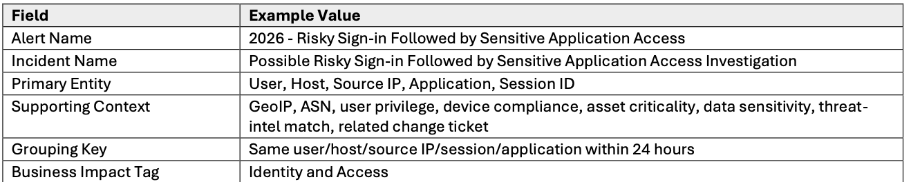

Grouping Logic 

• Group by same user and source IP when identity or cloud activity is involved.
• Group by same host, process, file hash or destination when endpoint activity is involved.
• Group by same mailbox, site, file repository or external recipient when email or data activity is involved.
• Group by same API token, endpoint, session or customer object when application/API activity is involved.
• Escalate to a higher-level incident when two or more categories appear in the same timeline.

Triage Questions

• Is the user, host, application or service account expected to perform this activity?
• Is there an approved change, service request, incident ticket or business justification?
• Did the same entity trigger other related alerts before or after this event?
• Is the source IP, country, ASN, device, user-agent or session new for this entity?
• Is the affected asset, mailbox, data repository or application business-critical?
• Was the activity allowed, blocked, partially completed or only attempted?
• Is there evidence of data access, privilege change, control tampering, lateral movement or persistence?
• Should this be escalated to L2/L3, Incident Response, IAM, endpoint, cloud, network, application or risk/compliance
team?
• Was MFA satisfied normally, bypassed, repeatedly challenged or modified?
• Should active sessions or tokens be revoked while validation is ongoing?

Recommended Response Actions

• Validate the alert against the simulated or real evidence timeline and preserve raw events.
• Enrich the entities with user role, asset owner, department, asset criticality, privilege level and recent activity.
• Check for matching activity across SIEM, EDR, identity, cloud, proxy, email, application and network telemetry.
• Escalate according to the incident classification and business impact, not only the technical event type.
• Document the final decision, containment actions, evidence and closure rationale in the case record.
• Consider session revocation, password reset, MFA reset, OAuth grant removal, conditional access review and account
disablement based on confirmation.
• Hunt for the same IP, application, token, user-agent, app ID or consent pattern across the tenant.

False Positive Possibilities

• Approved maintenance, migration, testing, vulnerability assessment or administrative activity.
• Known automation account, service integration, backup process, security tool, scanner or deployment platform.
• Business travel, remote work, vendor support activity or approved temporary access.
• False reputation match, geolocation inaccuracy, NAT/proxy aggregation or log parsing issue.
• Application behaviour change after release, patch, policy update or workflow redesign.

# usecase 16 : user added to domain admins or global admins

category : priviledged user , ad and pam 
mitre att&ck mapping : T1098 Account manipulation; T1078 Valid Accounts

hypothesis : A normal account is added to a high-priv group outside a documented change window

Required log sources :

    - ad security logs
    - entra id audit logs
    - pam logs
    - timegenerated/eventtime
    - user/account/service principal
    - sourceip/destip/geo/asn
    - action/result/status
    - application/resource/object
  

Building Block Design 

BB Priviledged Groups
BB Approved change tickets
BB Break Glass Accounts

Rule Creation Logic

rule User_Added_To_Domain_Admins
{
  meta:
    severity = "Critical"
    mitre_tactic = "Privilege Escalation"

  events:

    $change.metadata.event_type = "GROUP_MODIFICATION"

    $change.principal.user.userid = $actor

    $change.target.user.userid = $target_user

    $change.target.group.group_display_name = $group

    re.regex(
      $group,
      `(?i)(domain admins|enterprise admins|global admins)`
    )

  match:
    $target_user over 30m

  outcome:

    $risk_score = 90

  condition:

    #change > 0
}

Alert Design 

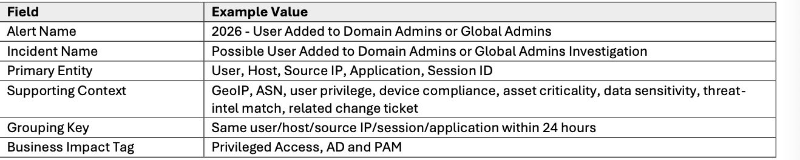

Grouping logic 

• Group by same user and source IP when identity or cloud activity is involved.
• Group by same host, process, file hash or destination when endpoint activity is involved.
• Group by same mailbox, site, file repository or external recipient when email or data activity is involved.
• Group by same API token, endpoint, session or customer object when application/API activity is involved.
• Escalate to a higher-level incident when two or more categories appear in the same timeline.

Triage Questions

• Is the user, host, application or service account expected to perform this activity?
• Is there an approved change, service request, incident ticket or business justification?
• Did the same entity trigger other related alerts before or after this event?
• Is the source IP, country, ASN, device, user-agent or session new for this entity?
• Is the affected asset, mailbox, data repository or application business-critical?
• Was the activity allowed, blocked, partially completed or only attempted?
• Is there evidence of data access, privilege change, control tampering, lateral movement or persistence?
• Should this be escalated to L2/L3, Incident Response, IAM, endpoint, cloud, network, application or risk/compliance
team?

Recommended Response Actions

• Validate the alert against the simulated or real evidence timeline and preserve raw events.
• Enrich the entities with user role, asset owner, department, asset criticality, privilege level and recent activity.
• Check for matching activity across SIEM, EDR, identity, cloud, proxy, email, application and network telemetry.
• Escalate according to the incident classification and business impact, not only the technical event type.
• Document the final decision, containment actions, evidence and closure rationale in the case record.

False Positive Possibilities

• Approved maintenance, migration, testing, vulnerability assessment or administrative activity.
• Known automation account, service integration, backup process, security tool, scanner or deployment platform.
• Business travel, remote work, vendor support activity or approved temporary access.
• False reputation match, geolocation inaccuracy, NAT/proxy aggregation or log parsing issue.
• Application behaviour change after release, patch, policy update or workflow redesign.

# uscase 17 : DCSync or Directory Replication Abuse Indicator 

Category : Priviledged Access, AD and PAM
mitre Att&ck mapping : T1003.006 DCSync

hypothesis : a non-domain controller account performs replication-like directory access that may indicate credential theft attempt

Req log sources :
    - ad directory service logs
      - provides supporting evidence for dcsync or directory replication abuse indicator
    - windows security logs
    - EDR
      - provides the endpoint execution and host level evidence for dcsync directory replication abuse indicator.
    - TimeGenerated/EventTimestamp
    - User/Account/Service Principal
    - Host/Device/Asset
    - Sourceip/Destip/geo/asn
    - Action/Result/Status
    - Application/Resource/Object

Building Block Design 

BB Domain Controllers list
BB Approved Replication Accounts
BB Priviledged Users

Rule Creation logic 

rule DCSync_From_Non_DC
{
  meta:
    severity = "Critical"

  events:

    $replication.metadata.event_type =
      "DIRECTORY_SERVICE_ACCESS"

    re.regex(
      $replication.security_result.summary,
      `(?i)(
        replication-get-changes|
        replication-get-changes-all|
        replication-get-changes-in-filtered-set
      )`
    )

    $replication.principal.user.userid = $user

    $replication.principal.hostname = $host

  match:
    $host over 30m

  condition:

    #replication > 0
}

Alert Design 

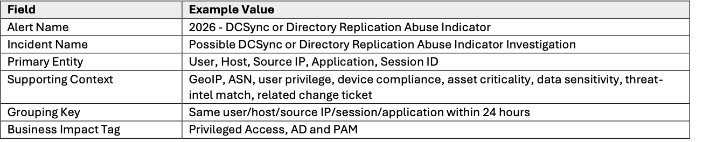

Grouping Logic 

• Group by same user and source IP when identity or cloud activity is involved.
• Group by same host, process, file hash or destination when endpoint activity is involved.
• Group by same mailbox, site, file repository or external recipient when email or data activity is involved.
• Group by same API token, endpoint, session or customer object when application/API activity is involved.
• Escalate to a higher-level incident when two or more categories appear in the same timeline.

Triage Questions

• Is the user, host, application or service account expected to perform this activity?
• Is there an approved change, service request, incident ticket or business justification?
• Did the same entity trigger other related alerts before or after this event?
• Is the source IP, country, ASN, device, user-agent or session new for this entity?
• Is the affected asset, mailbox, data repository or application business-critical?
• Was the activity allowed, blocked, partially completed or only attempted?
• Is there evidence of data access, privilege change, control tampering, lateral movement or persistence?
• Should this be escalated to L2/L3, Incident Response, IAM, endpoint, cloud, network, application or risk/compliance
team?

Recommended Response Actions

• Validate the alert against the simulated or real evidence timeline and preserve raw events.
• Enrich the entities with user role, asset owner, department, asset criticality, privilege level and recent activity.
• Check for matching activity across SIEM, EDR, identity, cloud, proxy, email, application and network telemetry.
• Escalate according to the incident classification and business impact, not only the technical event type.
• Document the final decision, containment actions, evidence and closure rationale in the case record.

False Positive Possibilities

• Approved maintenance, migration, testing, vulnerability assessment or administrative activity.
• Known automation account, service integration, backup process, security tool, scanner or deployment platform.
• Business travel, remote work, vendor support activity or approved temporary access.
• False reputation match, geolocation inaccuracy, NAT/proxy aggregation or log parsing issue.
• Application behaviour change after release, patch, policy update or workflow redesign.

# usecase 18 : Kerberoasting-like service ticket request spike

category : priviledged access, ad and pam 
mitre att&ck mapping : T1558.003 Kerberoasting

hypothesis : one user requests service tickest for many spn's in a short time period suggesting offline password attack preparation 

Required log sources :
    - ad kerberos logs
      - provides on-prem identity and windows autheniticaion evidence for kerberoasting-like service ticket requests spike
    - windows security event 4769
      - provides on-prem identity and windows autheniticaion evidence for kerberoasting-like service ticket requests spike
    - siem aggregration 
      - adds external intelligence context to kerberoadting like service ticket request spike
    - timegenerated / event time
    - user/account/service principal
    - host/device/asset
    - sourceip/destinationip/geo/asn
    - action/result/status
    - application/resource/object 

Building Block Design 

BB Service Accounts
BB High Value SPNs
BB Normal Ticket Baseline

Rule Creation Logic 

rule Kerberoasting_Service_Ticket_Abuse
{
  meta:
    severity = "Critical"

  events:

    $tgs.metadata.event_type =
      "KERBEROS_SERVICE_TICKET"

    $tgs.principal.user.userid = $user

    $tgs.principal.hostname = $host

    $tgs.target.service.name = $spn

    $high_value.target.service.name = $spn

    $high_value.security_result.summary =
      "HIGH_VALUE_SPN"

    $privileged.principal.user.userid = $user

    $privileged.group.name =
      "Privileged Users"

  match:
    $user over 30m

  outcome:

    $risk_score =
      40 +
      if(#high_value > 0,20,0) +
      if(#privileged > 0,20,0)

  condition:

    #tgs >= 20 and
    count_distinct($spn) >= 10 and
    (
      #high_value > 0 or
      #privileged > 0
    ) and
    $risk_score >= 70
}

Alert Design 

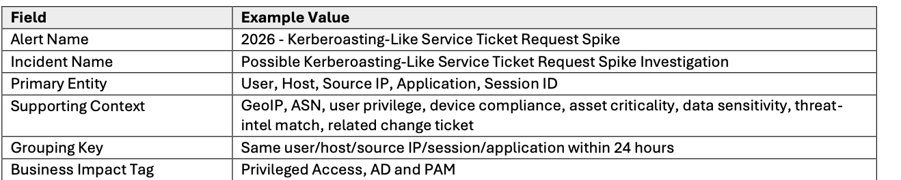

Grouping logic 

• Group by same user and source IP when identity or cloud activity is involved.
• Group by same host, process, file hash or destination when endpoint activity is involved.
• Group by same mailbox, site, file repository or external recipient when email or data activity is involved.
• Group by same API token, endpoint, session or customer object when application/API activity is involved.
• Escalate to a higher-level incident when two or more categories appear in the same timeline.

Triage Questions

• Is the user, host, application or service account expected to perform this activity?
• Is there an approved change, service request, incident ticket or business justification?
• Did the same entity trigger other related alerts before or after this event?
• Is the source IP, country, ASN, device, user-agent or session new for this entity?
• Is the affected asset, mailbox, data repository or application business-critical?
• Was the activity allowed, blocked, partially completed or only attempted?
• Is there evidence of data access, privilege change, control tampering, lateral movement or persistence?
• Should this be escalated to L2/L3, Incident Response, IAM, endpoint, cloud, network, application or risk/compliance
team?

Recommended Response Actions

• Validate the alert against the simulated or real evidence timeline and preserve raw events.
• Enrich the entities with user role, asset owner, department, asset criticality, privilege level and recent activity.
• Check for matching activity across SIEM, EDR, identity, cloud, proxy, email, application and network telemetry.
• Escalate according to the incident classification and business impact, not only the technical event type.
• Document the final decision, containment actions, evidence and closure rationale in the case record.

False Positive Possibilities

• Approved maintenance, migration, testing, vulnerability assessment or administrative activity.
• Known automation account, service integration, backup process, security tool, scanner or deployment platform.
• Business travel, remote work, vendor support activity or approved temporary access.
• False reputation match, geolocation inaccuracy, NAT/proxy aggregation or log parsing issue.
• Application behaviour change after release, patch, policy update or workflow redesign.

# usecase 19 : GPO modified to weaken security controls

category : priviledged access, ad and pam 
mitre att&ck mapping : T1484 Domain Policy Modification; T1562 Impair Defenses 

Hypothesis : A group policy object is changed to disable logging, antivirus, script restrictions or firewall settings 

Required log sources :
    - Ad gpo change logs
    - windows security logs
    - edr policy logs
    - timegenrated / event time
    - user / account / service principal
    - host / device / asset
    - source ip / geo / dest ip / asn 
    - action / result / status 
    - application / resource / object 
  
Building Blocks Design 

BB Critical GPOs
BB Security Baseline Policies
BB Approved Changed Windows

Rule Creation Logic 

rule Critical_GPO_Modified
{
  meta:
    severity = "High"

  events:

    $gpo.metadata.event_type =
      "DIRECTORY_OBJECT_MODIFICATION"

    $gpo.principal.user.userid = $user

    $gpo.target.resource.name = $gpo_name

    $critical.target.resource.name = $gpo_name

    $critical.security_result.summary =
      "CRITICAL_GPO"

  match:
    $gpo_name over 30m

  outcome:

    $risk_score =
      50 +
      if(#critical > 0,20,0)

  condition:

    #gpo > 0 and
    #critical > 0 and
    $risk_score >= 70
}

Alert Design 

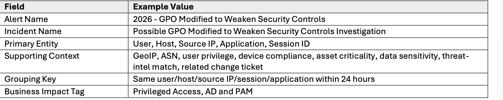

Grouping logic 

• Group by same user and source IP when identity or cloud activity is involved.
• Group by same host, process, file hash or destination when endpoint activity is involved.
• Group by same mailbox, site, file repository or external recipient when email or data activity is involved.
• Group by same API token, endpoint, session or customer object when application/API activity is involved.
• Escalate to a higher-level incident when two or more categories appear in the same timeline.

Triage Questions

• Is the user, host, application or service account expected to perform this activity?
• Is there an approved change, service request, incident ticket or business justification?
• Did the same entity trigger other related alerts before or after this event?
• Is the source IP, country, ASN, device, user-agent or session new for this entity?
• Is the affected asset, mailbox, data repository or application business-critical?
• Was the activity allowed, blocked, partially completed or only attempted?
• Is there evidence of data access, privilege change, control tampering, lateral movement or persistence?
• Should this be escalated to L2/L3, Incident Response, IAM, endpoint, cloud, network, application or risk/compliance
team?

Recommended Response Actions

• Validate the alert against the simulated or real evidence timeline and preserve raw events.
• Enrich the entities with user role, asset owner, department, asset criticality, privilege level and recent activity.
• Check for matching activity across SIEM, EDR, identity, cloud, proxy, email, application and network telemetry.
• Escalate according to the incident classification and business impact, not only the technical event type.
• Document the final decision, containment actions, evidence and closure rationale in the case record.

False Positive Possibilities

• Approved maintenance, migration, testing, vulnerability assessment or administrative activity.
• Known automation account, service integration, backup process, security tool, scanner or deployment platform.
• Business travel, remote work, vendor support activity or approved temporary access.
• False reputation match, geolocation inaccuracy, NAT/proxy aggregation or log parsing issue.
• Application behaviour change after release, patch, policy update or workflow redesign.

# usecase 20 : Remote Service Creation on Multiple Hosts 

Category : Priviledged Access, AD and PAM
Mitre att&ck mapping : T1021 Remote Service; T1543 Create or Modify System Process

Hypothesis : A single admin account creates services remotely across many endpoints which may indicate lateral movement

Req log sources : 
    - windows security logs
      - provides the on-prem identity and windows authentication evidence for remote service creation on multiple hosts
    - sysmon
      - provides the endpoint execution and host-level evidence for remoe service creation on multiple hosts
    - edr
      - provides the endpoint execution and host-level evidence for remoe service creation on multiple hosts
    - ad logs
    - timegenerated / event timestamp
    - user / account / service principal 
    - host / device / asset
    - source ip / destination ip / geo / asn 
    - action / result / status 
    - application / resource / object 

Building Blocks Desgin 

BB Admin Shares
BB Approved Deployment Tools
BB Crtical Servers

Rule Creation Logic 

rule PsExec_Like_Lateral_Movement
{
  meta:
    severity = "Critical"

  events:

    $share.metadata.event_type =
      "NETWORK_SHARE_ACCESS"

    $share.principal.user.userid = $user

    $share.target.share_name = $share_name

    re.regex(
      $share_name,
      `(?i)(admin\$|c\$|ipc\$)`
    )

    $svc.metadata.event_type =
      "SERVICE_CREATION"

    $svc.principal.user.userid = $user

    $svc.target.hostname = $host

  match:
    $user over 30m

  outcome:

    $risk_score = 90

  condition:

    #share >= 3 and
    #svc >= 3
}

Alert Design 

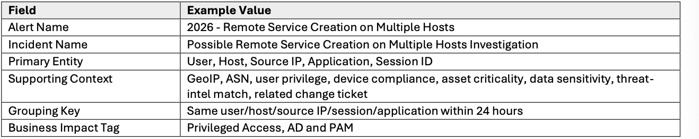

Grouping logic

• Group by same user and source IP when identity or cloud activity is involved.
• Group by same host, process, file hash or destination when endpoint activity is involved.
• Group by same mailbox, site, file repository or external recipient when email or data activity is involved.
• Group by same API token, endpoint, session or customer object when application/API activity is involved.
• Escalate to a higher-level incident when two or more categories appear in the same timeline.

Triage Questions

• Is the user, host, application or service account expected to perform this activity?
• Is there an approved change, service request, incident ticket or business justification?
• Did the same entity trigger other related alerts before or after this event?
• Is the source IP, country, ASN, device, user-agent or session new for this entity?
• Is the affected asset, mailbox, data repository or application business-critical?
• Was the activity allowed, blocked, partially completed or only attempted?
• Is there evidence of data access, privilege change, control tampering, lateral movement or persistence?
• Should this be escalated to L2/L3, Incident Response, IAM, endpoint, cloud, network, application or risk/compliance
team?

Recommended Response Actions

• Validate the alert against the simulated or real evidence timeline and preserve raw events.
• Enrich the entities with user role, asset owner, department, asset criticality, privilege level and recent activity.
• Check for matching activity across SIEM, EDR, identity, cloud, proxy, email, application and network telemetry.
• Escalate according to the incident classification and business impact, not only the technical event type.
• Document the final decision, containment actions, evidence and closure rationale in the case record.

False Positive Possibilities

• Approved maintenance, migration, testing, vulnerability assessment or administrative activity.
• Known automation account, service integration, backup process, security tool, scanner or deployment platform.
• Business travel, remote work, vendor support activity or approved temporary access.
• False reputation match, geolocation inaccuracy, NAT/proxy aggregation or log parsing issue.
• Application behaviour change after release, patch, policy update or workflow redesign.

# usecase 21 : wmi remote execution from unusual host 

category : priviledged access, ad and pam 
mitre att&ck mapping : T1047 Windows Management Instrumentation

hypothesis : a user workstation initiates wmi execution against a server outisde expected administration paths

Req log sources :
    - windows event logs
    - sysmon
    - edr
    - network logs
    - timegenerated/eventtime
    - user/account/service principal
    - host/device/asset
    - sourceip/geo/destip/ans
    - action/result/status
    - application/resource/object 

Building Blocks Design 

BB Approved Admin Workspace
BB Server Admin Group
BB WMI Admin Usage Baseline

Rule Creation logic 

rule WMI_Remote_Execution_Unusual_Host
{
  meta:
    severity = "High"

  events:

    $wmi.metadata.event_type = "PROCESS_LAUNCH"

    re.regex(
      $wmi.principal.process.command_line,
      `(?i)(wmic|invoke-wmimethod|win32_process)`
    )

    $wmi.principal.user.userid = $user

    $wmi.principal.hostname = $source_host

    $baseline.principal.hostname = $source_host

    $baseline.security_result.summary =
      "NOT_APPROVED_ADMIN_WORKSTATION"

  match:
    $user over 30m

  outcome:

    $risk_score =
      50 +
      if(#baseline > 0,20,0)

  condition:

    #wmi > 0 and
    #baseline > 0 and
    $risk_score >= 70
}

Alert Design 

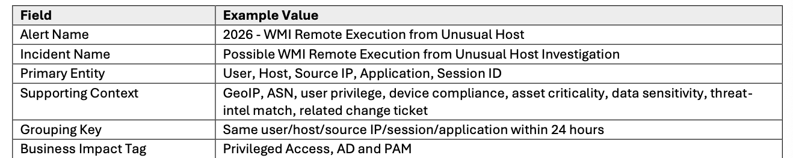

Grouping logic

• Group by same user and source IP when identity or cloud activity is involved.
• Group by same host, process, file hash or destination when endpoint activity is involved.
• Group by same mailbox, site, file repository or external recipient when email or data activity is involved.
• Group by same API token, endpoint, session or customer object when application/API activity is involved.
• Escalate to a higher-level incident when two or more categories appear in the same timeline

Triage Questions

• Is the user, host, application or service account expected to perform this activity?
• Is there an approved change, service request, incident ticket or business justification?
• Did the same entity trigger other related alerts before or after this event?
• Is the source IP, country, ASN, device, user-agent or session new for this entity?
• Is the affected asset, mailbox, data repository or application business-critical?
• Was the activity allowed, blocked, partially completed or only attempted?
• Is there evidence of data access, privilege change, control tampering, lateral movement or persistence?
• Should this be escalated to L2/L3, Incident Response, IAM, endpoint, cloud, network, application or risk/compliance
team?

Recommended Response Actions

• Validate the alert against the simulated or real evidence timeline and preserve raw events.
• Enrich the entities with user role, asset owner, department, asset criticality, privilege level and recent activity.
• Check for matching activity across SIEM, EDR, identity, cloud, proxy, email, application and network telemetry.
• Escalate according to the incident classification and business impact, not only the technical event type.
• Document the final decision, containment actions, evidence and closure rationale in the case record.

False Positive Possibilities

• Approved maintenance, migration, testing, vulnerability assessment or administrative activity.
• Known automation account, service integration, backup process, security tool, scanner or deployment platform.
• Business travel, remote work, vendor support activity or approved temporary access.
• False reputation match, geolocation inaccuracy, NAT/proxy aggregation or log parsing issue.
• Application behaviour change after release, patch, policy update or workflow redesign.

# usecase 22 : pam password checkout without approved ticket 

category : priviledged access; ad and pam 
mitre att&ck mapping : T1078 valid accounts

hypothesis : a priviledged password is checked out without an incident, change or service record

Required log sources :
    - pam logs
      - provides priviledged session evidence for pam passord checkout without approved ticket. 
      - it links admin activity to approved access requests, password checkouts, session recordings, commands executed, target systems and vendor/user identity
    - itsm/change logs 
      - provides supporting evidence for pam password checkout without approved ticket
    - ad security logs
      - provides on-prem identity and windows authentication evidence for pam password checkout without approved 
    - timegenerated/eventime
    - user/account/service prinicpal
    - host/device/asset
    - sourceip/geo/destip/asn
    - action/result/status
    - application/resource/object
  
Building Block Design 

BB Pam Managed Accounts
BB Approved Ticket Reference
BB Critical Systems

Rule Creation logic 

rule PAM_Checkout_Without_Ticket
{
  meta:
    severity = "High"

  events:

    $checkout.metadata.event_type =
      "PASSWORD_CHECKOUT"

    $checkout.principal.user.userid = $user

    $checkout.target.user.userid = $account

    $ticket.principal.user.userid = $user

    $ticket.security_result.summary =
      "APPROVED_CHANGE"

  match:
    $user over 60m

  outcome:

    $risk_score = 70

  condition:

    #checkout > 0 and
    #ticket = 0
}

Alert Design 

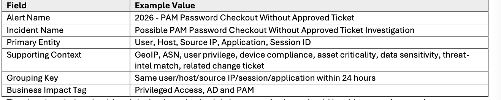

Grouping 

• Group by same user and source IP when identity or cloud activity is involved.
• Group by same host, process, file hash or destination when endpoint activity is involved.
• Group by same mailbox, site, file repository or external recipient when email or data activity is involved.
• Group by same API token, endpoint, session or customer object when application/API activity is involved.
• Escalate to a higher-level incident when two or more categories appear in the same timeline.

Triage Questions

• Is the user, host, application or service account expected to perform this activity?
• Is there an approved change, service request, incident ticket or business justification?
• Did the same entity trigger other related alerts before or after this event?
• Is the source IP, country, ASN, device, user-agent or session new for this entity?
• Is the affected asset, mailbox, data repository or application business-critical?
• Was the activity allowed, blocked, partially completed or only attempted?
• Is there evidence of data access, privilege change, control tampering, lateral movement or persistence?
• Should this be escalated to L2/L3, Incident Response, IAM, endpoint, cloud, network, application or risk/compliance
team?

Recommended Response Actions

• Validate the alert against the simulated or real evidence timeline and preserve raw events.
• Enrich the entities with user role, asset owner, department, asset criticality, privilege level and recent activity.
• Check for matching activity across SIEM, EDR, identity, cloud, proxy, email, application and network telemetry.
• Escalate according to the incident classification and business impact, not only the technical event type.
• Document the final decision, containment actions, evidence and closure rationale in the case record.

False Positive Possibilities

• Approved maintenance, migration, testing, vulnerability assessment or administrative activity.
• Known automation account, service integration, backup process, security tool, scanner or deployment platform.
• Business travel, remote work, vendor support activity or approved temporary access.
• False reputation match, geolocation inaccuracy, NAT/proxy aggregation or log parsing issue.
• Application behaviour change after release, patch, policy update or workflow redesign.

# usecase 23 : Breakglass account used

category : priviledge access; pam and ad
mitre att&ck mapping : T1078 valid accounts

hypothesis : an emergency account is used to logic when no active outage or incident has been declared

Required log sources :
    - entra id sign-in logs
    - ad security logs
    - pam logs
      - provides priviledged session evidence for break-glass accounts used
    - timegenerated/eventtime
    - user/account/service principal
    - host/device/asset
    - sourceip/destip/geo/asn
    - action/result/status
    - application/resource/object

Building Blocks Design

BB BreakGlass Accounts
BB Emergency Approvals
BB Critical Alerts

Rule Creation Logic 

rule Break_Glass_Used_Without_Approval
{
  meta:
    severity = "Critical"

  events:

    $login.metadata.event_type = "USER_LOGIN"

    $login.security_result.action = "ALLOW"

    $login.principal.user.userid = $user

    $breakglass.principal.user.userid = $user

    $breakglass.group.name = "Break-Glass Accounts"

    $approval.principal.user.userid = $user

    $approval.security_result.summary =
      "EMERGENCY_APPROVED"

  match:
    $user over 60m

  outcome:

    $risk_score = 90

  condition:

    #login > 0 and
    #breakglass > 0 and
    #approval = 0
}

Alert design 

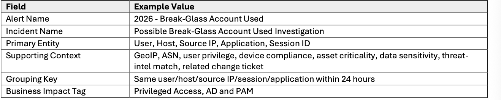

Grouping logic 

• Group by same user and source IP when identity or cloud activity is involved.
• Group by same host, process, file hash or destination when endpoint activity is involved.
• Group by same mailbox, site, file repository or external recipient when email or data activity is involved.
• Group by same API token, endpoint, session or customer object when application/API activity is involved.
• Escalate to a higher-level incident when two or more categories appear in the same timeline.

Triage Questions

• Is the user, host, application or service account expected to perform this activity?
• Is there an approved change, service request, incident ticket or business justification?
• Did the same entity trigger other related alerts before or after this event?
• Is the source IP, country, ASN, device, user-agent or session new for this entity?
• Is the affected asset, mailbox, data repository or application business-critical?
• Was the activity allowed, blocked, partially completed or only attempted?
• Is there evidence of data access, privilege change, control tampering, lateral movement or persistence?
• Should this be escalated to L2/L3, Incident Response, IAM, endpoint, cloud, network, application or risk/compliance
team?

Recommended Response Actions

• Validate the alert against the simulated or real evidence timeline and preserve raw events.
• Enrich the entities with user role, asset owner, department, asset criticality, privilege level and recent activity.
• Check for matching activity across SIEM, EDR, identity, cloud, proxy, email, application and network telemetry.
• Escalate according to the incident classification and business impact, not only the technical event type.
• Document the final decision, containment actions, evidence and closure rationale in the case record.

False Positive Possibilities

• Approved maintenance, migration, testing, vulnerability assessment or administrative activity.
• Known automation account, service integration, backup process, security tool, scanner or deployment platform.
• Business travel, remote work, vendor support activity or approved temporary access.
• False reputation match, geolocation inaccuracy, NAT/proxy aggregation or log parsing issue.
• Application behaviour change after release, patch, policy update or workflow redesign.

# usecase 24 : priviledged session recording disabled or missing 

category : priviledged access; ad and pam 
mitre att&ck mapping : T1562 impair defenses

hypothesis : a priviledged session begins, but expected session recording or audit evidence is missing or disabled

Required log sources :
    - pam logs
    - session recording logs
    - admin portal audit
    - timegenrated/eventtime
    - user/account/service-principal
    - host/device/asset
    - sourceip/geo/destip/asn
    - action/result/status
    - application/resource/object

Building Blocks Design 

BB Pam Sessions
BB Recording Required Systems
BB Approved Exemptions

Rule Creation Logic 

rule PAM_Recording_Disabled_On_Protected_System
{
  meta:
    severity = "Critical"

  events:

    $recording.metadata.event_type =
      "SECURITY_CONTROL_MODIFICATION"

    $recording.security_result.summary =
      "SESSION_RECORDING_DISABLED"

    $recording.principal.user.userid = $user

    $critical.target.hostname = $host

    $critical.security_result.summary =
      "RECORDING_REQUIRED_SYSTEM"

  match:
    $user over 60m

  outcome:

    $risk_score =
      60 +
      if(#critical > 0,20,0)

  condition:

    #recording > 0 and
    #critical > 0 and
    $risk_score >= 70
}

Alert Design 

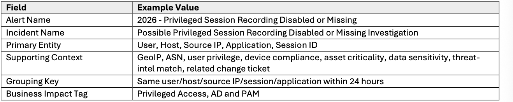

Grouping logic 

• Group by same user and source IP when identity or cloud activity is involved.
• Group by same host, process, file hash or destination when endpoint activity is involved.
• Group by same mailbox, site, file repository or external recipient when email or data activity is involved.
• Group by same API token, endpoint, session or customer object when application/API activity is involved.
• Escalate to a higher-level incident when two or more categories appear in the same timeline.

Triage Questions

• Is the user, host, application or service account expected to perform this activity?
• Is there an approved change, service request, incident ticket or business justification?
• Did the same entity trigger other related alerts before or after this event?
• Is the source IP, country, ASN, device, user-agent or session new for this entity?
• Is the affected asset, mailbox, data repository or application business-critical?
• Was the activity allowed, blocked, partially completed or only attempted?
• Is there evidence of data access, privilege change, control tampering, lateral movement or persistence?
• Should this be escalated to L2/L3, Incident Response, IAM, endpoint, cloud, network, application or risk/compliance
team?

Recommended Response Actions

• Validate the alert against the simulated or real evidence timeline and preserve raw events.
• Enrich the entities with user role, asset owner, department, asset criticality, privilege level and recent activity.
• Check for matching activity across SIEM, EDR, identity, cloud, proxy, email, application and network telemetry.
• Escalate according to the incident classification and business impact, not only the technical event type.
• Document the final decision, containment actions, evidence and closure rationale in the case record.

False Positive Possibilities

• Approved maintenance, migration, testing, vulnerability assessment or administrative activity.
• Known automation account, service integration, backup process, security tool, scanner or deployment platform.
• Business travel, remote work, vendor support activity or approved temporary access.
• False reputation match, geolocation inaccuracy, NAT/proxy aggregation or log parsing issue.
• Application behaviour change after release, patch, policy update or workflow redesign.

# usecase 25 : vendor priviledged access outside approved window

category : priviledged acces; ad and pam 
mitre att&ck mapping : T1078 Valid Accounts; T1199 Trusted Relationship

hypothesis : a third-party vendor account access production systems outside the scheduled maintenance window

Required log sources 
    - Pam logs
    - vpn logs
    - vendor access logs
    - change calendar
    - timegenerated/eventtime
    - user/account/service principal
    - host/device/asset
    - sourceip/destip/geo/asn
    - application/resource/object
    - action/result/status
  
Building Blocks Design 

BB Vendor Accounts
BB Approved Vendor Window
BB Critical Systems

Rule Creation logic

rule Vendor_Access_Outside_Approved_Window
{
  meta:
    severity = "Critical"

  events:

    $access.metadata.event_type = "USER_LOGIN"

    $access.principal.user.userid = $user

    $vendor.principal.user.userid = $user

    $vendor.group.name = "Vendor Accounts"

    $window.principal.user.userid = $user

    $window.security_result.summary =
      "APPROVED_VENDOR_WINDOW"

  match:
    $user over 60m

  outcome:

    $risk_score = 80

  condition:

    #access > 0 and
    #vendor > 0 and
    #window = 0
}

Alert Design 

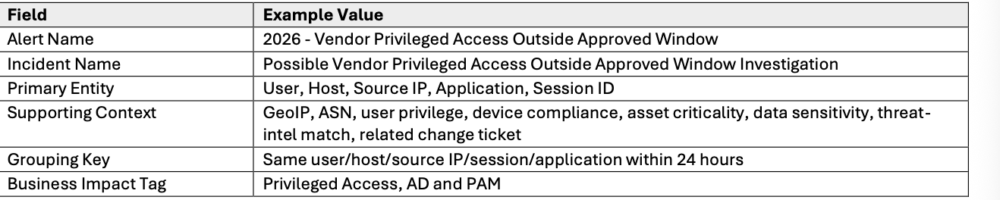

Grouping logic

• Group by same user and source IP when identity or cloud activity is involved.
• Group by same host, process, file hash or destination when endpoint activity is involved.
• Group by same mailbox, site, file repository or external recipient when email or data activity is involved.
• Group by same API token, endpoint, session or customer object when application/API activity is involved.
• Escalate to a higher-level incident when two or more categories appear in the same timeline.

Triage Questions

• Is the user, host, application or service account expected to perform this activity?
• Is there an approved change, service request, incident ticket or business justification?
• Did the same entity trigger other related alerts before or after this event?
• Is the source IP, country, ASN, device, user-agent or session new for this entity?
• Is the affected asset, mailbox, data repository or application business-critical?
• Was the activity allowed, blocked, partially completed or only attempted?
• Is there evidence of data access, privilege change, control tampering, lateral movement or persistence?
• Should this be escalated to L2/L3, Incident Response, IAM, endpoint, cloud, network, application or risk/compliance
team?

Recommended Response Actions

• Validate the alert against the simulated or real evidence timeline and preserve raw events.
• Enrich the entities with user role, asset owner, department, asset criticality, privilege level and recent activity.
• Check for matching activity across SIEM, EDR, identity, cloud, proxy, email, application and network telemetry.
• Escalate according to the incident classification and business impact, not only the technical event type.
• Document the final decision, containment actions, evidence and closure rationale in the case record.

Possible False Positives 

• Approved maintenance, migration, testing, vulnerability assessment or administrative activity.
• Known automation account, service integration, backup process, security tool, scanner or deployment platform.
• Business travel, remote work, vendor support activity or approved temporary access.
• False reputation match, geolocation inaccuracy, NAT/proxy aggregation or log parsing issue.
• Application behaviour change after release, patch, policy update or workflow redesign.

# usecase 26 : phishing email delivered and user clicked link

category : email, bec and collaboration 
mitre att&ck mapping : T156.002 Spearphishing Link;T1204 Execution 

hypothesis: A user recives a phishing email and clicks a link leading to a fake authentication page

Required log sources :
    - email gateway
      - provides the message delivery and threat veridct evidence for phishing email delivered and user clicked link
    - m365 defender
      - provides the post-auth activity for phishing email delivered and user clicked link 
    - url click logs
      - provides suppporting evidence for phishing email delivered and user clicked link 
    - proxy logs
      - shows outbound web access link to phishingh email delivered and user clicked link, including url, domain, category , upload/download size, http method, user-agent, action and reputation.
    - timegenerated/event time
    - user/account/service principal
    - host/device/asset
    - sourceip/destip/geo
    - action/result/status
    - application/resource/object

Building Block Design 

BB Phishing verdict 
BB User clicked url
BB Suspicious Domain Age 

Rule Creation logic 

rule Phishing_Click_Suspicious_Domain
{
  meta:
    severity = "High"

  events:

    $email.metadata.event_type = "EMAIL_DELIVERY"

    $email.security_result.category = "PHISHING"

    $email.target.user.userid = $user

    $click.metadata.event_type = "URL_CLICK"

    $click.principal.user.userid = $user

    $domain.target.hostname = $hostname

    $domain.security_result.summary =
      "SUSPICIOUS_DOMAIN"

  match:
    $user over 60m

  outcome:

    $risk_score =
      50 +
      if(#domain > 0,20,0)

  condition:

    #email > 0 and
    #click > 0 and
    #domain > 0 and
    $risk_score >= 70
}

Alert Design 

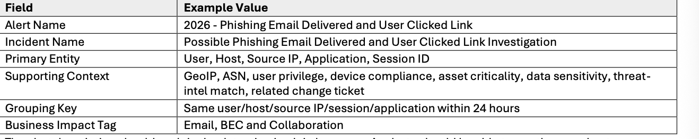

Grouping logic 

• Group by same user and source IP when identity or cloud activity is involved.
• Group by same host, process, file hash or destination when endpoint activity is involved.
• Group by same mailbox, site, file repository or external recipient when email or data activity is involved.
• Group by same API token, endpoint, session or customer object when application/API activity is involved.
• Escalate to a higher-level incident when two or more categories appear in the same timeline.

Triage Questions

• Is the user, host, application or service account expected to perform this activity?
• Is there an approved change, service request, incident ticket or business justification?
• Did the same entity trigger other related alerts before or after this event?
• Is the source IP, country, ASN, device, user-agent or session new for this entity?
• Is the affected asset, mailbox, data repository or application business-critical?
• Was the activity allowed, blocked, partially completed or only attempted?
• Is there evidence of data access, privilege change, control tampering, lateral movement or persistence?
• Should this be escalated to L2/L3, Incident Response, IAM, endpoint, cloud, network, application or risk/compliance
team?

Recommended Response Actions

• Validate the alert against the simulated or real evidence timeline and preserve raw events.
• Enrich the entities with user role, asset owner, department, asset criticality, privilege level and recent activity.
• Check for matching activity across SIEM, EDR, identity, cloud, proxy, email, application and network telemetry.
• Escalate according to the incident classification and business impact, not only the technical event type.
• Document the final decision, containment actions, evidence and closure rationale in the case record.
• Remove or quarantine malicious messages, block sender/domain/URL/hash where appropriate and search for
additional recipients.
• Notify affected users and validate whether credentials were entered or attachments were opened.

False Positive Possibilities

• Approved maintenance, migration, testing, vulnerability assessment or administrative activity.
• Known automation account, service integration, backup process, security tool, scanner or deployment platform.
• Business travel, remote work, vendor support activity or approved temporary access.
• False reputation match, geolocation inaccuracy, NAT/proxy aggregation or log parsing issue.
• Application behaviour change after release, patch, policy update or workflow redesign.

# usecase 27 : suspicious zip attachment containing lnk or script

category : email, bec and collaboration 
mitre att&ck mapping : T1566.001 Spearphishing Attachment; T1204 User Execution

hypothesis : an external email delivers an archive containing an shortcut or script that appears to be a document 

Required log sources :
    - email gateway
      - provides message delivery and threat verdict for suspicous zip attachment containing lnk or script
    - sandbox logs
      - provides message delivery and threat verdict for suspicous zip attachment containing lnk or script
    - edr file events
      - provides endpoint execution and host level evidence for suspicious zip attachment containing lnnk or script
    - timegenerated/eventtime
    - user/account/service principal
    - host/device/asset
    - sourceip/destip/geo/asn
    - action/result/status
    - application/resource/object

Building Blocks Design 

BB Archive attachment
BB High Risk File Extension 
BB External Sender

Rule Creation Logic 

rule External_ZIP_With_Script_Content
{
  meta:
    severity = "High"

  events:

    $email.metadata.event_type =
      "EMAIL_DELIVERY"

    $email.target.user.userid = $user

    $sender.security_result.summary =
      "EXTERNAL_SENDER"

    $attachment.security_result.summary =
      "ARCHIVE_ATTACHMENT"

    re.regex(
      $attachment.file.extension,
      `(?i)(
         lnk|
         js|
         vbs|
         ps1|
         hta|
         bat|
         cmd
      )`
    )

  match:
    $user over 60m

  outcome:

    $risk_score =
      50 +
      if(#sender > 0,20,0)

  condition:

    #email > 0 and
    #attachment > 0 and
    #sender > 0 and
    $risk_score >= 70
}

Alert Design 

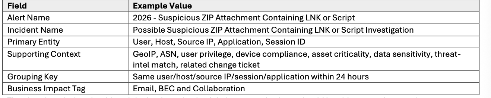

Grouping logic 

• Group by same user and source IP when identity or cloud activity is involved.
• Group by same host, process, file hash or destination when endpoint activity is involved.
• Group by same mailbox, site, file repository or external recipient when email or data activity is involved.
• Group by same API token, endpoint, session or customer object when application/API activity is involved.
• Escalate to a higher-level incident when two or more categories appear in the same timeline.

Triage Questions

• Is the user, host, application or service account expected to perform this activity?
• Is there an approved change, service request, incident ticket or business justification?
• Did the same entity trigger other related alerts before or after this event?
• Is the source IP, country, ASN, device, user-agent or session new for this entity?
• Is the affected asset, mailbox, data repository or application business-critical?
• Was the activity allowed, blocked, partially completed or only attempted?
• Is there evidence of data access, privilege change, control tampering, lateral movement or persistence?
• Should this be escalated to L2/L3, Incident Response, IAM, endpoint, cloud, network, application or risk/compliance
team?

Recommended Response Actions

• Validate the alert against the simulated or real evidence timeline and preserve raw events.
• Enrich the entities with user role, asset owner, department, asset criticality, privilege level and recent activity.
• Check for matching activity across SIEM, EDR, identity, cloud, proxy, email, application and network telemetry.
• Escalate according to the incident classification and business impact, not only the technical event type.
• Document the final decision, containment actions, evidence and closure rationale in the case record.
• Remove or quarantine malicious messages, block sender/domain/URL/hash where appropriate and search for
additional recipients.
• Notify affected users and validate whether credentials were entered or attachments were opened.

False Positive Possibilities

• Approved maintenance, migration, testing, vulnerability assessment or administrative activity.
• Known automation account, service integration, backup process, security tool, scanner or deployment platform.
• Business travel, remote work, vendor support activity or approved temporary access.
• False reputation match, geolocation inaccuracy, NAT/proxy aggregation or log parsing issue.
• Application behaviour change after release, patch, policy update or workflow redesign.

# usecase 28 : Teams or sharepoint suspicious file shared internally 

Category : Email, BEC and collaboration
Mitre att&ck mapping : T1204 User Execution; T1105 Ingress Tool Transfer

hypothesis : A compromised user sends a zip file through teams to another employee, leading to endpoint execution

Required log sources :
    - teams audit logs
      - provides supporting evidence for teams or sharpoint suspicious file shared internally
    - sharepoint audit logs
      - provides post-authentication activity for teams or sharepoint suspicious file shared internally
    - edr
      - provides endpoint execution and host-level evidence for teams or sharepoint suspicious file shared internally 
    - proxy 
    - timegenerate/eventtime
    - user/account/service-principal
    - sourceip/geo/destip/asn
    - action/result/status

Building Blocks Design 

BB Suspicious file type
BB Internal Sender Recently Risky
BB Collaboration Platform File Share

Rule Creation logic

rule Teams_SharePoint_Malicious_File_Sharing
{
  meta:
    severity = "High"

  events:

    $share.metadata.event_type = "FILE_SHARE"

    $share.principal.user.userid = $sender

    $share.target.file.name = $filename

    re.regex(
      $filename,
      `(?i)\.(lnk|js|jse|vbs|ps1|hta|iso|img)$`
    )

    $platform.security_result.summary =
      "COLLABORATION_PLATFORM_FILE_SHARE"

  match:
    $sender over 60m

  outcome:

    $risk_score = 80

  condition:

    #share > 0 and
    #platform > 0
}

Alert Design 

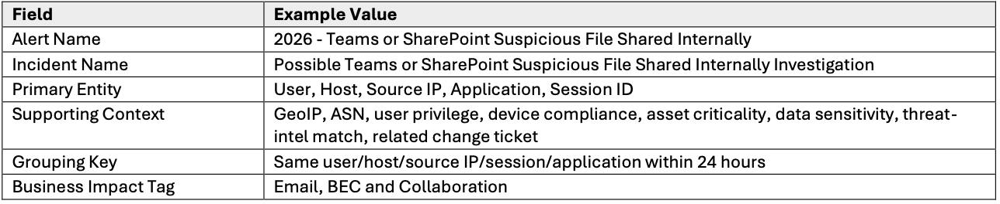

Grouping logic

• Group by same user and source IP when identity or cloud activity is involved.
• Group by same host, process, file hash or destination when endpoint activity is involved.
• Group by same mailbox, site, file repository or external recipient when email or data activity is involved.
• Group by same API token, endpoint, session or customer object when application/API activity is involved.
• Escalate to a higher-level incident when two or more categories appear in the same timeline.

Triage Questions

• Is the user, host, application or service account expected to perform this activity?
• Is there an approved change, service request, incident ticket or business justification?
• Did the same entity trigger other related alerts before or after this event?
• Is the source IP, country, ASN, device, user-agent or session new for this entity?
• Is the affected asset, mailbox, data repository or application business-critical?
• Was the activity allowed, blocked, partially completed or only attempted?
• Is there evidence of data access, privilege change, control tampering, lateral movement or persistence?
• Should this be escalated to L2/L3, Incident Response, IAM, endpoint, cloud, network, application or risk/compliance
team?

Recommended Response Actions

• Validate the alert against the simulated or real evidence timeline and preserve raw events.
• Enrich the entities with user role, asset owner, department, asset criticality, privilege level and recent activity.
• Check for matching activity across SIEM, EDR, identity, cloud, proxy, email, application and network telemetry.
• Escalate according to the incident classification and business impact, not only the technical event type.
• Document the final decision, containment actions, evidence and closure rationale in the case record.
• Remove or quarantine malicious messages, block sender/domain/URL/hash where appropriate and search for
additional recipients.
• Notify affected users and validate whether credentials were entered or attachments were opened.

False Positive Possibilities

• Approved maintenance, migration, testing, vulnerability assessment or administrative activity.
• Known automation account, service integration, backup process, security tool, scanner or deployment platform.
• Business travel, remote work, vendor support activity or approved temporary access.
• False reputation match, geolocation inaccuracy, NAT/proxy aggregation or log parsing issue.
• Application behaviour change after release, patch, policy update or workflow redesign.

# usecase 29 : mailbox forwarding rule to external domain 

Category : email, bec and collaboration
mitre att&ck mapping : T1114 Email Collection; T1537 Transfer Data to Cloud Account

hypothesis : A new rule forwards all mailbox content to an external mailbox

Required log sources :
    - exchange audit logs
    - m365 unified audit
    - entra id sign-in logs
    - timegenerated/eventtimestamp
    - user/account/service principal
    - host/device/asset
    - sourceip/destip/geo/asn
    - action/result/status
    - application/resource/object

Building Block Design 

BB External Forwarding Domain 
BB Mailbox Rule Creation
BB Risky Sign-in

Rule Creation logic 

rule External_Mailbox_Forwarding_Rule_Created
{
  meta:
    severity = "Critical"

  events:

    $rule.metadata.event_type =
      "MAILBOX_RULE_CREATION"

    $rule.principal.user.userid = $user

    $rule.target.email.address = $forward_address

    $rule.security_result.summary =
      "FORWARD_TO_EXTERNAL"

  match:
    $user over 60m

  outcome:

    $risk_score = 85

  condition:

    #rule > 0
}

Alert Design 

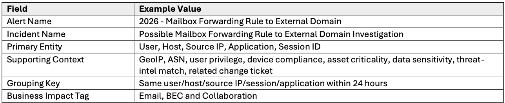

Grouping logic

• Group by same user and source IP when identity or cloud activity is involved.
• Group by same host, process, file hash or destination when endpoint activity is involved.
• Group by same mailbox, site, file repository or external recipient when email or data activity is involved.
• Group by same API token, endpoint, session or customer object when application/API activity is involved.
• Escalate to a higher-level incident when two or more categories appear in the same timeline.

Triage Questions

• Is the user, host, application or service account expected to perform this activity?
• Is there an approved change, service request, incident ticket or business justification?
• Did the same entity trigger other related alerts before or after this event?
• Is the source IP, country, ASN, device, user-agent or session new for this entity?
• Is the affected asset, mailbox, data repository or application business-critical?
• Was the activity allowed, blocked, partially completed or only attempted?
• Is there evidence of data access, privilege change, control tampering, lateral movement or persistence?
• Should this be escalated to L2/L3, Incident Response, IAM, endpoint, cloud, network, application or risk/compliance
team?

Recommended Response Actions

• Validate the alert against the simulated or real evidence timeline and preserve raw events.
• Enrich the entities with user role, asset owner, department, asset criticality, privilege level and recent activity.
• Check for matching activity across SIEM, EDR, identity, cloud, proxy, email, application and network telemetry.
• Escalate according to the incident classification and business impact, not only the technical event type.
• Document the final decision, containment actions, evidence and closure rationale in the case record.
• Remove or quarantine malicious messages, block sender/domain/URL/hash where appropriate and search for
additional recipients.
• Notify affected users and validate whether credentials were entered or attachments were opened.

False Positive Possibilities

• Approved maintenance, migration, testing, vulnerability assessment or administrative activity.
• Known automation account, service integration, backup process, security tool, scanner or deployment platform.
• Business travel, remote work, vendor support activity or approved temporary access.
• False reputation match, geolocation inaccuracy, NAT/proxy aggregation or log parsing issue.
• Application behaviour change after release, patch, policy update or workflow redesign.

# usecase 30 : inbox rule created to hide security or finance mails

category : email, bec and collaboration
mitre att&ck mapping : T1564 Hide Artifacts; T1114 Email Collection

required log sources : 

    - exchange audit logs 
      - provides post-authentication acitivity for inbox rule creation to hide security or finance mails
    - m365 unified audit 
      - provides post-authentication acitivity for inbox rule creation to hide security or finance mails
    - timegenerated / eventtime
    - user/account/service-principal
    - host/device/asset
    - sourceip/destip/geo/asn
    - action/result/status
    - application/resource/object

Building Blocks Design 

BB Suspicious Inbox Rule Keywords
BB External Forwarding 
BB Risky Sign-in 

Rule Creation logic

rule Inbox_Rule_Hiding_Security_Emails
{
  meta:
    severity = "Critical"

  events:

    $rule.metadata.event_type =
      "MAILBOX_RULE_CREATION"

    $rule.principal.user.userid = $user

    re.regex(
      $rule.target.resource.name,
      `(?i)(
         security|
         mfa|
         password|
         verification|
         alert
      )`
    )

    re.regex(
      $rule.security_result.summary,
      `(?i)(
         delete|
         archive|
         move to rss|
         mark as read
      )`
    )

  match:
    $user over 60m

  outcome:

    $risk_score = 85

  condition:

    #rule > 0
}

Alert Design 

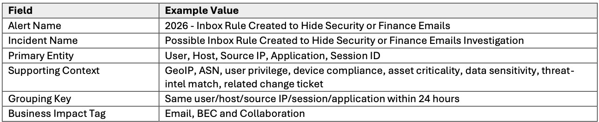

Grouping 

• Group by same user and source IP when identity or cloud activity is involved.
• Group by same host, process, file hash or destination when endpoint activity is involved.
• Group by same mailbox, site, file repository or external recipient when email or data activity is involved.
• Group by same API token, endpoint, session or customer object when application/API activity is involved.
• Escalate to a higher-level incident when two or more categories appear in the same timeline.

Triage Questions

• Is the user, host, application or service account expected to perform this activity?
• Is there an approved change, service request, incident ticket or business justification?
• Did the same entity trigger other related alerts before or after this event?
• Is the source IP, country, ASN, device, user-agent or session new for this entity?
• Is the affected asset, mailbox, data repository or application business-critical?
• Was the activity allowed, blocked, partially completed or only attempted?
• Is there evidence of data access, privilege change, control tampering, lateral movement or persistence?
• Should this be escalated to L2/L3, Incident Response, IAM, endpoint, cloud, network, application or risk/compliance
team?

Recommended Response Actions

• Validate the alert against the simulated or real evidence timeline and preserve raw events.
• Enrich the entities with user role, asset owner, department, asset criticality, privilege level and recent activity.
• Check for matching activity across SIEM, EDR, identity, cloud, proxy, email, application and network telemetry.
• Escalate according to the incident classification and business impact, not only the technical event type.
• Document the final decision, containment actions, evidence and closure rationale in the case record.
• Remove or quarantine malicious messages, block sender/domain/URL/hash where appropriate and search for
additional recipients.
• Notify affected users and validate whether credentials were entered or attachments were opened.

False Positive Possibilities

• Approved maintenance, migration, testing, vulnerability assessment or administrative activity.
• Known automation account, service integration, backup process, security tool, scanner or deployment platform.
• Business travel, remote work, vendor support activity or approved temporary access.
• False reputation match, geolocation inaccuracy, NAT/proxy aggregation or log parsing issue.
• Application behaviour change after release, patch, policy update or workflow redesign.

# usecase 31 : mass outbount email from user mailbox

category : email, bec and collaboration
mitre att&ck mapping : T1586 Compromise Accounts; T1078.004 Cloud Accounts

hypothesis : A mailbox suddenly sends hundreds of emails to external receipts shortly after a suspicious login

Required log sources : 
    - exchange message trace 
      - provides post-auth activity for mass outbound email from user mailbox
    - m365 audit
      - provides post-auth activity for mass outbount email from user mailbox
    - email gateway
      - provides message delivery and threat verdict evidence for mass outbound email from user inbox
    - timegenrated/eventtime
    - user/account/service-principal
    - host/device/asset
    - sourceip/geo/destip/asn
    - action/result/status
    - application/resource/object

Building Blocks Design 

BB Outside Email Baseline
BB External Reciepent Count
BB Risky Sign-in 

Rule creation logic :

rule Mass_Outbound_Email_Recipient_Spike
{
  meta:
    severity = "High"

  events:

    $email.metadata.event_type =
      "EMAIL_SEND"

    $email.principal.user.userid = $user

    $email.target.email.address = $recipient

    $external.security_result.summary =
      "EXTERNAL_RECIPIENT"

  match:
    $user over 60m

  outcome:

    $recipient_count =
      count_distinct($recipient)

    $risk_score =
      50 +
      if($recipient_count >= 50,20,0)

  condition:

    #email >= 50 and
    $recipient_count >= 25
}

Alert design : 

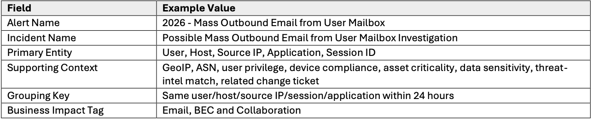

Grouping logic : 

• Group by same user and source IP when identity or cloud activity is involved.
• Group by same host, process, file hash or destination when endpoint activity is involved.
• Group by same mailbox, site, file repository or external recipient when email or data activity is involved.
• Group by same API token, endpoint, session or customer object when application/API activity is involved.
• Escalate to a higher-level incident when two or more categories appear in the same timeline.

Triage Questions

• Is the user, host, application or service account expected to perform this activity?
• Is there an approved change, service request, incident ticket or business justification?
• Did the same entity trigger other related alerts before or after this event?
• Is the source IP, country, ASN, device, user-agent or session new for this entity?
• Is the affected asset, mailbox, data repository or application business-critical?
• Was the activity allowed, blocked, partially completed or only attempted?
• Is there evidence of data access, privilege change, control tampering, lateral movement or persistence?
• Should this be escalated to L2/L3, Incident Response, IAM, endpoint, cloud, network, application or risk/compliance
team?

Recommended Response Actions

• Validate the alert against the simulated or real evidence timeline and preserve raw events.
• Enrich the entities with user role, asset owner, department, asset criticality, privilege level and recent activity.
• Check for matching activity across SIEM, EDR, identity, cloud, proxy, email, application and network telemetry.
• Escalate according to the incident classification and business impact, not only the technical event type.
• Document the final decision, containment actions, evidence and closure rationale in the case record.
• Remove or quarantine malicious messages, block sender/domain/URL/hash where appropriate and search for
additional recipients.
• Notify affected users and validate whether credentials were entered or attachments were opened.

False Positive Possibilities

• Approved maintenance, migration, testing, vulnerability assessment or administrative activity.
• Known automation account, service integration, backup process, security tool, scanner or deployment platform.
• Business travel, remote work, vendor support activity or approved temporary access.
• False reputation match, geolocation inaccuracy, NAT/proxy aggregation or log parsing issue.
• Application behaviour change after release, patch, policy update or workflow redesign.

# usecase 32 : BEC Payment instruction change request 

category : Email, BEC and collaboration 
mitre att&ck mapping : T1656 Impersonation; T1566 Phishing

hypothesis : A supplier-like email asks finanace to change bank account detaisl or urgentuly process payment

Required log sources :
    - email gateway
    - m365 audit
    - dlp
    - mailbox logs
    - timegenerated/eventtime
    - user/account/service-principal
    - host/device/asset
    - sourceip/geo/destip/asn
    - action/result/status
    - application/resource/object 

Building Blocks Design 

BB Finance Keywords
BB External Sender
BB Executive Impersonation Names

Rule Creation logic 

rule BEC_Executive_Impersonation_Payment_Fraud
{
  meta:
    severity = "Critical"

  events:

    $email.metadata.event_type =
      "EMAIL_DELIVERY"

    $impersonation.security_result.summary =
      "EXECUTIVE_IMPERSONATION"

    re.regex(
      $email.network.email.subject,
      `(?i)(
         wire|
         transfer|
         invoice|
         payment
      )`
    )

  match:
    $email.target.user.userid over 60m

  outcome:

    $risk_score = 95

  condition:

    #email > 0 and
    #impersonation > 0
}

Alert Design 

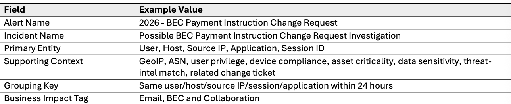

Grouping 

• Group by same user and source IP when identity or cloud activity is involved.
• Group by same host, process, file hash or destination when endpoint activity is involved.
• Group by same mailbox, site, file repository or external recipient when email or data activity is involved.
• Group by same API token, endpoint, session or customer object when application/API activity is involved.
• Escalate to a higher-level incident when two or more categories appear in the same timeline.

Triage Questions

• Is the user, host, application or service account expected to perform this activity?
• Is there an approved change, service request, incident ticket or business justification?
• Did the same entity trigger other related alerts before or after this event?
• Is the source IP, country, ASN, device, user-agent or session new for this entity?
• Is the affected asset, mailbox, data repository or application business-critical?
• Was the activity allowed, blocked, partially completed or only attempted?
• Is there evidence of data access, privilege change, control tampering, lateral movement or persistence?
• Should this be escalated to L2/L3, Incident Response, IAM, endpoint, cloud, network, application or risk/compliance
team?

Recommended Response Actions

• Validate the alert against the simulated or real evidence timeline and preserve raw events.
• Enrich the entities with user role, asset owner, department, asset criticality, privilege level and recent activity.
• Check for matching activity across SIEM, EDR, identity, cloud, proxy, email, application and network telemetry.
• Escalate according to the incident classification and business impact, not only the technical event type.
• Document the final decision, containment actions, evidence and closure rationale in the case record.
• Remove or quarantine malicious messages, block sender/domain/URL/hash where appropriate and search for
additional recipients.
• Notify affected users and validate whether credentials were entered or attachments were opened.

False Positive Possibilities

• Approved maintenance, migration, testing, vulnerability assessment or administrative activity.
• Known automation account, service integration, backup process, security tool, scanner or deployment platform.
• Business travel, remote work, vendor support activity or approved temporary access.
• False reputation match, geolocation inaccuracy, NAT/proxy aggregation or log parsing issue.
• Application behaviour change after release, patch, policy update or workflow redesign.

# usecase 33 :  Executive Display name spoofing 

category : Email;BEC and collaboration
mitre att&ck mapping : T1656 Impersonation; T1566 Phishing

hypothesis : An external sender uses the display name of a senior executive and asks for urgent action

Required log sources :

    - email gateway
      - provides message delivery and threat verdict evidence for executive display spoofing 
    - DMARC/SPF/DKIM Results
      - explains whether the activity in executive display name spoofing was attempted , allowed , blocked , failed , completed or partially completed.
    - Threat Intel
      - adds external intelligence context to executive display name spoofing, iocc, actor and confidence help prioritise alerts and connect internal evicdence to known malicious infra
    - timegernated/eventtime
    - user/account/service-principal
    - sourceip/geo/asn/destip
    - action/result/status
    - application/resource/object 

Building Blocks Design 

BB Executive Names
BB External Sender
BB Lookalike Domain

Rule Creation logic

rule Executive_Display_Name_From_External_Domain
{
  meta:
    severity = "Critical"

  events:

    $email.metadata.event_type = "EMAIL_DELIVERY"

    $email.network.email.from.display_name = $display_name

    $external.security_result.summary =
      "EXTERNAL_SENDER"

    $email.target.user.userid = $recipient

  match:
    $recipient over 60m

  outcome:

    $risk_score =
      60 +
      if(#external > 0,20,0)

  condition:

    #email > 0 and
    #external > 0 and
    $risk_score >= 70
}

Alert Design 

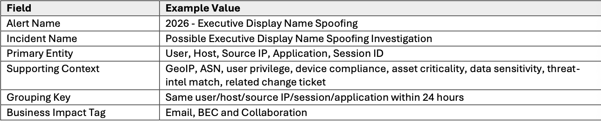

Grouping 

• Group by same user and source IP when identity or cloud activity is involved.
• Group by same host, process, file hash or destination when endpoint activity is involved.
• Group by same mailbox, site, file repository or external recipient when email or data activity is involved.
• Group by same API token, endpoint, session or customer object when application/API activity is involved.
• Escalate to a higher-level incident when two or more categories appear in the same timeline.

Triage Questions

• Is the user, host, application or service account expected to perform this activity?
• Is there an approved change, service request, incident ticket or business justification?
• Did the same entity trigger other related alerts before or after this event?
• Is the source IP, country, ASN, device, user-agent or session new for this entity?
• Is the affected asset, mailbox, data repository or application business-critical?
• Was the activity allowed, blocked, partially completed or only attempted?
• Is there evidence of data access, privilege change, control tampering, lateral movement or persistence?
• Should this be escalated to L2/L3, Incident Response, IAM, endpoint, cloud, network, application or risk/compliance
team?

Recommended Response Actions

• Validate the alert against the simulated or real evidence timeline and preserve raw events.
• Enrich the entities with user role, asset owner, department, asset criticality, privilege level and recent activity.
• Check for matching activity across SIEM, EDR, identity, cloud, proxy, email, application and network telemetry.
• Escalate according to the incident classification and business impact, not only the technical event type.
• Document the final decision, containment actions, evidence and closure rationale in the case record.
• Remove or quarantine malicious messages, block sender/domain/URL/hash where appropriate and search for
additional recipients.
• Notify affected users and validate whether credentials were entered or attachments were opened.

False Positive Possibilities

• Approved maintenance, migration, testing, vulnerability assessment or administrative activity.
• Known automation account, service integration, backup process, security tool, scanner or deployment platform.
• Business travel, remote work, vendor support activity or approved temporary access.
• False reputation match, geolocation inaccuracy, NAT/proxy aggregation or log parsing issue.
• Application behaviour change after release, patch, policy update or workflow redesign.

# usecase 34 : QR phishing email 

category : email, bec and collaboration
mitre att&ck mapping : T1566.002 Spearphishing Link

hypothesis : An email asks the user to scan a qr code to verify mailbox access, bypassing normal url inspection

required log sources :

    - email gateway 
    - ocr/sandbox metadata
    - proxy url logs
    - timegenerated/eventtime
    - user / account / service-principal
    - host / device / asset
    - sourceip/geo/destip/asn
    - action/result/status
    - application/resource/object 
  
Building Block Design 

BB QR Code Detected
BB Suspicious Landing Domain
BB Credential Form Indicator 

Rule Creation logic 

rule QR_Phishing_With_Suspicious_Domain
{
  meta:
    severity = "High"

  events:

    $email.metadata.event_type =
      "EMAIL_DELIVERY"

    $email.target.user.userid = $user

    $qr.security_result.summary =
      "QR_CODE_DETECTED"

    $domain.security_result.summary =
      "SUSPICIOUS_LANDING_DOMAIN"

  match:
    $user over 60m

  outcome:

    $risk_score =
      60 +
      if(#domain > 0,20,0)

  condition:

    #email > 0 and
    #qr > 0 and
    #domain > 0 and
    $risk_score >= 70
}

Alert Design 

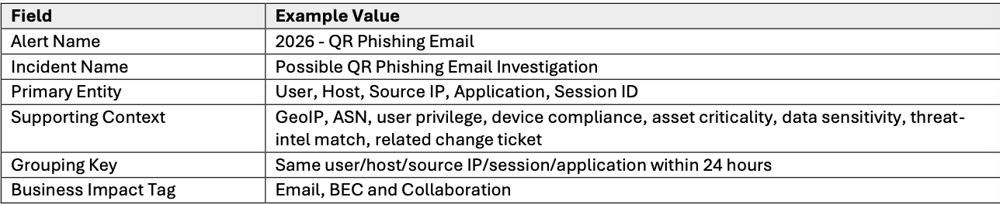

Grouping 

• Group by same user and source IP when identity or cloud activity is involved.
• Group by same host, process, file hash or destination when endpoint activity is involved.
• Group by same mailbox, site, file repository or external recipient when email or data activity is involved.
• Group by same API token, endpoint, session or customer object when application/API activity is involved.
• Escalate to a higher-level incident when two or more categories appear in the same timeline.

Triage Questions

• Is the user, host, application or service account expected to perform this activity?
• Is there an approved change, service request, incident ticket or business justification?
• Did the same entity trigger other related alerts before or after this event?
• Is the source IP, country, ASN, device, user-agent or session new for this entity?
• Is the affected asset, mailbox, data repository or application business-critical?
• Was the activity allowed, blocked, partially completed or only attempted?
• Is there evidence of data access, privilege change, control tampering, lateral movement or persistence?
• Should this be escalated to L2/L3, Incident Response, IAM, endpoint, cloud, network, application or risk/compliance
team?

Recommended Response Actions

• Validate the alert against the simulated or real evidence timeline and preserve raw events.
• Enrich the entities with user role, asset owner, department, asset criticality, privilege level and recent activity.
• Check for matching activity across SIEM, EDR, identity, cloud, proxy, email, application and network telemetry.
• Escalate according to the incident classification and business impact, not only the technical event type.
• Document the final decision, containment actions, evidence and closure rationale in the case record.
• Remove or quarantine malicious messages, block sender/domain/URL/hash where appropriate and search for
additional recipients.
• Notify affected users and validate whether credentials were entered or attachments were opened.

False Positive Possibilities

• Approved maintenance, migration, testing, vulnerability assessment or administrative activity.
• Known automation account, service integration, backup process, security tool, scanner or deployment platform.
• Business travel, remote work, vendor support activity or approved temporary access.
• False reputation match, geolocation inaccuracy, NAT/proxy aggregation or log parsing issue.
• Application behaviour change after release, patch, policy update or workflow redesign.

# usecase 35 : mailbox delegation or fullaccess permission added

category : email,bec and collaboration
mitre att&ck mapping : T1098 Account Manipulation; T1114 Email Collection

hypothesis : A user or admin grants mailbox fullaccess or sendas permission without approved access request 

Required log sources :
    - exchange audit logs
    - m365 unified audit
    - timegenerated/eventtime
    - user/account/service-principal
    - host/device/asset
    - sourceip/destip/geo/asn
    - action/result/status
    - application/resource/object 

Building Blocks Design 

BB Sensitive Mailboxes
BB Delegation Change
BB Approved Access Request 

Rule Creation Logic

rule Mailbox_FullAccess_Without_Approval
{
  meta:
    severity = "Critical"

  events:

    $delegation.metadata.event_type =
      "MAILBOX_PERMISSION_CHANGE"

    $delegation.principal.user.userid = $actor

    $delegation.target.user.userid = $mailbox

    $delegation.security_result.summary =
      "FULLACCESS_GRANTED"

    $approval.principal.user.userid = $actor

    $approval.security_result.summary =
      "APPROVED_ACCESS_REQUEST"

  match:
    $mailbox over 60m

  outcome:
    $risk_score = 85

  condition:

    #delegation > 0 and
    #approval = 0
}

Alert Design 

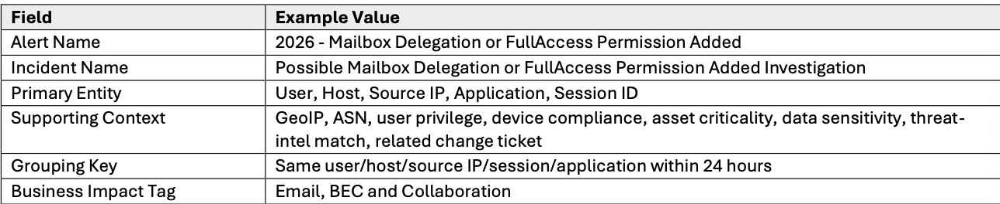

Grouping logic

• Group by same user and source IP when identity or cloud activity is involved.
• Group by same host, process, file hash or destination when endpoint activity is involved.
• Group by same mailbox, site, file repository or external recipient when email or data activity is involved.
• Group by same API token, endpoint, session or customer object when application/API activity is involved.
• Escalate to a higher-level incident when two or more categories appear in the same timeline.

Triage Questions

• Is the user, host, application or service account expected to perform this activity?
• Is there an approved change, service request, incident ticket or business justification?
• Did the same entity trigger other related alerts before or after this event?
• Is the source IP, country, ASN, device, user-agent or session new for this entity?
• Is the affected asset, mailbox, data repository or application business-critical?
• Was the activity allowed, blocked, partially completed or only attempted?
• Is there evidence of data access, privilege change, control tampering, lateral movement or persistence?
• Should this be escalated to L2/L3, Incident Response, IAM, endpoint, cloud, network, application or risk/compliance
team?

Recommended Response Actions

• Validate the alert against the simulated or real evidence timeline and preserve raw events.
• Enrich the entities with user role, asset owner, department, asset criticality, privilege level and recent activity.
• Check for matching activity across SIEM, EDR, identity, cloud, proxy, email, application and network telemetry.
• Escalate according to the incident classification and business impact, not only the technical event type.
• Document the final decision, containment actions, evidence and closure rationale in the case record.
• Remove or quarantine malicious messages, block sender/domain/URL/hash where appropriate and search for
additional recipients.
• Notify affected users and validate whether credentials were entered or attachments were opened.

False Positive Possibilities

• Approved maintenance, migration, testing, vulnerability assessment or administrative activity.
• Known automation account, service integration, backup process, security tool, scanner or deployment platform.
• Business travel, remote work, vendor support activity or approved temporary access.
• False reputation match, geolocation inaccuracy, NAT/proxy aggregation or log parsing issue.
• Application behaviour change after release, patch, policy update or workflow redesign.

# usecase 36 : office application spawns powershell 

category : endpoint;malware and lol-b
mitre att&ck mapping : T1059.001 PowerShell; T1204 User Execution

hypothesis : A user opens a document and office launches powershell with suspicious command-line parameters

Required log sources :
    - edr process events
    - sysmon
    - email gateway
    - timegenerated/eventtime
    - user/account/service-principal
    - host/device/asset
    - sourceip/geo/destip/asn
    - action/result/status
    - application/resource/object

Building Blocks Design 

BB Office Parent Process
BB Script Interpreter Child
BB External Sender Attachment

Rule creation logic 

rule Office_To_PowerShell_Process_Chain
{
  meta:
    severity = "Critical"

  events:

    $proc.metadata.event_type =
      "PROCESS_LAUNCH"

    re.regex(
      $proc.principal.process.file.full_path,
      `(?i).*(winword|excel|powerpnt|outlook)\.exe`
    )

    re.regex(
      $proc.target.process.file.full_path,
      `(?i).*powershell\.exe`
    )

    $host = $proc.principal.hostname

  match:
    $host over 60m

  outcome:
    $risk_score = 85

  condition:

    #proc > 0
}

Alert Design 

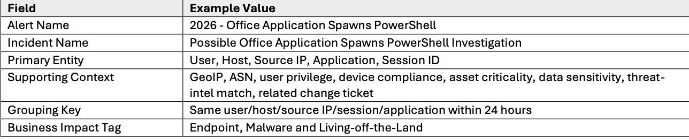

Grouping 

• Group by same user and source IP when identity or cloud activity is involved.
• Group by same host, process, file hash or destination when endpoint activity is involved.
• Group by same mailbox, site, file repository or external recipient when email or data activity is involved.
• Group by same API token, endpoint, session or customer object when application/API activity is involved.
• Escalate to a higher-level incident when two or more categories appear in the same timeline.

Triage Questions

• Is the user, host, application or service account expected to perform this activity?
• Is there an approved change, service request, incident ticket or business justification?
• Did the same entity trigger other related alerts before or after this event?
• Is the source IP, country, ASN, device, user-agent or session new for this entity?
• Is the affected asset, mailbox, data repository or application business-critical?
• Was the activity allowed, blocked, partially completed or only attempted?
• Is there evidence of data access, privilege change, control tampering, lateral movement or persistence?
• Should this be escalated to L2/L3, Incident Response, IAM, endpoint, cloud, network, application or risk/compliance
team?
• What is the parent-child process chain and command-line context?
• Should the endpoint or server be isolated immediately?

Recommended Response Actions

• Validate the alert against the simulated or real evidence timeline and preserve raw events.
• Enrich the entities with user role, asset owner, department, asset criticality, privilege level and recent activity.
• Check for matching activity across SIEM, EDR, identity, cloud, proxy, email, application and network telemetry.
• Escalate according to the incident classification and business impact, not only the technical event type.
• Document the final decision, containment actions, evidence and closure rationale in the case record.
• Contain affected endpoint or server if execution, credential access, persistence, lateral movement or impact indicators
are confirmed.
• Collect process tree, file hash, command line, network destination and memory/EDR evidence where required.

False Positive Possibilities

• Approved maintenance, migration, testing, vulnerability assessment or administrative activity.
• Known automation account, service integration, backup process, security tool, scanner or deployment platform.
• Business travel, remote work, vendor support activity or approved temporary access.
• False reputation match, geolocation inaccuracy, NAT/proxy aggregation or log parsing issue.
• Application behaviour change after release, patch, policy update or workflow redesign.

# usecase 37 : encoded or obfuscated powershell command

category : endpoint; malware and lol-b
mitre att&ck mapping : T1059.001 PowerShell; T1027 Obfuscated Files or Information

hypothesis : Powershell executes with encoded or hidden command flags from a user directory

Required log sources : 
    - edr
    - sysmon event 1
    - powershell logs
    - timegenerated/eventtime
    - user/account/service-prinicpal
    - sourceip/destip/asn/geo
    - host/device/asset
    - action/result/status
    - application/resource/object

Building Block Design 

BB EncodedCommand
BB Suspicious Powershell flags
BB User-writable path

Rule Creation logic

rule PowerShell_EncodedCommand
{
  meta:
    severity = "Critical"

  events:

    $ps.metadata.event_type =
      "PROCESS_LAUNCH"

    re.regex(
      $ps.target.process.file.full_path,
      `(?i).*powershell(\.exe)?`
    )

    re.regex(
      $ps.target.process.command_line,
      `(?i)(-enc|-encodedcommand)`
    )

  match:
    $ps.principal.hostname over 60m

  outcome:
    $risk_score = 85

  condition:

    #ps > 0
}

Alert Design 

Grouping 

• Group by same user and source IP when identity or cloud activity is involved.
• Group by same host, process, file hash or destination when endpoint activity is involved.
• Group by same mailbox, site, file repository or external recipient when email or data activity is involved.
• Group by same API token, endpoint, session or customer object when application/API activity is involved.
• Escalate to a higher-level incident when two or more categories appear in the same timeline.

Triage Questions

• Is the user, host, application or service account expected to perform this activity?
• Is there an approved change, service request, incident ticket or business justification?
• Did the same entity trigger other related alerts before or after this event?
• Is the source IP, country, ASN, device, user-agent or session new for this entity?
• Is the affected asset, mailbox, data repository or application business-critical?
• Was the activity allowed, blocked, partially completed or only attempted?
• Is there evidence of data access, privilege change, control tampering, lateral movement or persistence?
• Should this be escalated to L2/L3, Incident Response, IAM, endpoint, cloud, network, application or risk/compliance
team?
• What is the parent-child process chain and command-line context?
• Should the endpoint or server be isolated immediately?

Recommended Response Actions

• Validate the alert against the simulated or real evidence timeline and preserve raw events.
• Enrich the entities with user role, asset owner, department, asset criticality, privilege level and recent activity.
• Check for matching activity across SIEM, EDR, identity, cloud, proxy, email, application and network telemetry.
• Escalate according to the incident classification and business impact, not only the technical event type.
• Document the final decision, containment actions, evidence and closure rationale in the case record.
• Contain affected endpoint or server if execution, credential access, persistence, lateral movement or impact indicators
are confirmed.
• Collect process tree, file hash, command line, network destination and memory/EDR evidence where required.

False Positive Possibilities

• Approved maintenance, migration, testing, vulnerability assessment or administrative activity.
• Known automation account, service integration, backup process, security tool, scanner or deployment platform.
• Business travel, remote work, vendor support activity or approved temporary access.
• False reputation match, geolocation inaccuracy, NAT/proxy aggregation or log parsing issue.
• Application behaviour change after release, patch, policy update or workflow redesign.

# usecase 38 : powershell downloads remote content

cstegory : endpoint;malware and lol-b
mitre att&ck mapping : T1105 Ingress Tool Transfer; T1059.001 PowerShell

hypothesis : Powershell attempts to download a script or payload from an external domain

Required log sources :
    - edr
    - proxy logs
    - dns logs
    - powershell logs
    - timegenerated/eventtime
    - user/account/service-principal
    - host/device/asset
    - sourceip/destip/geo/asn
    - action/result/status
    - application/resource/object 

Building Block Design 

BB Powershell network
BB Suspicious Domain
BB Newly Seen Destination

Rule Creation logic 

rule High_Fidelity_PowerShell_Remote_Download
{
  meta:
    severity = "Critical"

  events:

    $ps.metadata.event_type =
      "PROCESS_LAUNCH"

    re.regex(
      $ps.target.process.command_line,
      `(?i)(
         invoke-webrequest|
         downloadstring|
         net\.webclient|
         iwr |
         irm
      )`
    )

    $ti.security_result.summary =
      "SUSPICIOUS_DOMAIN"

  match:
    $ps.principal.hostname over 60m

  outcome:
    $risk_score = 95

  condition:

    #ps > 0 and
    #ti > 0 and

    not $ps.principal.user.userid in
      %approved_automation_accounts
}

Alert design 

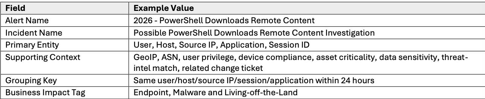

Grouping logic 

• Group by same user and source IP when identity or cloud activity is involved.
• Group by same host, process, file hash or destination when endpoint activity is involved.
• Group by same mailbox, site, file repository or external recipient when email or data activity is involved.
• Group by same API token, endpoint, session or customer object when application/API activity is involved.
• Escalate to a higher-level incident when two or more categories appear in the same timeline.

Triage Questions

• Is the user, host, application or service account expected to perform this activity?
• Is there an approved change, service request, incident ticket or business justification?
• Did the same entity trigger other related alerts before or after this event?
• Is the source IP, country, ASN, device, user-agent or session new for this entity?
• Is the affected asset, mailbox, data repository or application business-critical?
• Was the activity allowed, blocked, partially completed or only attempted?
• Is there evidence of data access, privilege change, control tampering, lateral movement or persistence?
• Should this be escalated to L2/L3, Incident Response, IAM, endpoint, cloud, network, application or risk/compliance
team?
• What is the parent-child process chain and command-line context?
• Should the endpoint or server be isolated immediately?

Recommended Response Actions

• Validate the alert against the simulated or real evidence timeline and preserve raw events.
• Enrich the entities with user role, asset owner, department, asset criticality, privilege level and recent activity.
• Check for matching activity across SIEM, EDR, identity, cloud, proxy, email, application and network telemetry.
• Escalate according to the incident classification and business impact, not only the technical event type.
• Document the final decision, containment actions, evidence and closure rationale in the case record.
• Contain affected endpoint or server if execution, credential access, persistence, lateral movement or impact indicators
are confirmed.
• Collect process tree, file hash, command line, network destination and memory/EDR evidence where required.

False Positive Possibilities 

• Approved maintenance, migration, testing, vulnerability assessment or administrative activity.
• Known automation account, service integration, backup process, security tool, scanner or deployment platform.
• Business travel, remote work, vendor support activity or approved temporary access.
• False reputation match, geolocation inaccuracy, NAT/proxy aggregation or log parsing issue.
• Application behaviour change after release, patch, policy update or workflow redesign.

# usecase 39 : lnk file launches command interpreter

category : endpoint; malware and living of the land binary
mitre att&ck mapping : T1204 User Execution; T1059 Command and Scripting Interpreter

hypothesis : a shortcut file disguised as a pdf launches cmd.exe or powershell

required log sources :
    - edr file events
    - edr process events
    - sysmon
    - timegenerated/eventtime
    - user/account/service-principal
    - host/device/asset
    - sourceip/destip/geo/asn
    - action/result/status
    - application/resource/object

Building Block Design

BB Lnk Execution
BB Command Interpreter Child
BB User Downloads Path

Rule Creation Logic 

rule High_Fidelity_LNK_Command_Interpreter
{
  meta:
    severity = "Critical"
    attack_technique = "T1204.002"

  events:

    $lnk.metadata.event_type = "PROCESS_LAUNCH"

    re.regex(
      $lnk.principal.process.file.full_path,
      `(?i).*\.lnk$`
    )

    re.regex(
      $lnk.target.process.file.full_path,
      `(?i)(
         cmd\.exe|
         powershell\.exe|
         pwsh\.exe|
         wscript\.exe|
         cscript\.exe
      )`
    )

    re.regex(
      $lnk.principal.process.file.full_path,
      `(?i)(
         \\downloads\\|
         \\desktop\\|
         \\temp\\|
         \\appdata\\
      )`
    )

  match:
    $lnk.principal.hostname over 60m

  outcome:

    $risk_score = 95

  condition:

    #lnk > 0 and

    not $lnk.principal.user.userid in
      %approved_automation_accounts
}

Alert Design 

Grouping logic 

• Group by same user and source IP when identity or cloud activity is involved.
• Group by same host, process, file hash or destination when endpoint activity is involved.
• Group by same mailbox, site, file repository or external recipient when email or data activity is involved.
• Group by same API token, endpoint, session or customer object when application/API activity is involved.
• Escalate to a higher-level incident when two or more categories appear in the same timeline.

Triage Questions

• Is the user, host, application or service account expected to perform this activity?
• Is there an approved change, service request, incident ticket or business justification?
• Did the same entity trigger other related alerts before or after this event?
• Is the source IP, country, ASN, device, user-agent or session new for this entity?
• Is the affected asset, mailbox, data repository or application business-critical?
• Was the activity allowed, blocked, partially completed or only attempted?
• Is there evidence of data access, privilege change, control tampering, lateral movement or persistence?
• Should this be escalated to L2/L3, Incident Response, IAM, endpoint, cloud, network, application or risk/compliance
team?
• What is the parent-child process chain and command-line context?
• Should the endpoint or server be isolated immediately?

Recommended Response Actions

• Validate the alert against the simulated or real evidence timeline and preserve raw events.
• Enrich the entities with user role, asset owner, department, asset criticality, privilege level and recent activity.
• Check for matching activity across SIEM, EDR, identity, cloud, proxy, email, application and network telemetry.
• Escalate according to the incident classification and business impact, not only the technical event type.
• Document the final decision, containment actions, evidence and closure rationale in the case record.
• Contain affected endpoint or server if execution, credential access, persistence, lateral movement or impact indicators
are confirmed.
• Collect process tree, file hash, command line, network destination and memory/EDR evidence where required.

False Positive Possibilities

• Approved maintenance, migration, testing, vulnerability assessment or administrative activity.
• Known automation account, service integration, backup process, security tool, scanner or deployment platform.
• Business travel, remote work, vendor support activity or approved temporary access.
• False reputation match, geolocation inaccuracy, NAT/proxy aggregation or log parsing issue.
• Application behaviour change after release, patch, policy update or workflow redesign.

# usecase 40 : Rundll32 execution from user-writable path

category : endpoint;malware and living of the land
mitre att&ck mapping : T1218.011 Rundll32

hypothesis : rundll32.exe runs a dll from downloads, temp or appdata rather than trusted system path

Required log sources :
    - edr
    - sysmon
    - file reputation
    - timegenerated/eventtime
    - user/account/service-prinicpal
    - host/device/asset
    - sourceip/geo/asn/destip
    - action/result/status
    - application/resource/object

Building Blocks Design

BB Rundll32 Execution
BB User-Writable Dll paths
BB Usigned File

Rule Creation logic 

rule High_Fidelity_Rundll32_User_Writable_DLL
{
  meta:
    severity = "Critical"
    attack_technique = "T1218.011"

  events:

    $proc.metadata.event_type =
      "PROCESS_LAUNCH"

    re.regex(
      $proc.target.process.file.full_path,
      `(?i).*\\rundll32\.exe`
    )

    re.regex(
      $proc.target.process.command_line,
      `(?i)(
         \\appdata\\|
         \\downloads\\|
         \\desktop\\|
         \\temp\\
      )`
    )

    $file.security_result.summary =
      "UNSIGNED_FILE"

  match:
    $proc.principal.hostname over 60m

  outcome:
    $risk_score = 95

  condition:

    #proc > 0 and
    #file > 0 and

    not $proc.principal.user.userid in
      %approved_software_deployment_accounts
}

Alert Design 

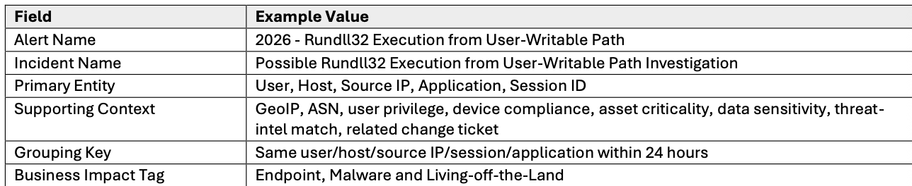

Grouping logic 

• Group by same user and source IP when identity or cloud activity is involved.
• Group by same host, process, file hash or destination when endpoint activity is involved.
• Group by same mailbox, site, file repository or external recipient when email or data activity is involved.
• Group by same API token, endpoint, session or customer object when application/API activity is involved.
• Escalate to a higher-level incident when two or more categories appear in the same timeline.

Triage Questions

• Is the user, host, application or service account expected to perform this activity?
• Is there an approved change, service request, incident ticket or business justification?
• Did the same entity trigger other related alerts before or after this event?
• Is the source IP, country, ASN, device, user-agent or session new for this entity?
• Is the affected asset, mailbox, data repository or application business-critical?
• Was the activity allowed, blocked, partially completed or only attempted?
• Is there evidence of data access, privilege change, control tampering, lateral movement or persistence?
• Should this be escalated to L2/L3, Incident Response, IAM, endpoint, cloud, network, application or risk/compliance
team?
• What is the parent-child process chain and command-line context?
• Should the endpoint or server be isolated immediately?

Recommended Response Actions

• Validate the alert against the simulated or real evidence timeline and preserve raw events.
• Enrich the entities with user role, asset owner, department, asset criticality, privilege level and recent activity.
• Check for matching activity across SIEM, EDR, identity, cloud, proxy, email, application and network telemetry.
• Escalate according to the incident classification and business impact, not only the technical event type.
• Document the final decision, containment actions, evidence and closure rationale in the case record.
• Contain affected endpoint or server if execution, credential access, persistence, lateral movement or impact indicators
are confirmed.
• Collect process tree, file hash, command line, network destination and memory/EDR evidence where required.

False Positive Possibilities

• Approved maintenance, migration, testing, vulnerability assessment or administrative activity.
• Known automation account, service integration, backup process, security tool, scanner or deployment platform.
• Business travel, remote work, vendor support activity or approved temporary access.
• False reputation match, geolocation inaccuracy, NAT/proxy aggregation or log parsing issue.
• Application behaviour change after release, patch, policy update or workflow redesign.

# usecase 41 : mshta execution from email or browser context 

category : endpoint, malware and living of the land
mitre att&ck mapping : T1218.005 Mshta

hypothesis : mshta.exe is launced froma an email or browser process and retrieves remote content

Required log sources :
    - edr
    - sysmon
    - email gateway
    - browser telemetry
    - timegenerated/eventtime
    - user/account/service-principal
    - host/device/asset
    - sourceip/destip/geo/asn
    - action/result/status
    - application/resource/object

Building Blocks Design 

BB Mshta execution
BB Suspicious Parent Process
BB External URL Argument

Rule Creation Logic 

rule High_Fidelity_Mshta_Email_Or_Browser_Execution
{
  meta:
    severity = "Critical"
    attack_technique = "T1218.005"

  events:

    $proc.metadata.event_type =
      "PROCESS_LAUNCH"

    re.regex(
      $proc.target.process.file.full_path,
      `(?i).*\\mshta\.exe`
    )

    re.regex(
      $proc.principal.process.file.full_path,
      `(?i)(
         outlook\.exe|
         chrome\.exe|
         msedge\.exe|
         firefox\.exe
      )`
    )

    re.regex(
      $proc.target.process.command_line,
      `(?i)(http://|https://)`
    )

  match:
    $proc.principal.hostname over 60m

  outcome:
    $risk_score = 95

  condition:

    #proc > 0 and

    not $proc.principal.user.userid in
      %approved_legacy_hta_users
}

Alert Design 

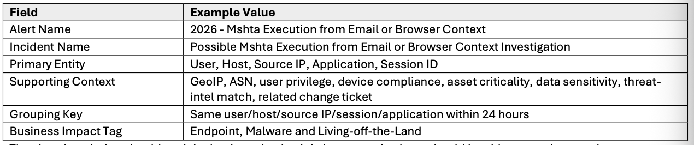

Grouping logic : 

• Group by same user and source IP when identity or cloud activity is involved.
• Group by same host, process, file hash or destination when endpoint activity is involved.
• Group by same mailbox, site, file repository or external recipient when email or data activity is involved.
• Group by same API token, endpoint, session or customer object when application/API activity is involved.
• Escalate to a higher-level incident when two or more categories appear in the same timeline.

Triage Questions : 

• Is the user, host, application or service account expected to perform this activity?
• Is there an approved change, service request, incident ticket or business justification?
• Did the same entity trigger other related alerts before or after this event?
• Is the source IP, country, ASN, device, user-agent or session new for this entity?
• Is the affected asset, mailbox, data repository or application business-critical?
• Was the activity allowed, blocked, partially completed or only attempted?
• Is there evidence of data access, privilege change, control tampering, lateral movement or persistence?
• Should this be escalated to L2/L3, Incident Response, IAM, endpoint, cloud, network, application or risk/compliance
team?
• What is the parent-child process chain and command-line context?
• Should the endpoint or server be isolated immediately?

Recommended Response Actions

• Validate the alert against the simulated or real evidence timeline and preserve raw events.
• Enrich the entities with user role, asset owner, department, asset criticality, privilege level and recent activity.
• Check for matching activity across SIEM, EDR, identity, cloud, proxy, email, application and network telemetry.
• Escalate according to the incident classification and business impact, not only the technical event type.
• Document the final decision, containment actions, evidence and closure rationale in the case record.
• Contain affected endpoint or server if execution, credential access, persistence, lateral movement or impact indicators
are confirmed.
• Collect process tree, file hash, command line, network destination and memory/EDR evidence where required.

False Positive Possibilities

• Approved maintenance, migration, testing, vulnerability assessment or administrative activity.
• Known automation account, service integration, backup process, security tool, scanner or deployment platform.
• Business travel, remote work, vendor support activity or approved temporary access.
• False reputation match, geolocation inaccuracy, NAT/proxy aggregation or log parsing issue.
• Application behaviour change after release, patch, policy update or workflow redesign.

# usecase 42 : Certutil or bitsadmin used to download file

category : Endpoint; malware and living of the land
mitre att&ck mapping : T1105 Ingress Tool Transfer; T1218 System Binary Proxy Execution

hypothesis : A native windows utility is used to to download a file on the internet 

Required log sources : 
    - edr
    - sysmon
      - 
    - proxy logs
      - shows outbount web access linked to certutil or bitsadmin used to download file , including url , domain, category, upload/download size, http method
    - timegenerated/eventtime
    - user/account/service-principal
    - sourceip/destinationip/geo/asn
    - action/result/status
    - application/resource/object 

Building Blocks Design 

BB Lolbin download
BB External Destination
BB User workstattion

Rule Creation logic

rule High_Fidelity_LOLBin_Download
{
  meta:
    severity = "Critical"
    attack_technique = "T1105"

  events:

    $proc.metadata.event_type =
      "PROCESS_LAUNCH"

    re.regex(
      $proc.target.process.file.full_path,
      `(?i).*(certutil|bitsadmin)\.exe`
    )

    re.regex(
      $proc.target.process.command_line,
      `(?i)(
         -urlcache|
         /transfer|
         http://|
         https://|
         ftp://
      )`
    )

    $ti.security_result.summary =
      "EXTERNAL_DESTINATION"

  match:
    $proc.principal.hostname over 60m

  outcome:
    $risk_score = 95

  condition:

    #proc > 0 and
    #ti > 0 and

    not $proc.principal.user.userid in
      %approved_software_deployment_accounts
}

Alert Design 

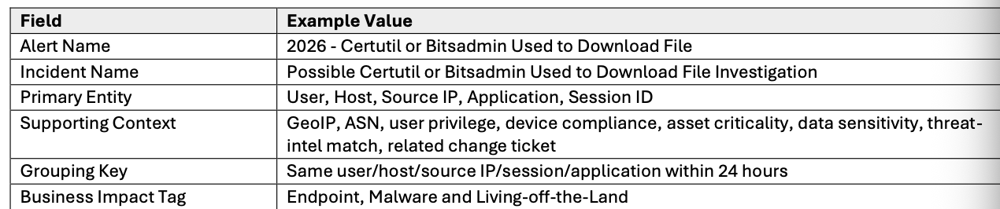

Grouping logic 

• Group by same user and source IP when identity or cloud activity is involved.
• Group by same host, process, file hash or destination when endpoint activity is involved.
• Group by same mailbox, site, file repository or external recipient when email or data activity is involved.
• Group by same API token, endpoint, session or customer object when application/API activity is involved.
• Escalate to a higher-level incident when two or more categories appear in the same timeline.

Triage Questions

• Is the user, host, application or service account expected to perform this activity?
• Is there an approved change, service request, incident ticket or business justification?
• Did the same entity trigger other related alerts before or after this event?
• Is the source IP, country, ASN, device, user-agent or session new for this entity?
• Is the affected asset, mailbox, data repository or application business-critical?
• Was the activity allowed, blocked, partially completed or only attempted?
• Is there evidence of data access, privilege change, control tampering, lateral movement or persistence?
• Should this be escalated to L2/L3, Incident Response, IAM, endpoint, cloud, network, application or risk/compliance
team?
• What is the parent-child process chain and command-line context?
• Should the endpoint or server be isolated immediately?

Recommended Response Actions

• Validate the alert against the simulated or real evidence timeline and preserve raw events.
• Enrich the entities with user role, asset owner, department, asset criticality, privilege level and recent activity.
• Check for matching activity across SIEM, EDR, identity, cloud, proxy, email, application and network telemetry.
• Escalate according to the incident classification and business impact, not only the technical event type.
• Document the final decision, containment actions, evidence and closure rationale in the case record.
• Contain affected endpoint or server if execution, credential access, persistence, lateral movement or impact indicators
are confirmed.
• Collect process tree, file hash, command line, network destination and memory/EDR evidence where required.

False Positive Possibilities

• Approved maintenance, migration, testing, vulnerability assessment or administrative activity.
• Known automation account, service integration, backup process, security tool, scanner or deployment platform.
• Business travel, remote work, vendor support activity or approved temporary access.
• False reputation match, geolocation inaccuracy, NAT/proxy aggregation or log parsing issue.
• Application behaviour change after release, patch, policy update or workflow redesign.

# usecase 43 : Suspicious Scheduled Task Created 

Category : Endpoint; malware and living of the land 
mitre att&ck mapping : T1053 Scheduled Task/Job; T1053.005 Scheduled Task

hypothesis : A scheduled task is created to run powershell or a script repeatedly from a user directory

Required log sources :
    - windows event logs
      - provides evidence for suspicious scheduled task created 
    - sysmon
    - edr
    - timegenerated/eventtime
    - user/account/service-principal
    - host/device/asset
    - sourceip/geo/destip/asn
    - action/result/status

Building Blocks Design 

BB Scheduled Task Creation
BB Script Interpreter Action
BB User-writable path

Rule Creation logic 

rule Scheduled_Task_Creates_Script_Interpreter
{
  meta:
    severity = "High"

  events:

    $task.metadata.event_type = "PROCESS_LAUNCH"

    re.regex(
      $task.target.process.file.full_path,
      `(?i).*schtasks\.exe`
    )

    re.regex(
      $task.target.process.command_line,
      `(?i)/create`
    )

    re.regex(
      $task.target.process.command_line,
      `(?i)(
        powershell\.exe|
        pwsh\.exe|
        cmd\.exe|
        wscript\.exe|
        cscript\.exe|
        mshta\.exe
      )`
    )

  match:
    $task.principal.hostname over 60m

  outcome:
    $risk_score = 85

  condition:
    #task > 0
}

Alert Design 

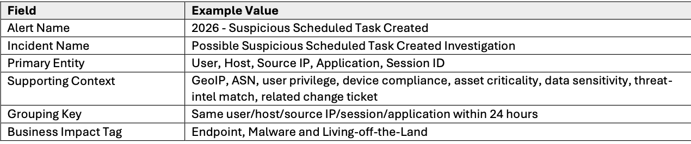

Grouping logic

• Group by same user and source IP when identity or cloud activity is involved.
• Group by same host, process, file hash or destination when endpoint activity is involved.
• Group by same mailbox, site, file repository or external recipient when email or data activity is involved.
• Group by same API token, endpoint, session or customer object when application/API activity is involved.
• Escalate to a higher-level incident when two or more categories appear in the same timeline.

Triage Questions

• Is the user, host, application or service account expected to perform this activity?
• Is there an approved change, service request, incident ticket or business justification?
• Did the same entity trigger other related alerts before or after this event?
• Is the source IP, country, ASN, device, user-agent or session new for this entity?
• Is the affected asset, mailbox, data repository or application business-critical?
• Was the activity allowed, blocked, partially completed or only attempted?
• Is there evidence of data access, privilege change, control tampering, lateral movement or persistence?
• Should this be escalated to L2/L3, Incident Response, IAM, endpoint, cloud, network, application or risk/compliance
team?
• What is the parent-child process chain and command-line context?
• Should the endpoint or server be isolated immediately?

Recommended Response Actions

• Validate the alert against the simulated or real evidence timeline and preserve raw events.
• Enrich the entities with user role, asset owner, department, asset criticality, privilege level and recent activity.
• Check for matching activity across SIEM, EDR, identity, cloud, proxy, email, application and network telemetry.
• Escalate according to the incident classification and business impact, not only the technical event type.
• Document the final decision, containment actions, evidence and closure rationale in the case record.
• Contain affected endpoint or server if execution, credential access, persistence, lateral movement or impact indicators
are confirmed.
• Collect process tree, file hash, command line, network destination and memory/EDR evidence where required.

False Positive Possibilities

• Approved maintenance, migration, testing, vulnerability assessment or administrative activity.
• Known automation account, service integration, backup process, security tool, scanner or deployment platform.
• Business travel, remote work, vendor support activity or approved temporary access.
• False reputation match, geolocation inaccuracy, NAT/proxy aggregation or log parsing issue.
• Application behaviour change after release, patch, policy update or workflow redesign.

# usecase 44 : Registry Run key persistence

Category : endpoint, malware and living of the land
mitre att&ck mapping : T1547.001 Registry Run Keys / Startup Folder

hypothesis : A run key is created pointing to an executable under AppData or Temp

Required log sources :
    - sysmon registry events
      - provides endpoint execution and host level evidence for registry run key persistence
    - edr
    - timegenerated/eventtime
    - user / account / service-principal
    - host/device/asset
    - sourceip/geo/asn/destip
    - action/result/status
    - application/resource/object

Rule Creation Logic 

rule Scheduled_Task_Creates_Script_Interpreter
{
  meta:
    severity = "High"

  events:

    $task.metadata.event_type = "PROCESS_LAUNCH"

    re.regex(
      $task.target.process.file.full_path,
      `(?i).*schtasks\.exe`
    )

    re.regex(
      $task.target.process.command_line,
      `(?i)/create`
    )

    re.regex(
      $task.target.process.command_line,
      `(?i)(
        powershell\.exe|
        pwsh\.exe|
        cmd\.exe|
        wscript\.exe|
        cscript\.exe|
        mshta\.exe
      )`
    )

  match:
    $task.principal.hostname over 60m

  outcome:
    $risk_score = 85

  condition:
    #task > 0
}

Alert Design 

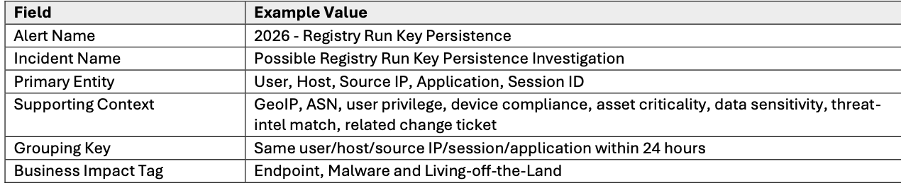

Groupin logic 

• Group by same user and source IP when identity or cloud activity is involved.
• Group by same host, process, file hash or destination when endpoint activity is involved.
• Group by same mailbox, site, file repository or external recipient when email or data activity is involved.
• Group by same API token, endpoint, session or customer object when application/API activity is involved.
• Escalate to a higher-level incident when two or more categories appear in the same timeline.

Triage Questions

• Is the user, host, application or service account expected to perform this activity?
• Is there an approved change, service request, incident ticket or business justification?
• Did the same entity trigger other related alerts before or after this event?
• Is the source IP, country, ASN, device, user-agent or session new for this entity?
• Is the affected asset, mailbox, data repository or application business-critical?
• Was the activity allowed, blocked, partially completed or only attempted?
• Is there evidence of data access, privilege change, control tampering, lateral movement or persistence?
• Should this be escalated to L2/L3, Incident Response, IAM, endpoint, cloud, network, application or risk/compliance
team?
• What is the parent-child process chain and command-line context?
• Should the endpoint or server be isolated immediately?

Recommended Response Actions

• Validate the alert against the simulated or real evidence timeline and preserve raw events.
• Enrich the entities with user role, asset owner, department, asset criticality, privilege level and recent activity.
• Check for matching activity across SIEM, EDR, identity, cloud, proxy, email, application and network telemetry.
• Escalate according to the incident classification and business impact, not only the technical event type.
• Document the final decision, containment actions, evidence and closure rationale in the case record.
• Contain affected endpoint or server if execution, credential access, persistence, lateral movement or impact indicators
are confirmed.
• Collect process tree, file hash, command line, network destination and memory/EDR evidence where required.

False Positive Possibilities

• Approved maintenance, migration, testing, vulnerability assessment or administrative activity.
• Known automation account, service integration, backup process, security tool, scanner or deployment platform.
• Business travel, remote work, vendor support activity or approved temporary access.
• False reputation match, geolocation inaccuracy, NAT/proxy aggregation or log parsing issue.
• Application behaviour change after release, patch, policy update or workflow redesign.

# usecase 45 : Suspicious lsass Access

category : endpoint, malware and living of the land
mitre att&ck mapping : T1003.001 LSASS Memory

hypothesis : An unsigned or abnormal process opens lsass memory with high access rights

Required log sources :
    - edr
    - sysmon event 10
    - windows security logs
    - timegenerated/event-time
    - user/account/service-prinicpal
    - host/device/asset
    - sourceip/geo/destip/asn
    - action/result/status
    - application/resource/object

Building Blocks Design 

BB Lsass Access
BB Non-standad Process
BB Credential Theft Tools Exclusion

Rule Creation logic

rule High_Fidelity_Suspicious_LSASS_Access
{
  meta:
    severity = "Critical"
    attack_technique = "T1003.001"

  events:

    $access.metadata.event_type =
      "PROCESS_ACCESS"

    re.regex(
      $access.target.process.file.full_path,
      `(?i).*\\lsass\.exe`
    )

    re.regex(
      $access.principal.process.file.full_path,
      `(?i)(
        mimikatz|
        procdump|
        dumpert|
        nanodump|
        rundll32
      )`
    )

  match:
    $access.principal.hostname over 60m

  outcome:
    $risk_score = 95

  condition:

    #access > 0 and

    not $access.principal.process.file.full_path in
      %approved_lsass_access_tools
}

Alert Design 

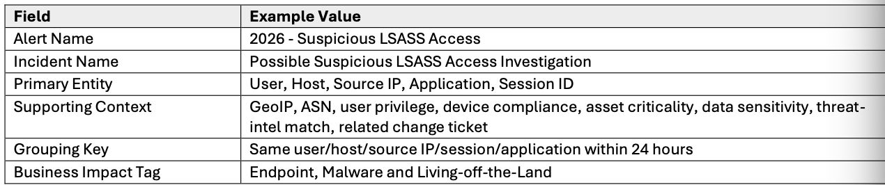

Grouping logic 

• Group by same user and source IP when identity or cloud activity is involved.
• Group by same host, process, file hash or destination when endpoint activity is involved.
• Group by same mailbox, site, file repository or external recipient when email or data activity is involved.
• Group by same API token, endpoint, session or customer object when application/API activity is involved.
• Escalate to a higher-level incident when two or more categories appear in the same timeline.

Triage Questions

• Is the user, host, application or service account expected to perform this activity?
• Is there an approved change, service request, incident ticket or business justification?
• Did the same entity trigger other related alerts before or after this event?
• Is the source IP, country, ASN, device, user-agent or session new for this entity?
• Is the affected asset, mailbox, data repository or application business-critical?
• Was the activity allowed, blocked, partially completed or only attempted?
• Is there evidence of data access, privilege change, control tampering, lateral movement or persistence?
• Should this be escalated to L2/L3, Incident Response, IAM, endpoint, cloud, network, application or risk/compliance
team?
• What is the parent-child process chain and command-line context?
• Should the endpoint or server be isolated immediately?

Recommended Response Actions

• Validate the alert against the simulated or real evidence timeline and preserve raw events.
• Enrich the entities with user role, asset owner, department, asset criticality, privilege level and recent activity.
• Check for matching activity across SIEM, EDR, identity, cloud, proxy, email, application and network telemetry.
• Escalate according to the incident classification and business impact, not only the technical event type.
• Document the final decision, containment actions, evidence and closure rationale in the case record.
• Contain affected endpoint or server if execution, credential access, persistence, lateral movement or impact indicators
are confirmed.
• Collect process tree, file hash, command line, network destination and memory/EDR evidence where required.

False Positive Possibilities

• Approved maintenance, migration, testing, vulnerability assessment or administrative activity.
• Known automation account, service integration, backup process, security tool, scanner or deployment platform.
• Business travel, remote work, vendor support activity or approved temporary access.
• False reputation match, geolocation inaccuracy, NAT/proxy aggregation or log parsing issue.
• Application behaviour change after release, patch, policy update or workflow redesign.

Tuning Notes

• Create and maintain the building blocks used by this rule: BB: LSASS Access, BB: Non-Standard Process, BB:
Credential Theft Tools Exclusion.
• Do not tune by broad user or IP exclusion alone. Prefer conditional exclusions using asset, application, time window,
change ticket and expected source.
• Use dynamic baselines per user, host, application or service account where possible. A single global threshold will
create noise or miss high-risk low-volume activity.
• Review the rule after every confirmed true positive, false positive spike, application migration, logging schema change
or major incident.
• Record tuning decisions in the use case register so future analysts understand why thresholds, exceptions and
suppression rules exist.

# usecase 46 : Security tool disabled or tampered

Category : endpoint, malware and living of the land
Mitre att&ck mapping : T1562 Impair Defenses

Hypothesis : Endpoint service is stopped or policy is weakened before suspicious activity continues

Required log sources : 
    - edr health logs
    - windows services
    - av logs
      - provides supporting evidence for security tool disabled or tampered
    - sysmon
    - timegenerated/eventtime
    - user/account/service-prinicpal
    - host/device/asset
    - sourceip/geo/asn/destip
    - action/result/status
    - application/resource/object

Building Block Design 

BB EDR Service Stop
BB AV Policy Change
BB Critical Servers

Rule Creation logic

rule EDR_Service_Stop_With_AV_Policy_Change
{
  meta:
    severity = "Critical"

  events:

    $service.metadata.event_type = "SERVICE_STATE_CHANGE"

    re.regex(
      $service.target.service.name,
      `(?i)(
         windefend|
         sense|
         csagent|
         sentinelone
      )`
    )

    $service.security_result.action = "STOP"

    $policy.metadata.event_type = "SECURITY_POLICY_MODIFICATION"

    $policy.security_result.action = "MODIFY"

  match:
    $service.principal.hostname over 60m

  outcome:
    $risk_score = 90

  condition:

    #service > 0 and
    #policy > 0
}

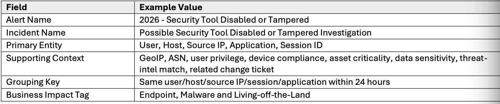

Grouping logic

• Group by same user and source IP when identity or cloud activity is involved.
• Group by same host, process, file hash or destination when endpoint activity is involved.
• Group by same mailbox, site, file repository or external recipient when email or data activity is involved.
• Group by same API token, endpoint, session or customer object when application/API activity is involved.
• Escalate to a higher-level incident when two or more categories appear in the same timeline.

Triage Questions

• Is the user, host, application or service account expected to perform this activity?
• Is there an approved change, service request, incident ticket or business justification?
• Did the same entity trigger other related alerts before or after this event?
• Is the source IP, country, ASN, device, user-agent or session new for this entity?
• Is the affected asset, mailbox, data repository or application business-critical?
• Was the activity allowed, blocked, partially completed or only attempted?
• Is there evidence of data access, privilege change, control tampering, lateral movement or persistence?
• Should this be escalated to L2/L3, Incident Response, IAM, endpoint, cloud, network, application or risk/compliance
team?
• What is the parent-child process chain and command-line context?
• Should the endpoint or server be isolated immediately?

Recommended Response Actions

• Validate the alert against the simulated or real evidence timeline and preserve raw events.
• Enrich the entities with user role, asset owner, department, asset criticality, privilege level and recent activity.
• Check for matching activity across SIEM, EDR, identity, cloud, proxy, email, application and network telemetry.
• Escalate according to the incident classification and business impact, not only the technical event type.
• Document the final decision, containment actions, evidence and closure rationale in the case record.
• Contain affected endpoint or server if execution, credential access, persistence, lateral movement or impact indicators
are confirmed.
• Collect process tree, file hash, command line, network destination and memory/EDR evidence where required.

False Positive Possibilities

• Approved maintenance, migration, testing, vulnerability assessment or administrative activity.
• Known automation account, service integration, backup process, security tool, scanner or deployment platform.
• Business travel, remote work, vendor support activity or approved temporary access.
• False reputation match, geolocation inaccuracy, NAT/proxy aggregation or log parsing issue.
• Application behaviour change after release, patch, policy update or workflow redesign.

# usecase 47 : same suspicious hash executed on multiple hosts

category : endpoint; malware and living of the land
mitre att&ck mapping : T1105 Ingress Tool Transfer; T1204 User Execution

hypothesis : The same unknown executable appears and runs on multiple workstations within a short period

Required log sources :
    - edr file events
    - edr process events
    - threat intel
    - timegenerated/eventtime
    - user/account/service-principal
    - host/device/asset
    - sourceip/destip/geo/asn
    - action/result/status
    - application/object/resource

Building Blocks Design 

BB Unkown File hash
BB Multi-Host Execution
BB Malware Reputation

Rule Creation logic

rule High_Fidelity_Suspicious_Hash_Outbreak
{
  meta:
    severity = "Critical"
    attack_technique = "T1204"

  events:

    $proc.metadata.event_type =
        "PROCESS_LAUNCH"

    $hash =
        $proc.target.process.file.sha256

    $ti.security_result.summary =
        "MALWARE_REPUTATION"

  match:

    $hash over 60m

  outcome:

    $host_count =
        count_distinct($proc.principal.hostname)

    $risk_score = 95

  condition:

    #proc >= 3 and

    $host_count >= 3 and

    #ti > 0 and

    not $hash in %approved_enterprise_hashes
}

Alert Design 

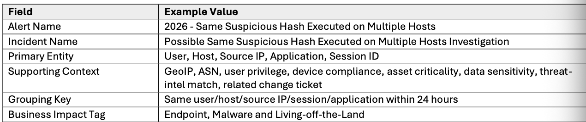

Grouping logic

• Group by same user and source IP when identity or cloud activity is involved.
• Group by same host, process, file hash or destination when endpoint activity is involved.
• Group by same mailbox, site, file repository or external recipient when email or data activity is involved.
• Group by same API token, endpoint, session or customer object when application/API activity is involved.
• Escalate to a higher-level incident when two or more categories appear in the same timeline.

Triage Questions

• Is the user, host, application or service account expected to perform this activity?
• Is there an approved change, service request, incident ticket or business justification?
• Did the same entity trigger other related alerts before or after this event?
• Is the source IP, country, ASN, device, user-agent or session new for this entity?
• Is the affected asset, mailbox, data repository or application business-critical?
• Was the activity allowed, blocked, partially completed or only attempted?
• Is there evidence of data access, privilege change, control tampering, lateral movement or persistence?
• Should this be escalated to L2/L3, Incident Response, IAM, endpoint, cloud, network, application or risk/compliance
team?
• What is the parent-child process chain and command-line context?
• Should the endpoint or server be isolated immediately?

Recommended Response Actions

• Validate the alert against the simulated or real evidence timeline and preserve raw events.
• Enrich the entities with user role, asset owner, department, asset criticality, privilege level and recent activity.
• Check for matching activity across SIEM, EDR, identity, cloud, proxy, email, application and network telemetry.
• Escalate according to the incident classification and business impact, not only the technical event type.
• Document the final decision, containment actions, evidence and closure rationale in the case record.
• Contain affected endpoint or server if execution, credential access, persistence, lateral movement or impact indicators
are confirmed.
• Collect process tree, file hash, command line, network destination and memory/EDR evidence where required.

False Positive Possibilities

• Approved maintenance, migration, testing, vulnerability assessment or administrative activity.
• Known automation account, service integration, backup process, security tool, scanner or deployment platform.
• Business travel, remote work, vendor support activity or approved temporary access.
• False reputation match, geolocation inaccuracy, NAT/proxy aggregation or log parsing issue.
• Application behaviour change after release, patch, policy update or workflow redesign.

# usecase 48 : Volume Shadow Copy Deletion

Category : Ransomware and Destructive Activity 
mitre att&ck mapping : T1490 Inhibit System Recovery

hypothesis : A host runs commands that delete local recovery snapshots, often seen before encryption activity

Required log sources :
    - edr process events
    - windows logs
    - powershell logs
    - timegenerated/eventtime
    - user/account/service-principal
    - host/device/asset
    - source-ip/destip/geo/asn
    - action/result/status
    - application/resource/object

Building Blocks Design 

BB Process Recovery 
BB Server Criticality
BB Admin Account

Rule Creation logic

rule High_Fidelity_Volume_Shadow_Copy_Deletion
{
  meta:
    severity = "Critical"
    attack_technique = "T1490"

  events:

    $proc.metadata.event_type = "PROCESS_LAUNCH"

    re.regex(
      $proc.target.process.command_line,
      `(?i)(
         vssadmin.*delete.*shadow|
         wmic.*shadowcopy.*delete|
         wbadmin.*delete.*catalog|
         bcdedit.*recoveryenabled.*no|
         bcdedit.*bootstatuspolicy.*ignoreallfailures
      )`
    )

    $asset.security_result.summary = "CRITICAL_SERVER"

  match:

    $proc.principal.hostname over 60m

  outcome:

    $risk_score = 95

  condition:

    #proc > 0 and

    not $proc.principal.user.userid in
      %approved_backup_accounts
}

Alert Design

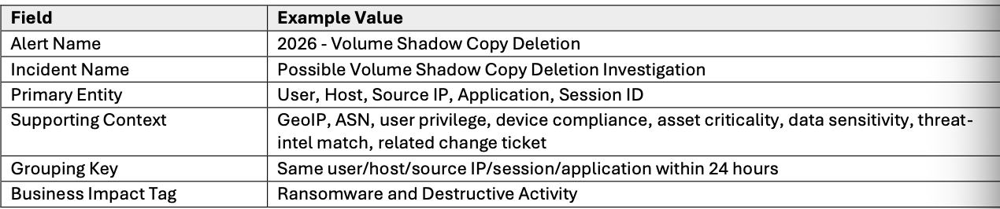

Grouping logic

• Group by same user and source IP when identity or cloud activity is involved.
• Group by same host, process, file hash or destination when endpoint activity is involved.
• Group by same mailbox, site, file repository or external recipient when email or data activity is involved.
• Group by same API token, endpoint, session or customer object when application/API activity is involved.
• Escalate to a higher-level incident when two or more categories appear in the same timeline.

Triage Questions

• Is the user, host, application or service account expected to perform this activity?
• Is there an approved change, service request, incident ticket or business justification?
• Did the same entity trigger other related alerts before or after this event?
• Is the source IP, country, ASN, device, user-agent or session new for this entity?
• Is the affected asset, mailbox, data repository or application business-critical?
• Was the activity allowed, blocked, partially completed or only attempted?
• Is there evidence of data access, privilege change, control tampering, lateral movement or persistence?
• Should this be escalated to L2/L3, Incident Response, IAM, endpoint, cloud, network, application or risk/compliance
team?
• What is the parent-child process chain and command-line context?
• Should the endpoint or server be isolated immediately?

Recommended Response Actions

• Validate the alert against the simulated or real evidence timeline and preserve raw events.
• Enrich the entities with user role, asset owner, department, asset criticality, privilege level and recent activity.
• Check for matching activity across SIEM, EDR, identity, cloud, proxy, email, application and network telemetry.
• Escalate according to the incident classification and business impact, not only the technical event type.
• Document the final decision, containment actions, evidence and closure rationale in the case record.
• Contain affected endpoint or server if execution, credential access, persistence, lateral movement or impact indicators
are confirmed.
• Collect process tree, file hash, command line, network destination and memory/EDR evidence where required.

False Positive Possibilities

• Approved maintenance, migration, testing, vulnerability assessment or administrative activity.
• Known automation account, service integration, backup process, security tool, scanner or deployment platform.
• Business travel, remote work, vendor support activity or approved temporary access.
• False reputation match, geolocation inaccuracy, NAT/proxy aggregation or log parsing issue.
• Application behaviour change after release, patch, policy update or workflow redesign.

# usecase 49 : Backup Repository Deletion or Tampering 

Category : Ransomware and Destructive Activity 
Mitre att&ck mapping : T1490 Inhibit System Recovery

hypothesis : A backup admin account deletes restore points or modifies retention unexpectedly

Required log sources :
    - backup platform logs
    - pam logs
    - windows logs
    - timegenerated/eventtime
    - user/account/service-principal
    - host/device/asset
    - sourceip/destip/geo/asn
    - action/result/status
    - application/resource/object

Building Blocks Design 

BB Backup Admin Accounts
BB Critical Backup Repository 
BB Approved Backup

Rule Creation logic 

rule Backup_Repository_Tampering_On_Critical_System
{
  meta:
    severity = "Critical"
    mitre_tactic = "Impact"

  events:

    $backup.metadata.event_type = "RESOURCE_DELETION"

    re.regex(
      $backup.target.resource.name,
      `(?i)(
         backup|
         repository|
         immutable|
         vault
      )`
    )

    $pam.security_result.summary = "BACKUP_ADMIN_ACCOUNT"

    $asset.security_result.summary = "CRITICAL_BACKUP_REPOSITORY"

  match:

    $backup.principal.hostname over 60m

  outcome:

    $risk_score =
        50 +
        if(#pam > 0,20,0) +
        if(#asset > 0,25,0)

  condition:

    #backup > 0 and

    (
      #pam > 0 or
      #asset > 0
    ) and

    $risk_score >= 80
}

Alert Design 

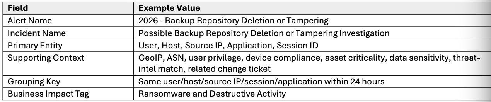

Grouping logic 

• Group by same user and source IP when identity or cloud activity is involved.
• Group by same host, process, file hash or destination when endpoint activity is involved.
• Group by same mailbox, site, file repository or external recipient when email or data activity is involved.
• Group by same API token, endpoint, session or customer object when application/API activity is involved.
• Escalate to a higher-level incident when two or more categories appear in the same timeline.

Triage Questions

• Is the user, host, application or service account expected to perform this activity?
• Is there an approved change, service request, incident ticket or business justification?
• Did the same entity trigger other related alerts before or after this event?
• Is the source IP, country, ASN, device, user-agent or session new for this entity?
• Is the affected asset, mailbox, data repository or application business-critical?
• Was the activity allowed, blocked, partially completed or only attempted?
• Is there evidence of data access, privilege change, control tampering, lateral movement or persistence?
• Should this be escalated to L2/L3, Incident Response, IAM, endpoint, cloud, network, application or risk/compliance
team?
• What is the parent-child process chain and command-line context?
• Should the endpoint or server be isolated immediately?

Recommended Response Actions

• Validate the alert against the simulated or real evidence timeline and preserve raw events.
• Enrich the entities with user role, asset owner, department, asset criticality, privilege level and recent activity.
• Check for matching activity across SIEM, EDR, identity, cloud, proxy, email, application and network telemetry.
• Escalate according to the incident classification and business impact, not only the technical event type.
• Document the final decision, containment actions, evidence and closure rationale in the case record.
• Contain affected endpoint or server if execution, credential access, persistence, lateral movement or impact indicators
are confirmed.
• Collect process tree, file hash, command line, network destination and memory/EDR evidence where required.

False Positive Possibilities

• Approved maintenance, migration, testing, vulnerability assessment or administrative activity.
• Known automation account, service integration, backup process, security tool, scanner or deployment platform.
• Business travel, remote work, vendor support activity or approved temporary access.
• False reputation match, geolocation inaccuracy, NAT/proxy aggregation or log parsing issue.
• Application behaviour change after release, patch, policy update or workflow redesign.

# usecase 50 : Mass File Rename or Modification Spike 

Category : Ransomwae and Destructive Activity 
Mitre att&ck mapping : T1486 Data Encrypted for Impact

Hypothesis : One endpoint modifies thounsands of fikes across a share in minutes

Required log sources :
    - file server audit
      - provides supporting evidence for mass file rename or modification spike
    - edr file events
    - windows logs
    - timegenrated/eventtime
    - user/account/service-principal
    - host/device/asset
    - sourceip/geo/asn/destip
    - action/result/status
    - application/resource/object

Building Block Design 

BB File Rename Share
BB Sensitive Shares
BB Known Backup Processes

Rule Creation Logic

rule Mass_File_Modification_On_Sensitive_Shares
{
  meta:
    severity = "Critical"
    mitre_tactic = "Impact"

  events:

    $file.metadata.event_type = "FILE_MODIFICATION"

    $host = $file.principal.hostname

    $share.security_result.summary = "SENSITIVE_SHARE"

    $proc.security_result.summary = "KNOWN_BACKUP_PROCESS"

  match:

    $host over 10m

  outcome:

    $modified =
        count($file)

    $risk_score =
        if($modified >= 1000,70,40) +
        if(#share > 0,20,0)

  condition:

    $modified >= 500 and

    #proc = 0 and

    $risk_score >= 80
}

Alert Design 

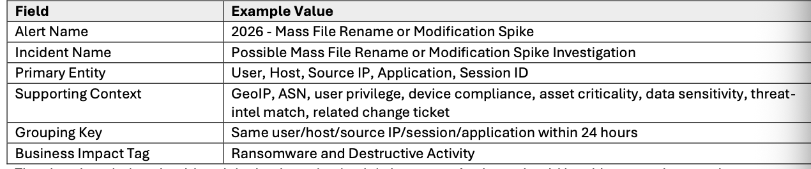

Grouping logic 

• Group by same user and source IP when identity or cloud activity is involved.
• Group by same host, process, file hash or destination when endpoint activity is involved.
• Group by same mailbox, site, file repository or external recipient when email or data activity is involved.
• Group by same API token, endpoint, session or customer object when application/API activity is involved.
• Escalate to a higher-level incident when two or more categories appear in the same timeline.

Triage Questions

• Is the user, host, application or service account expected to perform this activity?
• Is there an approved change, service request, incident ticket or business justification?
• Did the same entity trigger other related alerts before or after this event?
• Is the source IP, country, ASN, device, user-agent or session new for this entity?
• Is the affected asset, mailbox, data repository or application business-critical?
• Was the activity allowed, blocked, partially completed or only attempted?
• Is there evidence of data access, privilege change, control tampering, lateral movement or persistence?
• Should this be escalated to L2/L3, Incident Response, IAM, endpoint, cloud, network, application or risk/compliance
team?
• What is the parent-child process chain and command-line context?
• Should the endpoint or server be isolated immediately?

Recommended Response Actions

• Validate the alert against the simulated or real evidence timeline and preserve raw events.
• Enrich the entities with user role, asset owner, department, asset criticality, privilege level and recent activity.
• Check for matching activity across SIEM, EDR, identity, cloud, proxy, email, application and network telemetry.
• Escalate according to the incident classification and business impact, not only the technical event type.
• Document the final decision, containment actions, evidence and closure rationale in the case record.
• Contain affected endpoint or server if execution, credential access, persistence, lateral movement or impact indicators
are confirmed.
• Collect process tree, file hash, command line, network destination and memory/EDR evidence where required.

False Positive Possibilities

• Approved maintenance, migration, testing, vulnerability assessment or administrative activity.
• Known automation account, service integration, backup process, security tool, scanner or deployment platform.
• Business travel, remote work, vendor support activity or approved temporary access.
• False reputation match, geolocation inaccuracy, NAT/proxy aggregation or log parsing issue.
• Application behaviour change after release, patch, policy update or workflow redesign.

# usecase 51 : Ransom note pattern across multiple hosts

Category : Ransomware and Destructive Activity 
Mitre att&ck mapping : T1486 Data Encrypted for Impact

hypothesis : Identical recovery-note files appear across many folders and hosts

Required log sources :
    - edr file events
    - file server audit
      - provides supporting evidence for ransom note pattern across multiple hosts
    - user/account/service-principal
    - host/device/asset
    - sourceip/destip/geo/asn
    - action/result/status
    - application/resource/object

Building Blocks Design

BB Ransom Note FileName
BB Multi-Host File Creation
BB Sensitive Shares

Rule Creation Logic 

rule Ransom_Note_Created_On_Sensitive_Shares
{
  meta:
    severity = "Critical"
    mitre_tactic = "Impact"

  events:

    $note.metadata.event_type = "FILE_CREATION"

    re.regex(
      $note.target.file.full_path,
      `(?i)(
          readme|
          decrypt|
          recover|
          restore|
          ransom
      ).*\.(txt|html)$`
    )

    $share.security_result.summary =
        "SENSITIVE_SHARE"

    $host =
        $note.principal.hostname

  match:

    $host over 60m

  outcome:

    $note_count =
        count($note)

    $risk_score =
        if($note_count >= 5,80,60) +
        if(#share > 0,20,0)

  condition:

    $note_count >= 3 and

    #share > 0 and

    $risk_score >= 80
}

Alert Design 

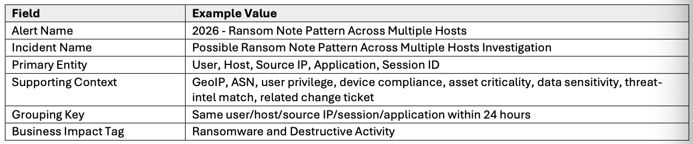

Grouping logic 

 Group by same user and source IP when identity or cloud activity is involved.
• Group by same host, process, file hash or destination when endpoint activity is involved.
• Group by same mailbox, site, file repository or external recipient when email or data activity is involved.
• Group by same API token, endpoint, session or customer object when application/API activity is involved.
• Escalate to a higher-level incident when two or more categories appear in the same timeline.

Triage Questions

• Is the user, host, application or service account expected to perform this activity?
• Is there an approved change, service request, incident ticket or business justification?
• Did the same entity trigger other related alerts before or after this event?
• Is the source IP, country, ASN, device, user-agent or session new for this entity?
• Is the affected asset, mailbox, data repository or application business-critical?
• Was the activity allowed, blocked, partially completed or only attempted?
• Is there evidence of data access, privilege change, control tampering, lateral movement or persistence?
• Should this be escalated to L2/L3, Incident Response, IAM, endpoint, cloud, network, application or risk/compliance
team?
• What is the parent-child process chain and command-line context?
• Should the endpoint or server be isolated immediately?

Recommended Response Actions

• Validate the alert against the simulated or real evidence timeline and preserve raw events.
• Enrich the entities with user role, asset owner, department, asset criticality, privilege level and recent activity.
• Check for matching activity across SIEM, EDR, identity, cloud, proxy, email, application and network telemetry.
• Escalate according to the incident classification and business impact, not only the technical event type.
• Document the final decision, containment actions, evidence and closure rationale in the case record.
• Contain affected endpoint or server if execution, credential access, persistence, lateral movement or impact indicators
are confirmed.
• Collect process tree, file hash, command line, network destination and memory/EDR evidence where required.

False Positive Possibilities

• Approved maintenance, migration, testing, vulnerability assessment or administrative activity.
• Known automation account, service integration, backup process, security tool, scanner or deployment platform.
• Business travel, remote work, vendor support activity or approved temporary access.
• False reputation match, geolocation inaccuracy, NAT/proxy aggregation or log parsing issue.
• Application behaviour change after release, patch, policy update or workflow redesign.

# usecase 52 : Remote Admin Tool abuse before impact 

Category : Ransomware and destructive Activity 
Mitre att&ck mapping : T1219 Remote Access Software; T1021 Remote Services

hypothesis : An unapproved remote administration tool is installed and used across many endpoints

Required log sources :
    - edr 
    - network logs
    - pam logs
    - timegenerated/eventtime
    - user/account/service-prinicpal
    - host/device/asset
    - sourceip/geo/asn/destip
    - action/result/status
    - application/resource/object

Building Block Design 

BB Aproved Remote Tools
BB Multi Host Execution 
BB Critical Server Access

Rule Creation logic

rule Remote_Admin_Tool_On_Critical_Servers
{
  meta:
    severity = "Critical"
    mitre_tactic = "Lateral Movement"

  events:

    $proc.metadata.event_type = "PROCESS_LAUNCH"

    re.regex(
      $proc.target.process.file.full_path,
      `(?i)(
         anydesk|
         teamviewer|
         rustdesk|
         screenconnect|
         connectwise|
         meshagent|
         atera|
         psexec
      )`
    )

    $asset.security_result.summary =
        "CRITICAL_SERVER"

    $pam.security_result.summary =
        "PRIVILEGED_SESSION"

    $user =
        $proc.principal.user.userid

  match:

    $user over 60m

  outcome:

    $hosts =
        count_distinct($proc.principal.hostname)

    $risk_score =
        50 +
        if(#asset > 0,20,0) +
        if(#pam > 0,20,0)

  condition:

    #proc >= 3 and

    $hosts >= 3 and

    (
        #asset > 0 or
        #pam > 0
    ) and

    $risk_score >= 80
}

Alert Design 

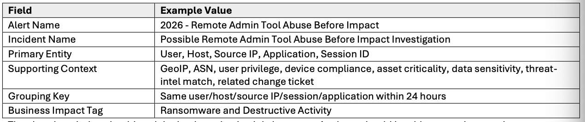

Grouping logic 

• Group by same user and source IP when identity or cloud activity is involved.
• Group by same host, process, file hash or destination when endpoint activity is involved.
• Group by same mailbox, site, file repository or external recipient when email or data activity is involved.
• Group by same API token, endpoint, session or customer object when application/API activity is involved.
• Escalate to a higher-level incident when two or more categories appear in the same timeline.

Triage Questions

• Is the user, host, application or service account expected to perform this activity?
• Is there an approved change, service request, incident ticket or business justification?
• Did the same entity trigger other related alerts before or after this event?
• Is the source IP, country, ASN, device, user-agent or session new for this entity?
• Is the affected asset, mailbox, data repository or application business-critical?
• Was the activity allowed, blocked, partially completed or only attempted?
• Is there evidence of data access, privilege change, control tampering, lateral movement or persistence?
• Should this be escalated to L2/L3, Incident Response, IAM, endpoint, cloud, network, application or risk/compliance
team?
• What is the parent-child process chain and command-line context?
• Should the endpoint or server be isolated immediately?

Recommended Response Actions

• Validate the alert against the simulated or real evidence timeline and preserve raw events.
• Enrich the entities with user role, asset owner, department, asset criticality, privilege level and recent activity.
• Check for matching activity across SIEM, EDR, identity, cloud, proxy, email, application and network telemetry.
• Escalate according to the incident classification and business impact, not only the technical event type.
• Document the final decision, containment actions, evidence and closure rationale in the case record.
• Contain affected endpoint or server if execution, credential access, persistence, lateral movement or impact indicators
are confirmed.
• Collect process tree, file hash, command line, network destination and memory/EDR evidence where required.

False Positive Possibilities

• Approved maintenance, migration, testing, vulnerability assessment or administrative activity.
• Known automation account, service integration, backup process, security tool, scanner or deployment platform.
• Business travel, remote work, vendor support activity or approved temporary access.
• False reputation match, geolocation inaccuracy, NAT/proxy aggregation or log parsing issue.
• Application behaviour change after release, patch, policy update or workflow redesign.

# usecase 53 : Security logs cleared on server

Category : Ransomware and Destructive Activity
Mitre att&ck mapping : T1070.001 Clear Windows Event Logs

hypothesis : Windows Security logs are cleared after priviledged access to a server

Required log sources :
    - windows security logs
    - edr
    - siem health
    - timegenerated/eventtime
    - user/account/service-principal
    - host/device/asset
    - sourceip/geo/destip/asn
    - action/result/status
    - application/resource/object

Building Blocks Design 

BB Event log cleared
BB Critical Servers
BB Priviledged Users

Rule Creation logic

rule High_Fidelity_Event_Log_Clearing
{
  meta:
    severity = "Critical"
    attack_technique = "T1070.001"

  events:

    $event.metadata.event_type = "STATUS_UPDATE"

    (
      $event.metadata.product_event_type = "1102" or
      $event.security_result.summary = "Audit log cleared"
    )

    $asset.security_result.summary = "CRITICAL_SERVER"

    $host = $event.principal.hostname

  match:

    $host over 60m

  outcome:

    $risk_score = 95

  condition:

      #event > 0

      and

      #asset > 0

      and

      not $event.principal.user.userid in
          %approved_server_admins
}

Alert Design 

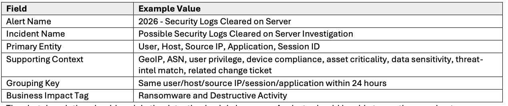

Grouping logic 

• Group by same user and source IP when identity or cloud activity is involved.
• Group by same host, process, file hash or destination when endpoint activity is involved.
• Group by same mailbox, site, file repository or external recipient when email or data activity is involved.
• Group by same API token, endpoint, session or customer object when application/API activity is involved.
• Escalate to a higher-level incident when two or more categories appear in the same timeline.

Triage Questions

• Is the user, host, application or service account expected to perform this activity?
• Is there an approved change, service request, incident ticket or business justification?
• Did the same entity trigger other related alerts before or after this event?
• Is the source IP, country, ASN, device, user-agent or session new for this entity?
• Is the affected asset, mailbox, data repository or application business-critical?
• Was the activity allowed, blocked, partially completed or only attempted?
• Is there evidence of data access, privilege change, control tampering, lateral movement or persistence?
• Should this be escalated to L2/L3, Incident Response, IAM, endpoint, cloud, network, application or risk/compliance
team?
• What is the parent-child process chain and command-line context?
• Should the endpoint or server be isolated immediately?

Recommended Response Actions

• Validate the alert against the simulated or real evidence timeline and preserve raw events.
• Enrich the entities with user role, asset owner, department, asset criticality, privilege level and recent activity.
• Check for matching activity across SIEM, EDR, identity, cloud, proxy, email, application and network telemetry.
• Escalate according to the incident classification and business impact, not only the technical event type.
• Document the final decision, containment actions, evidence and closure rationale in the case record.
• Contain affected endpoint or server if execution, credential access, persistence, lateral movement or impact indicators
are confirmed.
• Collect process tree, file hash, command line, network destination and memory/EDR evidence where required.

False Positive Possibilities

• Approved maintenance, migration, testing, vulnerability assessment or administrative activity.
• Known automation account, service integration, backup process, security tool, scanner or deployment platform.
• Business travel, remote work, vendor support activity or approved temporary access.
• False reputation match, geolocation inaccuracy, NAT/proxy aggregation or log parsing issue.
• Application behaviour change after release, patch, policy update or workflow redesign.

# usecase 54 : mass service stop on critical host 

category : ransomware and destructive activity 
mitre att&ck mapping : T1489 Service Stop

hypothesis : Multiple backup, database or endpoint protection services top in a short time window

Required log sources :
    - windows service logs
    - edr process events
    - application logs
    - timegenerated/eventtime
    - user/account/service-principal
    - sourceip/destip/geo/asn
    - action/result/status
    - application/resource/object

Building Blocks Design 

BB Critical Services
BB Mass Service Stop
BB Approved Maintenance Window

Rule Creation logic

rule Mass_Service_Stop_Critical_Server
{
  meta:
    severity = "Critical"
    mitre_tactic = "Impact"
    mitre_technique = "T1489"

  events:

    $svc.metadata.event_type = "SERVICE_STOP"

    $critical.security_result.summary = "CRITICAL_SERVICE"

    $asset.security_result.summary = "CRITICAL_HOST"

    $host = $svc.principal.hostname

  match:

    $host over 10m

  outcome:

    $service_count = count($svc)

    $risk_score =
        40 +
        if(#critical > 0,20,0) +
        if(#asset > 0,20,0) +
        if($service_count >= 10,20,10)

  condition:

    $service_count >= 5

    and

    (
      #critical > 0 or
      #asset > 0
    )

    and

    $risk_score >= 80
}

Alert Design 

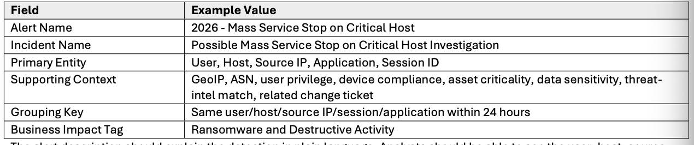

Grouping logic 

• Group by same user and source IP when identity or cloud activity is involved.
• Group by same host, process, file hash or destination when endpoint activity is involved.
• Group by same mailbox, site, file repository or external recipient when email or data activity is involved.
• Group by same API token, endpoint, session or customer object when application/API activity is involved.
• Escalate to a higher-level incident when two or more categories appear in the same timeline.

Triage Questions

• Is the user, host, application or service account expected to perform this activity?
• Is there an approved change, service request, incident ticket or business justification?
• Did the same entity trigger other related alerts before or after this event?
• Is the source IP, country, ASN, device, user-agent or session new for this entity?
• Is the affected asset, mailbox, data repository or application business-critical?
• Was the activity allowed, blocked, partially completed or only attempted?
• Is there evidence of data access, privilege change, control tampering, lateral movement or persistence?
• Should this be escalated to L2/L3, Incident Response, IAM, endpoint, cloud, network, application or risk/compliance
team?
• What is the parent-child process chain and command-line context?
• Should the endpoint or server be isolated immediately?

Recommended Response Actions

• Validate the alert against the simulated or real evidence timeline and preserve raw events.
• Enrich the entities with user role, asset owner, department, asset criticality, privilege level and recent activity.
• Check for matching activity across SIEM, EDR, identity, cloud, proxy, email, application and network telemetry.
• Escalate according to the incident classification and business impact, not only the technical event type.
• Document the final decision, containment actions, evidence and closure rationale in the case record.
• Contain affected endpoint or server if execution, credential access, persistence, lateral movement or impact indicators
are confirmed.
• Collect process tree, file hash, command line, network destination and memory/EDR evidence where required.

False Positive Possibilities

• Approved maintenance, migration, testing, vulnerability assessment or administrative activity.
• Known automation account, service integration, backup process, security tool, scanner or deployment platform.
• Business travel, remote work, vendor support activity or approved temporary access.
• False reputation match, geolocation inaccuracy, NAT/proxy aggregation or log parsing issue.
• Application behaviour change after release, patch, policy update or workflow redesign.

# usecase 55 : Data Staging and large archive creation before upload

Category : Ransomware and Destructive Activity 
Mitre att&ck mapping : T1560 Archive Collected Data; T1041 Exfiltration Over C2 Channel

hypothesis : Large archives are created from sensitive folders and shortly after uploaded externally

Required log sources :
    - edr file events
    - proxy logs
    - dlp
    - file server audits
    - timegenerated/eventtime
    - host/device/asset
    - sourceip/geo/asn/destip
    - application/resource/object
    
Building Blocks Design 

BB Large Archive Creation 
BB Sensitive Folder
BB External Upload

Rule Creation logic 

rule Large_Archive_Created_Before_External_Upload
{
  meta:
    severity = "Critical"
    mitre_tactic = "Collection"
    mitre_technique = "T1560"

  events:

    $archive.metadata.event_type = "FILE_CREATION"

    re.regex(
      $archive.target.file.full_path,
      `(?i)\.(zip|rar|7z|tar|gz)$`
    )

    $folder.security_result.summary = "SENSITIVE_FOLDER"

    $upload.metadata.event_type = "NETWORK_CONNECTION"

    $upload.security_result.action = "ALLOW"

    $host = $archive.principal.hostname

  match:

    $host over 30m

  outcome:

    $archive_count = count($archive)

    $risk_score =
        40 +
        if(#folder > 0,20,0) +
        if(#upload > 0,30,0)

  condition:

      $archive_count >= 2

      and

      #upload > 0

      and

      $risk_score >= 80
}

Alert Design 

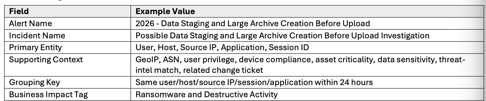

Grouping :

• Group by same user and source IP when identity or cloud activity is involved.
• Group by same host, process, file hash or destination when endpoint activity is involved.
• Group by same mailbox, site, file repository or external recipient when email or data activity is involved.
• Group by same API token, endpoint, session or customer object when application/API activity is involved.
• Escalate to a higher-level incident when two or more categories appear in the same timeline.

Triage Questions

• Is the user, host, application or service account expected to perform this activity?
• Is there an approved change, service request, incident ticket or business justification?
• Did the same entity trigger other related alerts before or after this event?
• Is the source IP, country, ASN, device, user-agent or session new for this entity?
• Is the affected asset, mailbox, data repository or application business-critical?
• Was the activity allowed, blocked, partially completed or only attempted?
• Is there evidence of data access, privilege change, control tampering, lateral movement or persistence?
• Should this be escalated to L2/L3, Incident Response, IAM, endpoint, cloud, network, application or risk/compliance
team?
• What is the parent-child process chain and command-line context?
• Should the endpoint or server be isolated immediately?

Recommended Response Actions

• Validate the alert against the simulated or real evidence timeline and preserve raw events.
• Enrich the entities with user role, asset owner, department, asset criticality, privilege level and recent activity.
• Check for matching activity across SIEM, EDR, identity, cloud, proxy, email, application and network telemetry.
• Escalate according to the incident classification and business impact, not only the technical event type.
• Document the final decision, containment actions, evidence and closure rationale in the case record.
• Contain affected endpoint or server if execution, credential access, persistence, lateral movement or impact indicators
are confirmed.
• Collect process tree, file hash, command line, network destination and memory/EDR evidence where required.

False Positive Possibilities

• Approved maintenance, migration, testing, vulnerability assessment or administrative activity.
• Known automation account, service integration, backup process, security tool, scanner or deployment platform.
• Business travel, remote work, vendor support activity or approved temporary access.
• False reputation match, geolocation inaccuracy, NAT/proxy aggregation or log parsing issue.
• Application behaviour change after release, patch, policy update or workflow redesign.

# usecase 56 : New OAuth Application Consent

Category : Cloud, SAAS, OAuth and Non-Human Identity 
Mitre att&ck mapping : T1098 Account Manipulation

Hypothesis : A user grants access to a priviously unseen third-party application.

Requried log sources :
    - entra id audit logs
    - cloud app security 
    - m365 audit
    - timegenerated/eventtime
    - user/account/service-prinicpal
    - sourceip/geo/asn/destip
    - action/result/status
    - application/resource/object
  
Building Blocks Design 

BB OAuth Consent Event
BB Approved Enterprise Apps
BB Sensitive Users

Rule Creation logic 

rule High_Fidelity_OAuth_Consent
{
  meta:
    severity = "Critical"
    attack_technique = "T1098.001"

  events:

    $oauth.metadata.event_type = "USER_RESOURCE_ACCESS"

    $oauth.metadata.product_event_type =
        "Consent to application"

    $vip.security_result.summary =
        "SENSITIVE_USER"

    $user =
        $oauth.principal.user.userid

  match:

    $user over 60m

  outcome:

    $risk_score =
        if(#vip > 0,95,80)

  condition:

      #oauth > 0

      and

      not $oauth.target.application.display_name in
          %approved_enterprise_apps
}

Alert Design 

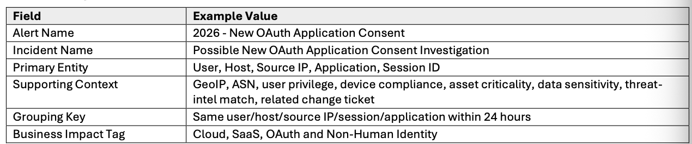

Grouping logic 

• Group by same user and source IP when identity or cloud activity is involved.
• Group by same host, process, file hash or destination when endpoint activity is involved.
• Group by same mailbox, site, file repository or external recipient when email or data activity is involved.
• Group by same API token, endpoint, session or customer object when application/API activity is involved.
• Escalate to a higher-level incident when two or more categories appear in the same timeline.

Triage Questions

• Is the user, host, application or service account expected to perform this activity?
• Is there an approved change, service request, incident ticket or business justification?
• Did the same entity trigger other related alerts before or after this event?
• Is the source IP, country, ASN, device, user-agent or session new for this entity?
• Is the affected asset, mailbox, data repository or application business-critical?
• Was the activity allowed, blocked, partially completed or only attempted?
• Is there evidence of data access, privilege change, control tampering, lateral movement or persistence?
• Should this be escalated to L2/L3, Incident Response, IAM, endpoint, cloud, network, application or risk/compliance
team?
• Was MFA satisfied normally, bypassed, repeatedly challenged or modified?
• Should active sessions or tokens be revoked while validation is ongoing?

Recommended Response Actions

• Validate the alert against the simulated or real evidence timeline and preserve raw events.
• Enrich the entities with user role, asset owner, department, asset criticality, privilege level and recent activity.
• Check for matching activity across SIEM, EDR, identity, cloud, proxy, email, application and network telemetry.
• Escalate according to the incident classification and business impact, not only the technical event type.
• Document the final decision, containment actions, evidence and closure rationale in the case record.
• Consider session revocation, password reset, MFA reset, OAuth grant removal, conditional access review and account
disablement based on confirmation.
• Hunt for the same IP, application, token, user-agent, app ID or consent pattern across the tenant.

False Positive Possibilities

• Approved maintenance, migration, testing, vulnerability assessment or administrative activity.
• Known automation account, service integration, backup process, security tool, scanner or deployment platform.
• Business travel, remote work, vendor support activity or approved temporary access.
• False reputation match, geolocation inaccuracy, NAT/proxy aggregation or log parsing issue.
• Application behaviour change after release, patch, policy update or workflow redesign.

# usecase 57 : High-Risk OAuth Permissions Granted

Category : Cloud, SAAS, OAuth and Non-Human Identity 
Mitre att&ck mapping : T1098 Account Manipulation; T1114 Email Collection

Hypothesis : An oauth app is granted mail.read, files.read.all , offline_access or directory.read.all.

Required log sources :
    - entra id audit logs
    - graph audit logs
    - m365 audit
    - timegenerated/eventtime
    - user/account/service-prinicpal
    - host/device/asset
    - sourceip/destip/geo/asn
    - action/result/status
    - applicationresource/object
  
Building Blocks Design 

BB High Risk OAuth
BB Unverified Publisher
BB Priviledged Users

Rule Creation logic 

rule High_Risk_OAuth_Permission_Grant
{
  meta:
    severity = "Critical"
    mitre_tactic = "Persistence"
    mitre_technique = "T1098.001"

  events:

    $oauth.metadata.event_type = "USER_RESOURCE_ACCESS"

    $oauth.metadata.product_event_type = "Consent to application"

    re.regex(
      $oauth.target.resource.attribute.permissions,
      `(?i)(
          Mail\.ReadWrite|
          Mail\.Send|
          Files\.ReadWrite\.All|
          Directory\.ReadWrite\.All|
          RoleManagement\.ReadWrite\.Directory|
          User\.Read\.All|
          offline_access
      )`
    )

    $publisher.security_result.summary = "UNVERIFIED_PUBLISHER"

    $userctx.security_result.summary = "PRIVILEGED_USER"

    $user = $oauth.principal.user.userid

  match:

    $user over 60m

  outcome:

    $risk_score =
        40 +
        if(#publisher > 0,25,0) +
        if(#userctx > 0,20,0) +
        20

  condition:

      #oauth > 0

      and

      (
          #publisher > 0 or
          #userctx > 0
      )

      and

      $risk_score >= 80
}

Alert Design 

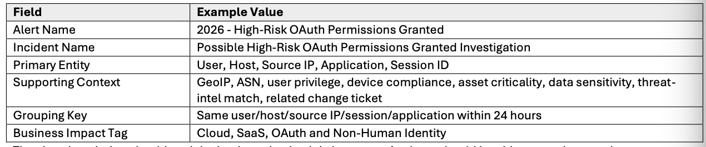

Grouping logic 

• Group by same user and source IP when identity or cloud activity is involved.
• Group by same host, process, file hash or destination when endpoint activity is involved.
• Group by same mailbox, site, file repository or external recipient when email or data activity is involved.
• Group by same API token, endpoint, session or customer object when application/API activity is involved.
• Escalate to a higher-level incident when two or more categories appear in the same timeline.

Triage Questions

• Is the user, host, application or service account expected to perform this activity?
• Is there an approved change, service request, incident ticket or business justification?
• Did the same entity trigger other related alerts before or after this event?
• Is the source IP, country, ASN, device, user-agent or session new for this entity?
• Is the affected asset, mailbox, data repository or application business-critical?
• Was the activity allowed, blocked, partially completed or only attempted?
• Is there evidence of data access, privilege change, control tampering, lateral movement or persistence?
• Should this be escalated to L2/L3, Incident Response, IAM, endpoint, cloud, network, application or risk/compliance
team?
• Was MFA satisfied normally, bypassed, repeatedly challenged or modified?
• Should active sessions or tokens be revoked while validation is ongoing?

Recommended Response Actions

• Validate the alert against the simulated or real evidence timeline and preserve raw events.
• Enrich the entities with user role, asset owner, department, asset criticality, privilege level and recent activity.
• Check for matching activity across SIEM, EDR, identity, cloud, proxy, email, application and network telemetry.
• Escalate according to the incident classification and business impact, not only the technical event type.
• Document the final decision, containment actions, evidence and closure rationale in the case record.
• Consider session revocation, password reset, MFA reset, OAuth grant removal, conditional access review and account
disablement based on confirmation.
• Hunt for the same IP, application, token, user-agent, app ID or consent pattern across the tenant.

False Positive Possibilities

• Approved maintenance, migration, testing, vulnerability assessment or administrative activity.
• Known automation account, service integration, backup process, security tool, scanner or deployment platform.
• Business travel, remote work, vendor support activity or approved temporary access.
• False reputation match, geolocation inaccuracy, NAT/proxy aggregation or log parsing issue.
• Application behaviour change after release, patch, policy update or workflow redesign.

# usecase 58 : OAuth Consent After Risky login

Category : Cloud, SAAS, OAuth and Non-Human Identity
Mitre att&ck mapping : T1098 Account Manipulation; T1078.004 Cloud Accounts

hypothesis : A suspicious login is followed by consent to an unknown application 

Required log sources : 
    - entra id sign-in logs
    - entra id audit logs
    - m365 audit
    - Timegenerated/eventtime
    - user/account/service-prinicpal
    - host/device/asset
    - sourceip/geo/asn/destip
    - action/result/status
    - application/resource/object

Building Blocks Design 

BB Risky Sign-in
BB OAuth Consent Event
BB New App for Tenant

Rule Creation logic 

rule High_Risk_OAuth_Consent_After_Risky_Login
{
  meta:
    severity = "Critical"
    mitre_tactic = "Persistence"
    mitre_technique = "T1098.001"

  events:

    // Building Block 1
    $signin.metadata.event_type = "USER_LOGIN"

    $signin.security_result.severity = "HIGH"

    // Building Block 2
    $oauth.metadata.event_type = "USER_RESOURCE_ACCESS"

    $oauth.metadata.product_event_type = "Consent to application"

    // Building Block 3
    $newapp.security_result.summary = "NEW_APP_FOR_TENANT"

    $user = $signin.principal.user.userid

    $oauth.principal.user.userid = $user

  match:

    $user over 30m

  outcome:

    $risk_score =
        40 +
        if(#signin > 0,20,0) +
        if(#newapp > 0,20,0) +
        if(#oauth > 0,20,0)

  condition:

      #signin > 0

      and

      #oauth > 0

      and

      (
          #newapp > 0
          or
          $risk_score >= 80
      )
}

Alert Design 

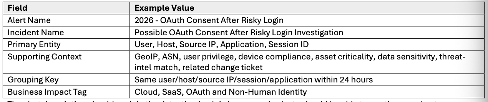

Grouping logic 

• Group by same user and source IP when identity or cloud activity is involved.
• Group by same host, process, file hash or destination when endpoint activity is involved.
• Group by same mailbox, site, file repository or external recipient when email or data activity is involved.
• Group by same API token, endpoint, session or customer object when application/API activity is involved.
• Escalate to a higher-level incident when two or more categories appear in the same timeline.

Triage Questions

• Is the user, host, application or service account expected to perform this activity?
• Is there an approved change, service request, incident ticket or business justification?
• Did the same entity trigger other related alerts before or after this event?
• Is the source IP, country, ASN, device, user-agent or session new for this entity?
• Is the affected asset, mailbox, data repository or application business-critical?
• Was the activity allowed, blocked, partially completed or only attempted?
• Is there evidence of data access, privilege change, control tampering, lateral movement or persistence?
• Should this be escalated to L2/L3, Incident Response, IAM, endpoint, cloud, network, application or risk/compliance
team?
• Was MFA satisfied normally, bypassed, repeatedly challenged or modified?
• Should active sessions or tokens be revoked while validation is ongoing?

Recommended Response Actions

• Validate the alert against the simulated or real evidence timeline and preserve raw events.
• Enrich the entities with user role, asset owner, department, asset criticality, privilege level and recent activity.
• Check for matching activity across SIEM, EDR, identity, cloud, proxy, email, application and network telemetry.
• Escalate according to the incident classification and business impact, not only the technical event type.
• Document the final decision, containment actions, evidence and closure rationale in the case record.
• Consider session revocation, password reset, MFA reset, OAuth grant removal, conditional access review and account
disablement based on confirmation.
• Hunt for the same IP, application, token, user-agent, app ID or consent pattern across the tenant.

False Positive Possibilities

• Approved maintenance, migration, testing, vulnerability assessment or administrative activity.
• Known automation account, service integration, backup process, security tool, scanner or deployment platform.
• Business travel, remote work, vendor support activity or approved temporary access.
• False reputation match, geolocation inaccuracy, NAT/proxy aggregation or log parsing issue.
• Application behaviour change after release, patch, policy update or workflow redesign.

# usecase 59 : Service principal or certificate added

Category : Cloud, SAAS, OAuth and Non-Human Identity 
Mitre att&ck mapping : T1098 Account Manipulation

Hypothesis : A new client secret or certificate is added to a production service prinicpal

Required log sources :
    - entra id audit logs
    - cloud iam logs
    - timegenerated/eventtime
    - user / account / service-prinicpal
    - host / device / asset
    - sourceip/dest/geo/asn
    - action / result / status
    - application / resource / object 

Building Blocks Design 

BB Service Prinicpal
BB Production Apps
BB Approved Change Tickets

Rule Creation logic 

rule High_Fidelity_Service_Principal_Credential_Addition
{
  meta:
    severity = "Critical"
    attack_technique = "T1098"

  events:

    $audit.metadata.event_type = "RESOURCE_UPDATE"

    (
        $audit.metadata.product_event_type = "Add password credential" or
        $audit.metadata.product_event_type = "Add key credential"
    )

    $prod.security_result.summary =
        "PRODUCTION_APPLICATION"

    $sp =
        $audit.target.resource.name

  match:

    $sp over 60m

  outcome:

    $risk_score =
        if(#prod > 0,95,85)

  condition:

        #audit > 0

    and

        #prod > 0

    and

        not $audit.principal.user.userid in
            %approved_identity_admins

    and

        not $sp in
            %approved_service_principals
}

Alert Design 

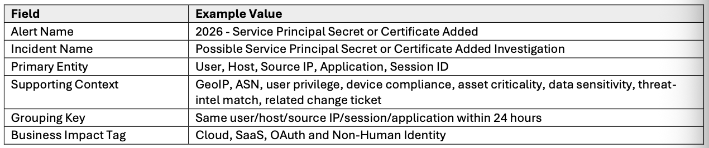

Grouping logic

• Group by same user and source IP when identity or cloud activity is involved.
• Group by same host, process, file hash or destination when endpoint activity is involved.
• Group by same mailbox, site, file repository or external recipient when email or data activity is involved.
• Group by same API token, endpoint, session or customer object when application/API activity is involved.
• Escalate to a higher-level incident when two or more categories appear in the same timeline.

Triage Questions

• Is the user, host, application or service account expected to perform this activity?
• Is there an approved change, service request, incident ticket or business justification?
• Did the same entity trigger other related alerts before or after this event?
• Is the source IP, country, ASN, device, user-agent or session new for this entity?
• Is the affected asset, mailbox, data repository or application business-critical?
• Was the activity allowed, blocked, partially completed or only attempted?
• Is there evidence of data access, privilege change, control tampering, lateral movement or persistence?
• Should this be escalated to L2/L3, Incident Response, IAM, endpoint, cloud, network, application or risk/compliance
team?
• Was MFA satisfied normally, bypassed, repeatedly challenged or modified?
• Should active sessions or tokens be revoked while validation is ongoing?

Recommended Response Actions

• Validate the alert against the simulated or real evidence timeline and preserve raw events.
• Enrich the entities with user role, asset owner, department, asset criticality, privilege level and recent activity.
• Check for matching activity across SIEM, EDR, identity, cloud, proxy, email, application and network telemetry.
• Escalate according to the incident classification and business impact, not only the technical event type.
• Document the final decision, containment actions, evidence and closure rationale in the case record.
• Consider session revocation, password reset, MFA reset, OAuth grant removal, conditional access review and account
disablement based on confirmation.
• Hunt for the same IP, application, token, user-agent, app ID or consent pattern across the tenant.

False Positive Possibilities

• Approved maintenance, migration, testing, vulnerability assessment or administrative activity.
• Known automation account, service integration, backup process, security tool, scanner or deployment platform.
• Business travel, remote work, vendor support activity or approved temporary access.
• False reputation match, geolocation inaccuracy, NAT/proxy aggregation or log parsing issue.
• Application behaviour change after release, patch, policy update or workflow redesign.

# usecase 60 : Service Principal Used from new country or ASN

Category : Cloud, SAAS, OAuth and Non-Human Identity 
Mitre att&ck mapping : T1078.004 Cloud Accounts; T1550 Use Alternate Authentication Material

Hypothesis : A machine identity normally used by internal systems authenticates from an external cloud hosting provider

Required log sources : 
    - cloud sign-in logs
    - api gateway logs
    - proxy
    - timegenerated/eventtime
    - user/account/service-principal
    - host/device/asset
    - sourceip/destip/geo/asn
    - action/result/status
    - application/resource/object 

Building Blocks Design 

BB Non Human Identities
BB New ASN
BB Expected Source IPs

Rule Creation logic

rule Service_Principal_From_New_Country_Or_ASN
{
  meta:
    severity = "Critical"
    mitre_tactic = "Credential Access"
    mitre_technique = "T1078.004"

  events:

    // Primary Event
    $login.metadata.event_type = "USER_LOGIN"

    $login.principal.user.user_type = "SERVICE_ACCOUNT"

    // Building Blocks
    $identity.security_result.summary = "NON_HUMAN_IDENTITY"

    $asn.security_result.summary = "NEW_ASN"

    $country.security_result.summary = "NEW_COUNTRY"

    $baseline.security_result.summary = "EXPECTED_SOURCE_IP"

    $sp = $login.principal.user.userid

  match:

    $sp over 60m

  outcome:

    $risk_score =
        40 +
        if(#asn > 0,20,0) +
        if(#country > 0,20,0) +
        if(#identity > 0,10,0)

  condition:

      #login > 0

      and

      (
          #asn > 0 or
          #country > 0
      )

      and

      #baseline == 0

      and

      $risk_score >= 80
}

Alert Design 

Grouping logic 

• Group by same user and source IP when identity or cloud activity is involved.
• Group by same host, process, file hash or destination when endpoint activity is involved.
• Group by same mailbox, site, file repository or external recipient when email or data activity is involved.
• Group by same API token, endpoint, session or customer object when application/API activity is involved.
• Escalate to a higher-level incident when two or more categories appear in the same timeline.

Triage Questions

• Is the user, host, application or service account expected to perform this activity?
• Is there an approved change, service request, incident ticket or business justification?
• Did the same entity trigger other related alerts before or after this event?
• Is the source IP, country, ASN, device, user-agent or session new for this entity?
• Is the affected asset, mailbox, data repository or application business-critical?
• Was the activity allowed, blocked, partially completed or only attempted?
• Is there evidence of data access, privilege change, control tampering, lateral movement or persistence?
• Should this be escalated to L2/L3, Incident Response, IAM, endpoint, cloud, network, application or risk/compliance
team?
• Was MFA satisfied normally, bypassed, repeatedly challenged or modified?
• Should active sessions or tokens be revoked while validation is ongoing?

Recommended Response Actions

• Validate the alert against the simulated or real evidence timeline and preserve raw events.
• Enrich the entities with user role, asset owner, department, asset criticality, privilege level and recent activity.
• Check for matching activity across SIEM, EDR, identity, cloud, proxy, email, application and network telemetry.
• Escalate according to the incident classification and business impact, not only the technical event type.
• Document the final decision, containment actions, evidence and closure rationale in the case record.
• Consider session revocation, password reset, MFA reset, OAuth grant removal, conditional access review and account
disablement based on confirmation.
• Hunt for the same IP, application, token, user-agent, app ID or consent pattern across the tenant.

False Positive Possibilities

• Approved maintenance, migration, testing, vulnerability assessment or administrative activity.
• Known automation account, service integration, backup process, security tool, scanner or deployment platform.
• Business travel, remote work, vendor support activity or approved temporary access.
• False reputation match, geolocation inaccuracy, NAT/proxy aggregation or log parsing issue.

# usecase 61 : AI Agent Created or granted Access

Category : Cloud, SAAS, OAuth and Non-Human Identity 
Mitre att&ck mapping : T1136 Create Account; T1098 Account Manipulation

hypothesis : A new AI asistant or automation idenity is created and granted access to internal repositories 

Required log sources : 
    - iam logs
    - ai platform audit
    - cloud app logs
    - timegenerated/eventtime
    - user / account / service principal
    - host / device / asset
    - sourceip / geo / asn / destip
    - action / result / status
    - application / resource / object 

Building Block Design 

BB AI Agent 
BB Sensititve Data Sources
BB Approved AI Projects

Rule Creation logic

rule AI_Agent_Identity_Created_Granted_Access
{
  meta:
    severity = "Critical"
    mitre_tactic = "Persistence"
    mitre_technique = "T1098"

  events:

    // Primary Event
    $audit.metadata.event_type = "RESOURCE_UPDATE"

    (
        $audit.metadata.product_event_type = "Create Service Principal" or
        $audit.metadata.product_event_type = "Create Managed Identity" or
        $audit.metadata.product_event_type = "Grant API Permission" or
        $audit.metadata.product_event_type = "Add Role Assignment"
    )

    // Building Blocks
    $agent.security_result.summary = "AI_AGENT_ACCOUNT"

    $data.security_result.summary = "SENSITIVE_DATA_SOURCE"

    $project.security_result.summary = "APPROVED_AI_PROJECT"

    $identity = $audit.target.resource.name

  match:

    $identity over 60m

  outcome:

    $risk_score =
        40 +
        if(#agent > 0,20,0) +
        if(#data > 0,25,0) -
        if(#project > 0,25,0)

  condition:

      #audit > 0

      and

      #agent > 0

      and

      #project == 0

      and

      $risk_score >= 80
}

Alert Design 

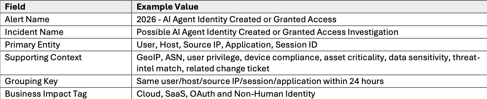

Grouping logic 

• Group by same user and source IP when identity or cloud activity is involved.
• Group by same host, process, file hash or destination when endpoint activity is involved.
• Group by same mailbox, site, file repository or external recipient when email or data activity is involved.
• Group by same API token, endpoint, session or customer object when application/API activity is involved.
• Escalate to a higher-level incident when two or more categories appear in the same timeline.

Triage Questions

• Is the user, host, application or service account expected to perform this activity?
• Is there an approved change, service request, incident ticket or business justification?
• Did the same entity trigger other related alerts before or after this event?
• Is the source IP, country, ASN, device, user-agent or session new for this entity?
• Is the affected asset, mailbox, data repository or application business-critical?
• Was the activity allowed, blocked, partially completed or only attempted?
• Is there evidence of data access, privilege change, control tampering, lateral movement or persistence?
• Should this be escalated to L2/L3, Incident Response, IAM, endpoint, cloud, network, application or risk/compliance
team?
• Was MFA satisfied normally, bypassed, repeatedly challenged or modified?
• Should active sessions or tokens be revoked while validation is ongoing?

Recommended Response Actions

• Validate the alert against the simulated or real evidence timeline and preserve raw events.
• Enrich the entities with user role, asset owner, department, asset criticality, privilege level and recent activity.
• Check for matching activity across SIEM, EDR, identity, cloud, proxy, email, application and network telemetry.
• Escalate according to the incident classification and business impact, not only the technical event type.
• Document the final decision, containment actions, evidence and closure rationale in the case record.
• Consider session revocation, password reset, MFA reset, OAuth grant removal, conditional access review and account
disablement based on confirmation.
• Hunt for the same IP, application, token, user-agent, app ID or consent pattern across the tenant.

False Positive Possibilities

• Approved maintenance, migration, testing, vulnerability assessment or administrative activity.
• Known automation account, service integration, backup process, security tool, scanner or deployment platform.
• Business travel, remote work, vendor support activity or approved temporary access.
• False reputation match, geolocation inaccuracy, NAT/proxy aggregation or log parsing issue.
• Application behaviour change after release, patch, policy update or workflow redesign.

# usecase 62 : AI Agent Performs Abnormal Volume of Actions

Category : Cloud, SAAS, OAuth and Non-Human Identity
Mitre att&ck mapping : T1078.004 Cloud Accounts; T1530 Data from Cloud Storage

hypothesis : An AI agent reads or exports many files beyond its normal workflow pattern

Required log sources :
    - AI Platform audit
      - performs supporting evidence for AI agent performing abnormal volume of actions
    - SAAS Audit logs
    - DLP
    - CASB
      - shows data protection evidence for AI agent performs abnormal volume of actions.
    - Timegenerated/eventtime
    - user / account / service-principal
    - host / device / asset
    - source-ip/ dest-ip / geo / asn 
    - action / result / status
    - application / resource / object 

Building Blocks Design

BB AI Agent Accounts
BB Action Baseline
BB Sensitive Repository 

Rule Creation logic

rule High_Fidelity_Cloud_Storage_Access
{
  meta:
    author = "SOC Team"
    severity = "Critical"
    mitre_tactic = "Credential Access, Collection"
    mitre_technique = "T1078.004,T1530"

  events:

    // Successful Cloud Login
    $login.metadata.event_type = "USER_LOGIN"

    $login.security_result.action = "ALLOW"

    // Cloud Storage Access
    $storage.metadata.event_type = "RESOURCE_ACCESS"

    $storage.security_result.action = "ALLOW"

    // Building Blocks
    $risk.security_result.summary = "RISKY_SIGNIN"

    $country.security_result.summary = "NEW_COUNTRY"

    $asn.security_result.summary = "NEW_ASN"

    $storagectx.security_result.summary = "SENSITIVE_DATA_SOURCE"

    $user = $login.principal.user.userid

    $storage.principal.user.userid = $user

  match:

    $user over 30m

  outcome:

    $risk_score =
        40 +
        if(#risk > 0,20,0) +
        if(#country > 0,15,0) +
        if(#asn > 0,15,0) +
        if(#storagectx > 0,20,0)

  condition:

        #login > 0

    and

        #storage > 0

    and

        (
            #risk > 0 or
            #country > 0 or
            #asn > 0 or
            #storagectx > 0
        )

    and

        $risk_score >= 80
}

Alert Design 

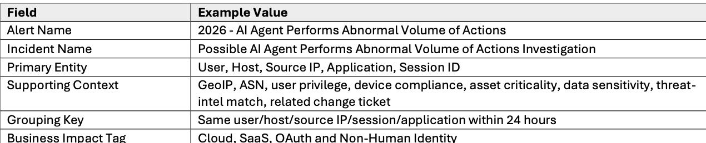

Grouping logic 

• Group by same user and source IP when identity or cloud activity is involved.
• Group by same host, process, file hash or destination when endpoint activity is involved.
• Group by same mailbox, site, file repository or external recipient when email or data activity is involved.
• Group by same API token, endpoint, session or customer object when application/API activity is involved.
• Escalate to a higher-level incident when two or more categories appear in the same timeline.

Triage Questions

• Is the user, host, application or service account expected to perform this activity?
• Is there an approved change, service request, incident ticket or business justification?
• Did the same entity trigger other related alerts before or after this event?
• Is the source IP, country, ASN, device, user-agent or session new for this entity?
• Is the affected asset, mailbox, data repository or application business-critical?
• Was the activity allowed, blocked, partially completed or only attempted?
• Is there evidence of data access, privilege change, control tampering, lateral movement or persistence?
• Should this be escalated to L2/L3, Incident Response, IAM, endpoint, cloud, network, application or risk/compliance
team?
• Was MFA satisfied normally, bypassed, repeatedly challenged or modified?
• Should active sessions or tokens be revoked while validation is ongoing?

Recommended Response Actions

• Validate the alert against the simulated or real evidence timeline and preserve raw events.
• Enrich the entities with user role, asset owner, department, asset criticality, privilege level and recent activity.
• Check for matching activity across SIEM, EDR, identity, cloud, proxy, email, application and network telemetry.
• Escalate according to the incident classification and business impact, not only the technical event type.
• Document the final decision, containment actions, evidence and closure rationale in the case record.
• Consider session revocation, password reset, MFA reset, OAuth grant removal, conditional access review and account
disablement based on confirmation.
• Hunt for the same IP, application, token, user-agent, app ID or consent pattern across the tenant.

False Positive Possibilities

• Approved maintenance, migration, testing, vulnerability assessment or administrative activity.
• Known automation account, service integration, backup process, security tool, scanner or deployment platform.
• Business travel, remote work, vendor support activity or approved temporary access.
• False reputation match, geolocation inaccuracy, NAT/proxy aggregation or log parsing issue.
• Application behaviour change after release, patch, policy update or workflow redesign.

# usecase 63 : Conditional Access Policy Modified

Category : Cloud, SAAS and Non-human identity 
Mitre att&ck mapping : T1556 Modify Authentication Process; T1562 Impair Defenses

Hypothesis : A conditional access policy requiring MFA is disabled or weakened.

Required log sources :
    - entra id audit logs
    - security admin logs
    - timegenerated/eventtime
    - user/account/service-prinicpal
    - host/device/asset
    - sourceip/geo/asn/destip
    - action/result/status
    - application/resource/object

Building Blocks Design 

BB Conditional Acces Policies
BB Approved IAM Change
BB Priviledged Users

Rule Creation logic 

rule High_Fidelity_Conditional_Access_Policy_Modification
{
  meta:
    author = "SOC Team"
    description = "Detect unauthorized Conditional Access policy modifications"
    severity = "Critical"
    mitre_tactic = "Defense Evasion"
    mitre_technique = "T1562.007"

  events:

    // Primary Event
    $audit.metadata.event_type = "RESOURCE_UPDATE"

    (
      $audit.metadata.product_event_type = "Update conditional access policy" or
      $audit.metadata.product_event_type = "Conditional Access Policy Modified"
    )

    // Building Blocks
    $ca.security_result.summary = "CONDITIONAL_ACCESS_POLICY"

    $priv.security_result.summary = "PRIVILEGED_USER"

    $change.security_result.summary = "APPROVED_IAM_CHANGE"

    $policy = $audit.target.resource.name

  match:

    $policy over 60m

  outcome:

    $risk_score =
        40 +
        if(#ca > 0,20,0) +
        if(#priv > 0,20,0) -
        if(#change > 0,30,0)

  condition:

      #audit > 0

      and

      #ca > 0

      and

      #change == 0

      and

      $risk_score >= 80
}

Alert Design 

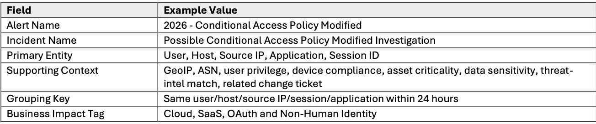

Grouping logic 

• Group by same user and source IP when identity or cloud activity is involved.
• Group by same host, process, file hash or destination when endpoint activity is involved.
• Group by same mailbox, site, file repository or external recipient when email or data activity is involved.
• Group by same API token, endpoint, session or customer object when application/API activity is involved.
• Escalate to a higher-level incident when two or more categories appear in the same timeline.

Triage Questions

• Is the user, host, application or service account expected to perform this activity?
• Is there an approved change, service request, incident ticket or business justification?
• Did the same entity trigger other related alerts before or after this event?
• Is the source IP, country, ASN, device, user-agent or session new for this entity?
• Is the affected asset, mailbox, data repository or application business-critical?
• Was the activity allowed, blocked, partially completed or only attempted?
• Is there evidence of data access, privilege change, control tampering, lateral movement or persistence?
• Should this be escalated to L2/L3, Incident Response, IAM, endpoint, cloud, network, application or risk/compliance
team?
• Was MFA satisfied normally, bypassed, repeatedly challenged or modified?
• Should active sessions or tokens be revoked while validation is ongoing?

Recommended Response Actions

• Validate the alert against the simulated or real evidence timeline and preserve raw events.
• Enrich the entities with user role, asset owner, department, asset criticality, privilege level and recent activity.
• Check for matching activity across SIEM, EDR, identity, cloud, proxy, email, application and network telemetry.
• Escalate according to the incident classification and business impact, not only the technical event type.
• Document the final decision, containment actions, evidence and closure rationale in the case record.
• Consider session revocation, password reset, MFA reset, OAuth grant removal, conditional access review and account
disablement based on confirmation.
• Hunt for the same IP, application, token, user-agent, app ID or consent pattern across the tenant.

False Positive Possibilities

• Approved maintenance, migration, testing, vulnerability assessment or administrative activity.
• Known automation account, service integration, backup process, security tool, scanner or deployment platform.
• Business travel, remote work, vendor support activity or approved temporary access.
• False reputation match, geolocation inaccuracy, NAT/proxy aggregation or log parsing issue.
• Application behaviour change after release, patch, policy update or workflow redesign

# usecase 64 : Cloud Audit Logging Disabled or Reduced

Category : Cloud, SaaS, OAuth and Non-Human Identity
Mitre att&ck mapping : T1562.008 Disable or Modify Cloud Logs

Hypothesis : Audit logging is disabled or retention is reduced for a cloud tenant or subscription 

Required log sources :
    - Cloud Audit logs
    - Admin Activity logs
    - TimeGenerated/eventtime
    - Host/Device/Asset
    - Sourceip/geo/asn/destip
    - action/result/status
    - application/resource/object

Building Blocks Design 

BB Critical Logging Controls
BB Cloud Admins
BB Approved Change Tickets

Rule Creation logic 

rule Enterprise_Cloud_Audit_Logging_Disabled
{
  meta:
    severity = "Critical"
    attack_technique = "T1562.008"

  events:

    $audit.metadata.event_type = "RESOURCE_UPDATE"

    (
      $audit.metadata.product_event_type = "Disable Audit Logging" or
      $audit.metadata.product_event_type = "Logging Configuration Changed"
    )

    $logging.security_result.summary = "CRITICAL_LOGGING_CONTROL"

    $admin.security_result.summary = "CLOUD_ADMIN"

    $resource = $audit.target.resource.name

  match:

    $resource over 60m

  outcome:

    $risk_score =
        if(#admin > 0,95,85)

  condition:

      #audit > 0

      and

      #logging > 0

      and

      not $audit.principal.user.userid in
          %approved_cloud_admins

      and

      not $resource in
          %approved_logging_changes
}

Alert Design 

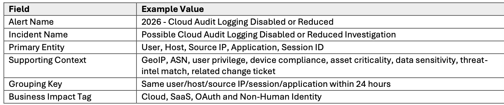

Grouping logic 

• Group by same user and source IP when identity or cloud activity is involved.
• Group by same host, process, file hash or destination when endpoint activity is involved.
• Group by same mailbox, site, file repository or external recipient when email or data activity is involved.
• Group by same API token, endpoint, session or customer object when application/API activity is involved.
• Escalate to a higher-level incident when two or more categories appear in the same timeline.

Triage Questions

• Is the user, host, application or service account expected to perform this activity?
• Is there an approved change, service request, incident ticket or business justification?
• Did the same entity trigger other related alerts before or after this event?
• Is the source IP, country, ASN, device, user-agent or session new for this entity?
• Is the affected asset, mailbox, data repository or application business-critical?
• Was the activity allowed, blocked, partially completed or only attempted?
• Is there evidence of data access, privilege change, control tampering, lateral movement or persistence?
• Should this be escalated to L2/L3, Incident Response, IAM, endpoint, cloud, network, application or risk/compliance
team?
• Was MFA satisfied normally, bypassed, repeatedly challenged or modified?
• Should active sessions or tokens be revoked while validation is ongoing?

Recommended Response Actions

• Validate the alert against the simulated or real evidence timeline and preserve raw events.
• Enrich the entities with user role, asset owner, department, asset criticality, privilege level and recent activity.
• Check for matching activity across SIEM, EDR, identity, cloud, proxy, email, application and network telemetry.
• Escalate according to the incident classification and business impact, not only the technical event type.
• Document the final decision, containment actions, evidence and closure rationale in the case record.
• Consider session revocation, password reset, MFA reset, OAuth grant removal, conditional access review and account
disablement based on confirmation.
• Hunt for the same IP, application, token, user-agent, app ID or consent pattern across the tenant.

False Positive Possibilities

• Approved maintenance, migration, testing, vulnerability assessment or administrative activity.
• Known automation account, service integration, backup process, security tool, scanner or deployment platform.
• Business travel, remote work, vendor support activity or approved temporary access.
• False reputation match, geolocation inaccuracy, NAT/proxy aggregation or log parsing issue.
• Application behaviour change after release, patch, policy update or workflow redesign.

# usecase 65 : Cloud Admin Role Assigned

Category : Cloud, SaaS, OAuth and Non-Human Identity
Mitre att&ck mapping :T1098 Account Manipulation

Hypothesis : A user or service principal is assigned global admin , owner or high-impact role

Required log sources : 

    - Entra-id audit logs
    - cloud iam logs
    - timegenerated/eventtime
    - user/prinicpal/service-prinicpal
    - host/device/asset
    - sourceip/dest-ip/geo/asn
    - action/result/status
    - application/resource/object

Building Blocks Design 

BB Cloud Admin roles
BB Approved Access Request 
BB Break-glass Accounts

Rule Creation logic 

rule High_Fidelity_Cloud_Admin_Role_Assigned
{
  meta:
    author = "SOC Team"
    description = "Detect unauthorized cloud administrator role assignments"
    severity = "Critical"
    mitre_tactic = "Privilege Escalation"
    mitre_technique = "T1098,T1078.004"

  events:

    // Primary Event
    $audit.metadata.event_type = "RESOURCE_UPDATE"

    (
      $audit.metadata.product_event_type = "Add member to role" or
      $audit.metadata.product_event_type = "Role assignment created" or
      $audit.metadata.product_event_type = "Assign directory role"
    )

    // Building Blocks
    $role.security_result.summary = "CLOUD_ADMIN_ROLE"

    $approval.security_result.summary = "APPROVED_ACCESS_REQUEST"

    $breakglass.security_result.summary = "BREAK_GLASS_ACCOUNT"

    $adminRole = $audit.target.resource.attribute.role_name

  match:

    $adminRole over 60m

  outcome:

    $risk_score =
        40 +
        if(#role > 0,20,0) +
        if(#breakglass > 0,15,0) -
        if(#approval > 0,30,0)

  condition:

      #audit > 0

      and

      #role > 0

      and

      #approval == 0

      and

      $risk_score >= 80
}

Alert Design 

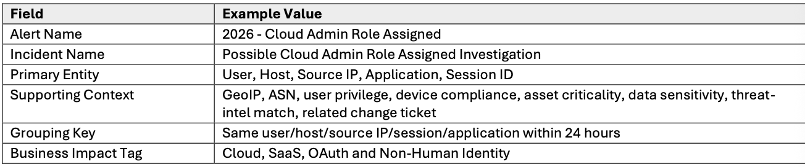

Grouping logic

• Group by same user and source IP when identity or cloud activity is involved.
• Group by same host, process, file hash or destination when endpoint activity is involved.
• Group by same mailbox, site, file repository or external recipient when email or data activity is involved.
• Group by same API token, endpoint, session or customer object when application/API activity is involved.
• Escalate to a higher-level incident when two or more categories appear in the same timeline.

Triage Questions

• Is the user, host, application or service account expected to perform this activity?
• Is there an approved change, service request, incident ticket or business justification?
• Did the same entity trigger other related alerts before or after this event?
• Is the source IP, country, ASN, device, user-agent or session new for this entity?
• Is the affected asset, mailbox, data repository or application business-critical?
• Was the activity allowed, blocked, partially completed or only attempted?
• Is there evidence of data access, privilege change, control tampering, lateral movement or persistence?
• Should this be escalated to L2/L3, Incident Response, IAM, endpoint, cloud, network, application or risk/compliance
team?
• Was MFA satisfied normally, bypassed, repeatedly challenged or modified?
• Should active sessions or tokens be revoked while validation is ongoing?

Recommended Response Actions

• Validate the alert against the simulated or real evidence timeline and preserve raw events.
• Enrich the entities with user role, asset owner, department, asset criticality, privilege level and recent activity.
• Check for matching activity across SIEM, EDR, identity, cloud, proxy, email, application and network telemetry.
• Escalate according to the incident classification and business impact, not only the technical event type.
• Document the final decision, containment actions, evidence and closure rationale in the case record.
• Consider session revocation, password reset, MFA reset, OAuth grant removal, conditional access review and account
disablement based on confirmation.
• Hunt for the same IP, application, token, user-agent, app ID or consent pattern across the tenant.

False Positive Possibilities

• Approved maintenance, migration, testing, vulnerability assessment or administrative activity.
• Known automation account, service integration, backup process, security tool, scanner or deployment platform.
• Business travel, remote work, vendor support activity or approved temporary access.
• False reputation match, geolocation inaccuracy, NAT/proxy aggregation or log parsing issue.
• Application behaviour change after release, patch, policy update or workflow redesign.

# usecase 66 : External Guest Added to Sensitive Workspace

Category : Cloud, SaaS, OAuth and Non-Human Identity
Mitre att&ck mapping : T1136 Create Account; T1530 Data from Cloud Storage

Hypothesis : A external guest is invited to a sensitive teams or sharepoint workspace

Required log sources :
    - teams audit
    - sharepoint audit
    - entra id audit
    - timegenerated/eventtime
    - user/account/service-prinicpal
    - host/device/asset
    - sourceip/geo/asn/destip
    - action/result/status
    - application/resource/object
  
Building Blocks Design 

BB Sensitive Workspace
BB External Guest Accounts
BB Approved Guest Domains

Rule Creation logic 

rule High_Fidelity_External_Guest_Added_To_Sensitive_Workspace
{
  meta:
    author = "SOC Team"
    description = "Detect external guest users added to sensitive collaboration workspaces"
    severity = "Critical"
    mitre_tactic = "Persistence"
    mitre_technique = "T1136.003"

  events:

    // Primary Event
    $audit.metadata.event_type = "RESOURCE_UPDATE"

    (
      $audit.metadata.product_event_type = "Add guest user" or
      $audit.metadata.product_event_type = "Add member to group" or
      $audit.metadata.product_event_type = "Add team member"
    )

    // Building Blocks
    $workspace.security_result.summary = "SENSITIVE_WORKSPACE"

    $guest.security_result.summary = "EXTERNAL_GUEST_ACCOUNT"

    $approved.security_result.summary = "APPROVED_GUEST_DOMAIN"

    $team = $audit.target.resource.name

  match:

    $team over 60m

  outcome:

    $risk_score =
        40 +
        if(#workspace > 0,20,0) +
        if(#guest > 0,20,0) -
        if(#approved > 0,30,0)

  condition:

      #audit > 0

      and

      #workspace > 0

      and

      #guest > 0

      and

      #approved == 0

      and

      $risk_score >= 80
}

Alert Design 

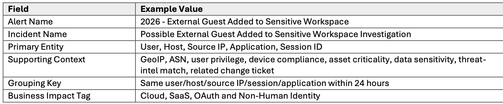

Grouping logic : 

• Group by same user and source IP when identity or cloud activity is involved.
• Group by same host, process, file hash or destination when endpoint activity is involved.
• Group by same mailbox, site, file repository or external recipient when email or data activity is involved.
• Group by same API token, endpoint, session or customer object when application/API activity is involved.
• Escalate to a higher-level incident when two or more categories appear in the same timeline.

Triage Questions

• Is the user, host, application or service account expected to perform this activity?
• Is there an approved change, service request, incident ticket or business justification?
• Did the same entity trigger other related alerts before or after this event?
• Is the source IP, country, ASN, device, user-agent or session new for this entity?
• Is the affected asset, mailbox, data repository or application business-critical?
• Was the activity allowed, blocked, partially completed or only attempted?
• Is there evidence of data access, privilege change, control tampering, lateral movement or persistence?
• Should this be escalated to L2/L3, Incident Response, IAM, endpoint, cloud, network, application or risk/compliance
team?
• Was MFA satisfied normally, bypassed, repeatedly challenged or modified?
• Should active sessions or tokens be revoked while validation is ongoing?

Recommended Response Actions

• Validate the alert against the simulated or real evidence timeline and preserve raw events.
• Enrich the entities with user role, asset owner, department, asset criticality, privilege level and recent activity.
• Check for matching activity across SIEM, EDR, identity, cloud, proxy, email, application and network telemetry.
• Escalate according to the incident classification and business impact, not only the technical event type.
• Document the final decision, containment actions, evidence and closure rationale in the case record.
• Consider session revocation, password reset, MFA reset, OAuth grant removal, conditional access review and account
disablement based on confirmation.
CONFIDENTIAL
• Hunt for the same IP, application, token, user-agent, app ID or consent pattern across the tenant.

False Positive Possibilities

• Approved maintenance, migration, testing, vulnerability assessment or administrative activity.
• Known automation account, service integration, backup process, security tool, scanner or deployment platform.
• Business travel, remote work, vendor support activity or approved temporary access.
• False reputation match, geolocation inaccuracy, NAT/proxy aggregation or log parsing issue.
• Application behaviour change after release, patch, policy update or workflow redesign.

# usecase 67 : Guest User mass download from sharepoint 

Category : Cloud, SaaS, OAuth and Non-Human Identity
Mitre att&ck mapping : T1530 Data from Cloud Storage

hypothesis : A guest account downloads many files from a confidential project site

Required log sources :
    - sharepoint audit
    - m365 audit
    - casb
    - timegenerated/eventtime
    - user/prinicpal/service-principal
    - host/device/asset
    - sourceip/geo/asn/destip
    - action/result/status
    - application/resource/object

Building Blocks Design 

• BB: External Guest Accounts: maintain the list owner, update frequency, source of truth and exception approval
process.
• BB: Download Volume Baseline: maintain the list owner, update frequency, source of truth and exception approval
process.
• BB: Sensitive Sites: maintain the list owner, update frequency, source of truth and exception approval process.

Rule Creation logic : 

rule High_Fidelity_Guest_User_Mass_Download
{
  meta:
    author = "SOC Team"
    description = "Detect guest users downloading excessive data from sensitive SharePoint sites"
    severity = "Critical"
    mitre_tactic = "Collection"
    mitre_technique = "T1213,T1530"

  events:

    // Primary Event
    $download.metadata.event_type = "RESOURCE_ACCESS"

    re.regex(
        $download.metadata.product_event_type,
        `(?i)(FileDownloaded|DownloadFile)`
    )

    // Building Blocks
    $guest.security_result.summary = "EXTERNAL_GUEST_ACCOUNT"

    $baseline.security_result.summary = "DOWNLOAD_VOLUME_BASELINE"

    $site.security_result.summary = "SENSITIVE_SITE"

    $user = $download.principal.user.userid

  match:

    $user over 60m

  outcome:

    $downloads = count($download)

    $risk_score =
        40 +
        if(#guest > 0,20,0) +
        if(#site > 0,20,0) +
        if($downloads >= 100,20,10)

  condition:

      #download > 0

      and

      #guest > 0

      and

      #site > 0

      and

      $downloads >= 50

      and

      $risk_score >= 80
}

Alert Design 

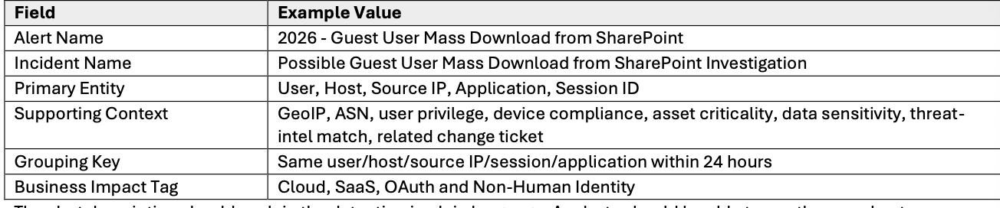

Grouping logic

• Group by same user and source IP when identity or cloud activity is involved.
• Group by same host, process, file hash or destination when endpoint activity is involved.
• Group by same mailbox, site, file repository or external recipient when email or data activity is involved.
• Group by same API token, endpoint, session or customer object when application/API activity is involved.
• Escalate to a higher-level incident when two or more categories appear in the same timeline.

Triage Questions

• Is the user, host, application or service account expected to perform this activity?
• Is there an approved change, service request, incident ticket or business justification?
• Did the same entity trigger other related alerts before or after this event?
• Is the source IP, country, ASN, device, user-agent or session new for this entity?
• Is the affected asset, mailbox, data repository or application business-critical?
• Was the activity allowed, blocked, partially completed or only attempted?
• Is there evidence of data access, privilege change, control tampering, lateral movement or persistence?
• Should this be escalated to L2/L3, Incident Response, IAM, endpoint, cloud, network, application or risk/compliance
team?
• Was MFA satisfied normally, bypassed, repeatedly challenged or modified?
• Should active sessions or tokens be revoked while validation is ongoing?

Recommended Response Actions

• Validate the alert against the simulated or real evidence timeline and preserve raw events.
• Enrich the entities with user role, asset owner, department, asset criticality, privilege level and recent activity.
• Check for matching activity across SIEM, EDR, identity, cloud, proxy, email, application and network telemetry.
• Escalate according to the incident classification and business impact, not only the technical event type.
• Document the final decision, containment actions, evidence and closure rationale in the case record.
• Consider session revocation, password reset, MFA reset, OAuth grant removal, conditional access review and account
disablement based on confirmation.
• Hunt for the same IP, application, token, user-agent, app ID or consent pattern across the tenant.

False Positive Possibilities

• Approved maintenance, migration, testing, vulnerability assessment or administrative activity.
• Known automation account, service integration, backup process, security tool, scanner or deployment platform.
• Business travel, remote work, vendor support activity or approved temporary access.
• False reputation match, geolocation inaccuracy, NAT/proxy aggregation or log parsing issue.
• Application behaviour change after release, patch, policy update or workflow redesign.

# usecase 68 : DLP or Sensitive lable policy modified

Category : Cloud, SaaS, OAuth and Non-Human Identity
Mitre att&ck mapping : T1562 Impair Defenses

Hypothesis : A data protection is disabled shortly before external sharing activity increases.

Required log sources :
    - m365 compliance audit
    - dlp logs
    - admin audit
    - timegenerated/eventtime
    - user/account/service-principal
    - host/device/asset
    - sourceip/geo/asn/destip
    - action/result/status
    - application/resource/object

Building Blocks Design 

BB DLP Policies
BB Sensititve Label Policies
BB Approved Compliance Change

Rule Creation logic 

rule High_Fidelity_DLP_Or_Sensitivity_Label_Modification
{
  meta:
    author = "SOC Team"
    description = "Detect unauthorized DLP or Sensitivity Label policy modifications"
    severity = "Critical"
    mitre_tactic = "Defense Evasion"
    mitre_technique = "T1562"

  events:

    // Primary Event
    $audit.metadata.event_type = "RESOURCE_UPDATE"

    re.regex(
        $audit.metadata.product_event_type,
        `(?i)(
            DLP Policy Modified|
            Sensitivity Label Policy Modified|
            Compliance Policy Updated
        )`
    )

    // Building Blocks
    $dlp.security_result.summary = "DLP_POLICY"

    $label.security_result.summary = "SENSITIVITY_LABEL_POLICY"

    $change.security_result.summary = "APPROVED_COMPLIANCE_CHANGE"

    $policy = $audit.target.resource.name

  match:

    $policy over 60m

  outcome:

    $risk_score =
        40 +
        if(#dlp > 0,20,0) +
        if(#label > 0,20,0) -
        if(#change > 0,30,0)

  condition:

      #audit > 0

      and

      (#dlp > 0 or #label > 0)

      and

      #change == 0

      and

      $risk_score >= 80
}

Alert Design 

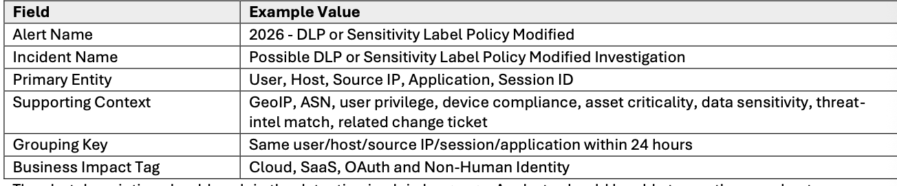

Grouping logic

• Group by same user and source IP when identity or cloud activity is involved.
• Group by same host, process, file hash or destination when endpoint activity is involved.
• Group by same mailbox, site, file repository or external recipient when email or data activity is involved.
• Group by same API token, endpoint, session or customer object when application/API activity is involved.
• Escalate to a higher-level incident when two or more categories appear in the same timeline.

Triage Questions

• Is the user, host, application or service account expected to perform this activity?
• Is there an approved change, service request, incident ticket or business justification?
• Did the same entity trigger other related alerts before or after this event?
• Is the source IP, country, ASN, device, user-agent or session new for this entity?
• Is the affected asset, mailbox, data repository or application business-critical?
• Was the activity allowed, blocked, partially completed or only attempted?
• Is there evidence of data access, privilege change, control tampering, lateral movement or persistence?
• Should this be escalated to L2/L3, Incident Response, IAM, endpoint, cloud, network, application or risk/compliance
team?
• Was MFA satisfied normally, bypassed, repeatedly challenged or modified?
• Should active sessions or tokens be revoked while validation is ongoing?

Recommended Response Actions

• Validate the alert against the 
simulated or real evidence timeline and preserve raw events.
• Enrich the entities with user role, asset owner, department, asset criticality, privilege level and recent activity.
• Check for matching activity across SIEM, EDR, identity, cloud, proxy, email, application and network telemetry.
• Escalate according to the incident classification and business impact, not only the technical event type.
• Document the final decision, containment actions, evidence and closure rationale in the case record.
• Consider session revocation, password reset, MFA reset, OAuth grant removal, conditional access review and account
disablement based on confirmation.
• Hunt for the same IP, application, token, user-agent, app ID or consent pattern across the tenant.

False Positive Possibilities

• Approved maintenance, migration, testing, vulnerability assessment or administrative activity.
• Known automation account, service integration, backup process, security tool, scanner or deployment platform.
• Business travel, remote work, vendor support activity or approved temporary access.
• False reputation match, geolocation inaccuracy, NAT/proxy aggregation or log parsing issue.
• Application behaviour change after release, patch, policy update or workflow redesign.

# usecase 69 : Excessive API Calls to sensitive endpoint 

Category : API, Application and Web Security
Mitre att&ck mapping : T1499 Endpoint Denial of Service; T1530 Data from Cloud Storage

Hypothesis : One token calls customer/account endpoints far above normal rate

Required log sources :
    - api gateway logs
    - waf logs
    - application logs
    - timegenerated/eventtime
    - user/account/service-principal
    - host/device/asset
    - sourceip/destip/geo/asn
    - action/result/status
    - application/resource/object 

Building Blocks Design 

BB Sensitive API Endpoints
BB Rate Baseline
BB API Consumers

Rule Creation logic 

rule High_Fidelity_Excessive_API_Calls
{
  meta:
    author = "SOC Team"
    description = "Detect excessive API activity against sensitive endpoints"
    severity = "Critical"
    mitre_tactic = "Collection"
    mitre_technique = "T1190"

  events:

    // Primary Event
    $api.metadata.event_type = "NETWORK_HTTP"

    re.regex(
        $api.target.url,
        `(?i)(
            /admin|
            /api/admin|
            /api/export|
            /graphql|
            /oauth
        )`
    )

    // Building Blocks
    $endpoint.security_result.summary = "SENSITIVE_API_ENDPOINT"

    $baseline.security_result.summary = "RATE_BASELINE"

    $consumer.security_result.summary = "API_CONSUMER"

    $url = $api.target.url

  match:

    $url over 60m

  outcome:

    $requests = count($api)

    $risk_score =
        40 +
        if(#endpoint > 0,20,0) +
        if(#consumer > 0,10,0) +
        if($requests >= 1000,30,15)

  condition:

      #api > 0

      and

      #endpoint > 0

      and

      $requests >= 500

      and

      $risk_score >= 80
}

Alert Design 

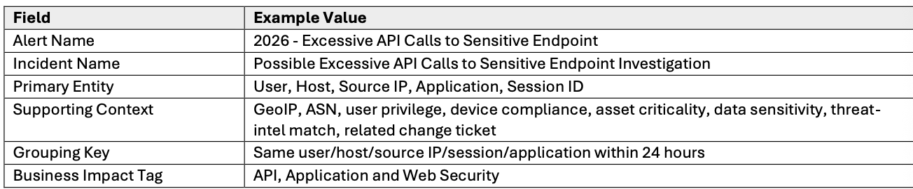

Grouping logic 

• Group by same user and source IP when identity or cloud activity is involved.
• Group by same host, process, file hash or destination when endpoint activity is involved.
• Group by same mailbox, site, file repository or external recipient when email or data activity is involved.
• Group by same API token, endpoint, session or customer object when application/API activity is involved.
• Escalate to a higher-level incident when two or more categories appear in the same timeline.

Triage Questions

• Is the user, host, application or service account expected to perform this activity?
• Is there an approved change, service request, incident ticket or business justification?
• Did the same entity trigger other related alerts before or after this event?
• Is the source IP, country, ASN, device, user-agent or session new for this entity?
• Is the affected asset, mailbox, data repository or application business-critical?
• Was the activity allowed, blocked, partially completed or only attempted?
• Is there evidence of data access, privilege change, control tampering, lateral movement or persistence?
• Should this be escalated to L2/L3, Incident Response, IAM, endpoint, cloud, network, application or risk/compliance
team?
• What data was accessed, exported, downloaded or uploaded?
• Is customer, confidential, regulated or long-lived sensitive data involved?

Recommended Response Actions

• Validate the alert against the simulated or real evidence timeline and preserve raw events.
• Enrich the entities with user role, asset owner, department, asset criticality, privilege level and recent activity.
• Check for matching activity across SIEM, EDR, identity, cloud, proxy, email, application and network telemetry.
• Escalate according to the incident classification and business impact, not only the technical event type.
• Document the final decision, containment actions, evidence and closure rationale in the case record.
• Block or rate-limit malicious source where justified, rotate exposed tokens and validate application-side impact.
• Coordinate with application, network and infrastructure teams for evidence and containment.

False Positive Possibilities

• Approved maintenance, migration, testing, vulnerability assessment or administrative activity.
• Known automation account, service integration, backup process, security tool, scanner or deployment platform.
• Business travel, remote work, vendor support activity or approved temporary access.
• False reputation match, geolocation inaccuracy, NAT/proxy aggregation or log parsing issue.
• Application behaviour change after release, patch, policy update or workflow redesign.

# usecase 70 : API token used from new source ip 

Category : API, Application and Web Security
Mitre att&ck mapping : T1550 Use Alternate Authentication Material; T1078 Valid Accounts

Hypothesis : A prod api token normally used by an app server is used from a overseas vps

Required log sources :
    - api gateway logs
    - iam logs
    - timegenerarted/eventtime
    - proxy logs
    - user/account/service-principal
    - host/device/asset
    - source-ip/geo/asn/dest-ip
    - application/resource/object 

Building Blocks Design 

BB API Tokens
BB Expected Source IPs
BB New ASN

Rule Creation logic

rule High_Fidelity_API_Token_Used_From_New_Source_IP
{
  meta:
    author = "SOC Team"
    description = "Detect API token usage from an unfamiliar source IP or ASN"
    severity = "Critical"
    mitre_tactic = "Credential Access"
    mitre_technique = "T1528"

  events:

    // Primary Event
    $api.metadata.event_type = "USER_LOGIN"

    re.regex(
        $api.metadata.product_event_type,
        `(?i)(
            API Authentication|
            Access Token Used|
            Bearer Token Authentication
        )`
    )

    // Building Blocks
    $token.security_result.summary = "API_TOKEN"

    $expected.security_result.summary = "EXPECTED_SOURCE_IP"

    $asn.security_result.summary = "NEW_ASN"

    $tokenId = $api.principal.resource.name

  match:

    $tokenId over 60m

  outcome:

    $risk_score =
        40 +
        if(#token > 0,20,0) +
        if(#asn > 0,20,0) -
        if(#expected > 0,30,0)

  condition:

      #api > 0

      and

      #token > 0

      and

      #expected == 0

      and

      $risk_score >= 80
}

Alert Design 

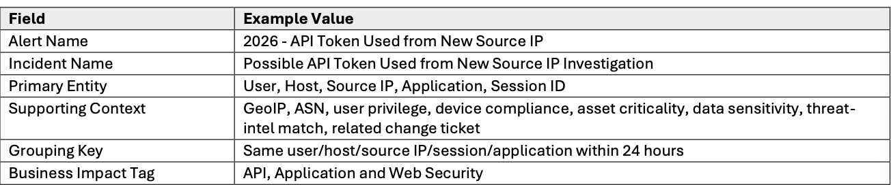

Grouping logic 

• Group by same user and source IP when identity or cloud activity is involved.
• Group by same host, process, file hash or destination when endpoint activity is involved.
• Group by same mailbox, site, file repository or external recipient when email or data activity is involved.
• Group by same API token, endpoint, session or customer object when application/API activity is involved.
• Escalate to a higher-level incident when two or more categories appear in the same timeline.

Triage Questions

• Is the user, host, application or service account expected to perform this activity?
• Is there an approved change, service request, incident ticket or business justification?
• Did the same entity trigger other related alerts before or after this event?
• Is the source IP, country, ASN, device, user-agent or session new for this entity?
• Is the affected asset, mailbox, data repository or application business-critical?
• Was the activity allowed, blocked, partially completed or only attempted?
• Is there evidence of data access, privilege change, control tampering, lateral movement or persistence?
• Should this be escalated to L2/L3, Incident Response, IAM, endpoint, cloud, network, application or risk/compliance
team?
• What data was accessed, exported, downloaded or uploaded?
• Is customer, confidential, regulated or long-lived sensitive data involved?

Recommended Response Actions

• Validate the alert against the simulated or real evidence timeline and preserve raw events.
• Enrich the entities with user role, asset owner, department, asset criticality, privilege level and recent activity.
• Check for matching activity across SIEM, EDR, identity, cloud, proxy, email, application and network telemetry.
• Escalate according to the incident classification and business impact, not only the technical event type.
• Document the final decision, containment actions, evidence and closure rationale in the case record.
• Block or rate-limit malicious source where justified, rotate exposed tokens and validate application-side impact.
• Coordinate with application, network and infrastructure teams for evidence and containment.

False Positive Possibilities

• Approved maintenance, migration, testing, vulnerability assessment or administrative activity.
• Known automation account, service integration, backup process, security tool, scanner or deployment platform.
• Business travel, remote work, vendor support activity or approved temporary access.
• False reputation match, geolocation inaccuracy, NAT/proxy aggregation or log parsing issue.
• Application behaviour change after release, patch, policy update or workflow redesign.