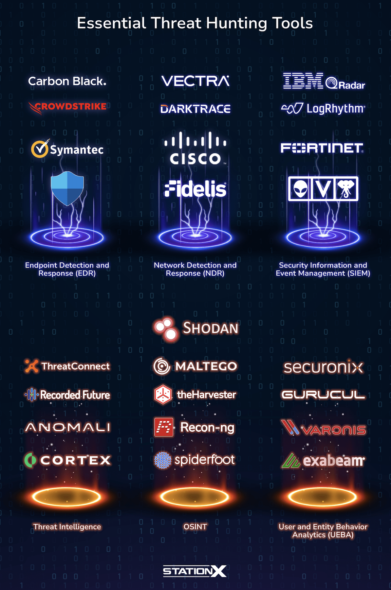
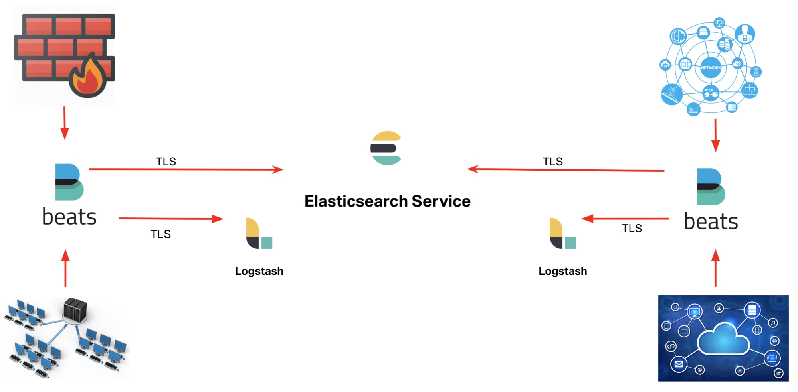
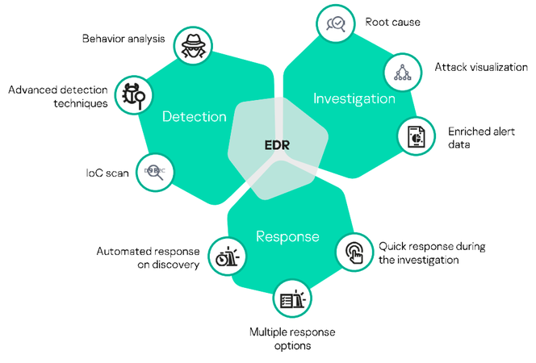
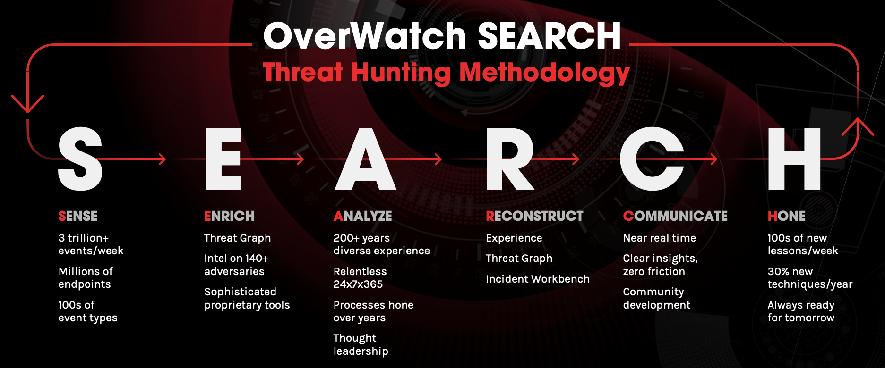
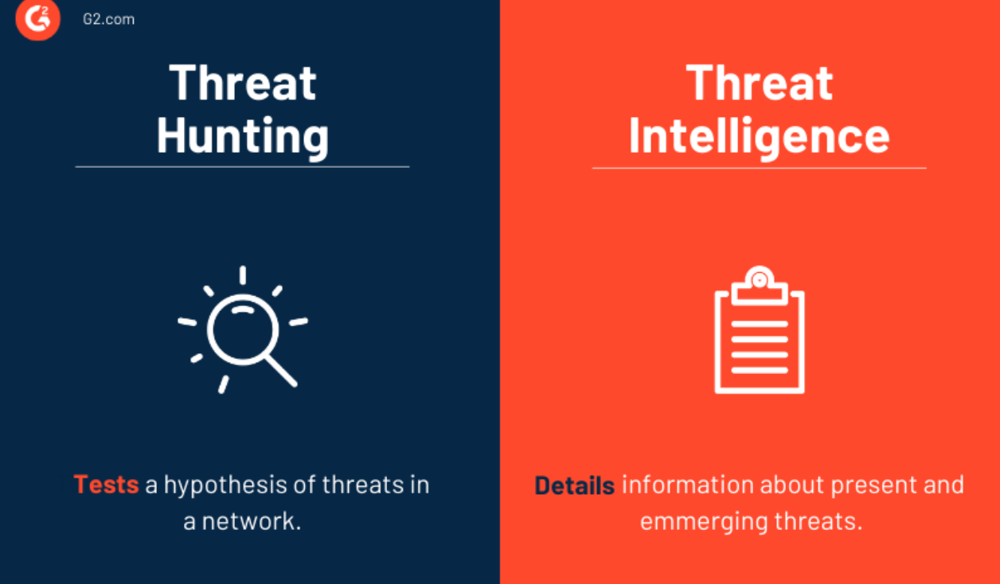
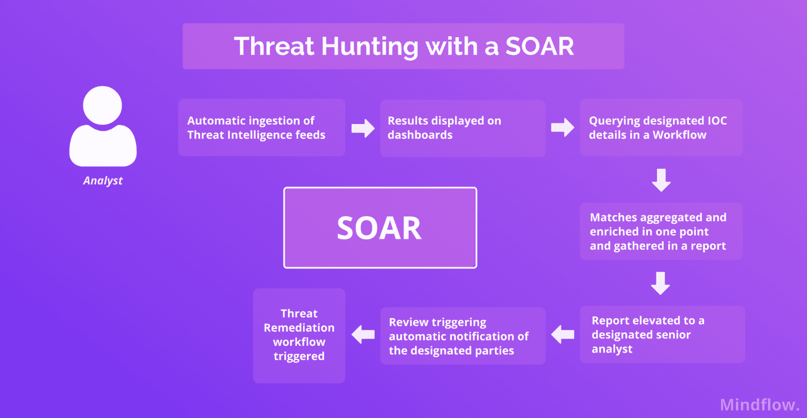

# Categories of Threat Hunting Tools

- **Data Collection Tools**
  - Provide critical data by tracking events that occur on systems and networks.
  - Examples: Sysmon, Winlogbeat.

- **Data Analysis Tools**
  - Analyze collected data and transform it into meaningful insights.
  - Examples: Splunk, ELK Stack.

- **Network Monitoring Tools**
  - Detect and prevent network threats through traffic monitoring.
  - Examples: Wireshark, Snort.

- **Endpoint Detection and Response (EDR) Tools**
  - Detect suspicious endpoint activities and enable rapid intervention.
  - Examples: CrowdStrike Falcon, SentinelOne.

- **Cyber Threat Intelligence (CTI) Tools**
  - Collect and analyze threat intelligence from multiple sources.
  - Examples: ThreatConnect, Recorded Future.

---

# Data Collection Tools

## Sysmon

Sysmon is a Microsoft utility that closely monitors important system events.

### Features

- Process creation monitoring
- Network connection monitoring
- File change detection
- Event correlation

### Areas of Use

- Detecting Advanced Persistent Threats (APTs) and malware
- Tracking system activity during threat hunting
- Identifying suspicious processes, network connections, and file changes

---

## Winlogbeat

Winlogbeat collects Windows event logs and forwards them to a centralized system. It is developed by Elastic and used extensively in large environments.

### Features

- Lightweight and efficient
- Easy integration
  - Integrates with Elasticsearch, Logstash, and Kibana
- Collects multiple event types
  - Security logs
  - Application logs
  - System logs
- Timestamp preservation

### Areas of Use

- Centralized event management and monitoring
- Collecting and analyzing security events across large organizations
- Supporting threat hunting investigations

---

## NXLog

NXLog is a versatile log collection tool that gathers logs from multiple platforms.

### Features

- Multi-platform support
  - Windows
  - Linux
  - Unix
- Flexible data processing
  - Collection
  - Filtering
  - Forwarding
- High performance
- Comprehensive protocol support
  - Syslog
  - JSON
  - CSV
  - GELF

### Areas of Use

- Log management in large and complex environments
- Aggregating logs into centralized analysis systems
- Supporting threat hunters with normalized log data

---

## Graylog

Graylog is a centralized log management and analysis platform.

### Features

- Centralized log collection, storage, and analysis
- Real-time search capabilities
- Extensible architecture through plugins
- User-friendly visualization interface

### Areas of Use

- Detecting security events
- Investigating incidents
- Reporting and analysis

---

# Data Analysis Tools

## Splunk

Splunk enables organizations to search, monitor, and analyze large datasets using SPL (Search Processing Language).

### Features

- Real-time search
- Advanced visualizations
- Event correlation
- Alerts and reporting
- Machine learning capabilities

### Areas of Use

- Security monitoring
- Threat detection
- Identifying anomalous activities
- Supporting rapid incident response

---

## ELK Stack

**ELK = Elasticsearch + Logstash + Kibana**

An open-source log management and analytics platform.

### Components

#### Elasticsearch

- Indexes and searches large datasets rapidly

#### Logstash

- Collects and processes data
- Integrates multiple data sources

#### Kibana

- Visualizes data
- Creates dashboards, charts, and tables

### Features

- Flexible data processing
- Powerful search capabilities
- Advanced visualizations
- Scalability

### Areas of Use

- Managing and analyzing large datasets
- Supporting threat hunting activities

---

## LogRhythm

An integrated Security Information and Event Management (SIEM) platform.

### Features

- Centralized log management
- Advanced analysis
- Real-time alerts
- Event response capabilities
- Broad integrations

### Areas of Use

- Security event detection
- Large-scale log management
- Integration with existing security ecosystems

---

# Network Monitoring Tools

## Wireshark

Wireshark captures and analyzes network traffic in real time.

### Features

- Packet capture
- Extensive protocol support
  - TCP/IP
  - UDP
  - HTTP
  - DNS
  - SSL/TLS
- Powerful filtering
- Visualization capabilities
- Open source

### Areas of Use

- Network traffic analysis
- Protocol investigations
- Understanding attacker techniques

---

## Snort

Snort is an open-source Network Intrusion Detection and Prevention System (IDS/IPS).

### Features

- Attack detection
- Rule authoring
- Real-time monitoring
- Integration capabilities
- Open source

### Areas of Use

- IDS/IPS deployments
- Detecting anomalies and known attacks
- Creating custom detection logic

---

## Zeek (formerly Bro)

A powerful network security monitoring platform.

### Features

- Detailed traffic analysis
- Extensive logging
- Security event detection

### Areas of Use

- Monitoring large networks
- Detecting suspicious activities
- Supporting incident investigations

---

## Vectra NDR

Vectra Network Detection and Response detects anomalous activity through network traffic analysis.

### Features

- AI and machine learning
- Real-time monitoring
- Automated threat detection
- Visualization
- Incident response support

### Areas of Use

- Threat hunting in large environments
- Detecting abnormal network behaviors
- Supporting network security operations

---

## PRTG Network Monitor

A comprehensive network monitoring solution.

### Features

- Comprehensive monitoring
- Customizable sensors
- Real-time alerts
- User-friendly interface
- Mobile access

### Areas of Use

- Monitoring small and large networks
- Detecting network anomalies
- Prompt intervention during incidents

---

## Nagios

Nagios is an open-source monitoring platform for networks and systems.

### Features

- Network monitoring
- Alerting
- Customization
- Plugin ecosystem
- Open source

### Areas of Use

- Monitoring infrastructure performance
- Detecting anomalies
- Determining security implications

---

# Endpoint Detection and Response (EDR) Tools

## CrowdStrike Falcon

A cloud-based EDR platform.

### Features

- Real-time monitoring
- Integrated threat intelligence
- Machine learning
- Rapid response
- Cloud-native deployment

### Areas of Use

- Endpoint protection
- Security incident analysis
- Threat response across organizations of all sizes

---

## SentinelOne

An EDR solution focused on automated detection and response.

### Features

- Automated threat detection
- Behavioral analysis
- Real-time response
- Continuous endpoint monitoring
- Threat intelligence
- Automation and orchestration
- Attack chain visualization
- Cross-platform support
  - Windows
  - macOS
  - Linux

---

## Microsoft Defender for Endpoint

Microsoft's enterprise EDR solution.

### Features

- Advanced threat protection
- Microsoft threat intelligence integration
- Behavioral analysis
- Incident response
- Integration with Microsoft security products

### Areas of Use

- Endpoint security
- Threat hunting
- Monitoring and responding to endpoint incidents

---

# Cyber Threat Intelligence (CTI) Tools

## Threat Data Collection and Enrichment

CTI tools gather and enrich threat data from multiple sources.

### Sources

- Open Source Intelligence (OSINT)
- Commercial threat feeds
- Information Sharing and Analysis Centers (ISACs)

### Contributions

- Multi-source data collection
- Data enrichment and contextualization

---

## Analysis and Correlation

CTI tools correlate information from different sources.

### Contributions

- Understanding attacker methods
- Identifying attack vectors
- Improving threat detection
- Supporting proactive defense

---

## Threat Intelligence Sharing

CTI tools distribute intelligence efficiently.

### Contributions

- Rapid information sharing
- Collaboration among teams
- Coordinated defense efforts

---

## Proactive Defense and Prediction

CTI solutions help anticipate attacks.

### Contributions

- Early threat detection
- Alert generation
- Predictive analysis
- Preventive security strategies

---

## Incident Response and Improvement

### Contributions

- Rapid incident response
- Easier containment and remediation
- Continuous improvement through lessons learned

---

# Example CTI Tools and Their Contributions

## Recorded Future

### Contributions

- Real-time threat data collection
- Threat analysis
- Fast intelligence sharing

---

## ThreatConnect

### Contributions

- Threat correlation and analysis
- Enhanced collaboration
- Effective incident response

---

# Integration and Automation of Threat Hunting Tools

## Integration of Tools

- SIEM integration
- EDR integration
- CTI integration
- Network monitoring tool integration

## Threat Hunting Automation

### Automation Tools and Techniques

- SOAR
- Splunk Phantom
- IBM Resilient
- Demisto (Palo Alto Networks Cortex XSOAR)

